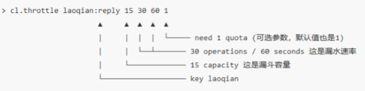
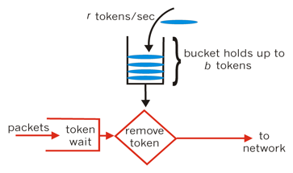

# 限流

在高并发场景下有三把利器保护系统：缓存、降级、和限流。缓存的目的是提升系统的访问你速度和增大系统能处理的容量；降级是当服务出问题或影响到核心流程的性能则需要暂时屏蔽掉。而有些场景则需要限制并发请求量，如秒杀、抢购、发帖、评论、恶意爬虫等。
限流算法

常见的限流算法有：计数器，漏桶、令牌桶。

## 计数器

使用zset维护一个滑动的时间窗口，通过score来圈出这个时间窗口。为节省内存，我们只需要保留时间窗口内的行为记录，同时如果用户是冷用户，滑动时间窗口内的行为是空记录，那么这个 zset 就可以从内存中移除，不再占用空间。 

通过统计滑动窗口内的行为数量与阈值 max_count 进行比较就可以得出当前的行为是否允许。

```python
def is_action_allowed(user_id, action_key, period, max_count):     
    key = 'hist:%s:%s' % (user_id, action_key)     
    now_ts = int(time.time() * 1000)  # 毫秒时间戳     
    with client.pipeline() as pipe:  # client 是 StrictRedis 实例         
        # 记录行为         
        pipe.zadd(key, now_ts, now_ts)  # value 和 score 都使用毫秒时间戳         
        # 移除时间窗口之前的行为记录，剩下的都是时间窗口内的         
        pipe.zremrangebyscore(key, 0, now_ts - period * 1000)         
        # 获取窗口内的行为数量         
        pipe.zcard(key) 
        # 设置 zset 过期时间，避免冷用户持续占用内存         
        # 过期时间应该等于时间窗口的长度，再多宽限 1s         
        pipe.expire(key, period + 1)         
        # 批量执行         
        _, _, current_count, _ = pipe.execute()     
        # 比较数量是否超标     
    return current_count <= max_count 
```

## 漏桶

漏桶(Leaky Bucket)算法思路很简单，水(请求)先进入到漏桶里，漏桶以一定的速度出水(接口有响应速率)，当水流入速度过大会直接溢出(访问频率超过接口响应速率)，然后就拒绝请求，可以看出漏桶算法能强行限制数据的传输速率。


```python
# coding: utf8 
 
import time 
 
class Funnel(object):     
    def __init__(self, capacity, leaking_rate):         
        self.capacity = capacity  # 漏斗容量         
        self.leaking_rate = leaking_rate  # 漏嘴流水速率 
        self.left_quota = capacity  # 漏斗剩余空间         
        self.leaking_ts = time.time()  # 上一次漏水时间 
    
     def make_space(self):         
        now_ts = time.time()         
        delta_ts = now_ts - self.leaking_ts  # 距离上一次漏水过去了多久         
        delta_quota = delta_ts * self.leaking_rate  # 又可以腾出不少空间了         
        if delta_quota < 1:  # 腾的空间太少，那就等下次吧             
            return         
        self.left_quota += delta_quota  # 增加剩余空间         
        self.leaking_ts = now_ts  # 记录漏水时间         
        if self.left_quota > self.capacity:  # 剩余空间不得高于容量             
            self.left_quota = self.capacity 

     def watering(self, quota):         
        self.make_space()         
        if self.left_quota >= quota:  # 判断剩余空间是否足够             
            self.left_quota -= quota             
            return True         
        return False 

funnels = {}  # 所有的漏斗 

# capacity  漏斗容量 
# leaking_rate 漏嘴流水速率 quota/s 
def is_action_allowed(user_id, action_key, capacity, leaking_rate):     
    key = '%s:%s' % (user_id, action_key)     
    funnel = funnels.get(key)     
    if not funnel:         
        funnel = Funnel(capacity, leaking_rate)         
        funnels[key] = funnel     
    return funnel.watering(1) 
```

Funnel 对象的 make_space 方法是漏斗算法的核心，其在每次灌水前都会被调用以触发漏水，给漏斗腾出空间来。能腾出多少空间取决于过去了多久以及流水的速率。Funnel 对象占据的空间大小不再和行为的频率成正比，它的空间占用是一个常量。 

问题来了，分布式的漏斗算法该如何实现？能不能使用 Redis 的基础数据结构来搞定？ 

我们观察 Funnel 对象的几个字段，我们发现可以将 Funnel 对象的内容按字段存储到一个 hash 结构中，灌水的时候将 hash 结构的字段取出来进行逻辑运算后，再将新值回填到 hash 结构中就完成了一次行为频度的检测。

但是有个问题，我们无法保证整个过程的原子性。从 hash 结构中取值，然后在内存里运算，再回填到 hash 结构，这三个过程无法原子化，意味着需要进行适当的加锁控制。而一旦加锁，就意味着会有加锁失败，加锁失败就需要选择重试或者放弃。 如果重试的话，就会导致性能下降。如果放弃的话，就会影响用户体验。同时，代码的复杂度也跟着升高很多。

Redis 4.0提供了一个限流Redis模块，名称为redis-cell，该模块提供漏斗算法，并提供原子的限流指令。

该模块只有一条指令cl.throttle，其参数和返回值比较复杂。



上面这个指令的意思是允许「用户老钱回复行为」的频率为每 60s 最多 30 次(漏水速率)，漏斗的初始容量为 15，也就是说一开始可以连续回复 15 个帖子，然后才开始受漏水速率的影响。我们看到这个指令中漏水速率变成了 2 个参数，替代了之前的单个浮点数。用两个参数相除的结果来表达漏水速率相对单个浮点数要更加直观一些。

```
> cl.throttle laoqian:reply 15 30 60 1
1) (integer) 0    # 0表示允许，1表示拒绝
2) (integer) 15    # 漏斗容量capacity
3) (integer) 14    # 漏斗剩余空间left_quota
4) (integer) -1    # 如果拒绝了，需要多长时间后再重试，单位秒
5) (integer) 2    # 多长时间后，漏斗完全空出来，单位秒
```

在执行限流指令时，如果被拒绝了，就需要丢弃或重试。cl.throttle 指令考虑的非常周到，连重试时间都帮你算好了，直接取返回结果数组的第四个值进行 sleep 即可，如果不想阻塞线程，也可以异步定时任务来重试。 

## 令牌桶

令牌桶算法的原理是系统会以一个恒定的速度往桶里放入令牌，而如果请求需要被处理，则需要先从桶里获取一个令牌，当桶里没有令牌可取时，则拒绝服务。从原理上看，令牌桶算法和漏桶算法是相反的，一个“进水”，一个是“漏水”。



Google的Guava包中的RateLimiter类就是令牌桶算法的解决方案。

## 漏桶算法和令牌桶算法的选择

漏桶算法与令牌桶算法在表面看起来类似，很容易将两者混淆。但事实上，这两者具有截然不同的特性，且为不同的目的而使用。

漏桶算法与令牌桶算法的区别在于，漏桶算法能够强行限制数据的传输速率，令牌桶算法能够在限制数据的平均传输速率的同时还允许某种程度的突发传输。

需要注意的是，在某些情况下，漏桶算法不能够有效地使用网络资源，因为漏桶的漏出速率是固定的，所以即使网络中没有发生拥塞，漏桶算法也不能使某一个单独的数据流达到端口速率。因此，漏桶算法对于存在突发特性的流量来说缺乏效率。而令牌桶算法则能够满足这些具有突发特性的流量。通常，漏桶算法与令牌桶算法结合起来为网络流量提供更高效的控制。

## Reference

[基于Redis的限流系统的设计](https://www.jianshu.com/p/a3d068f2586d)