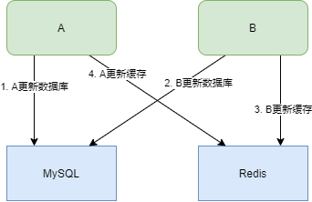
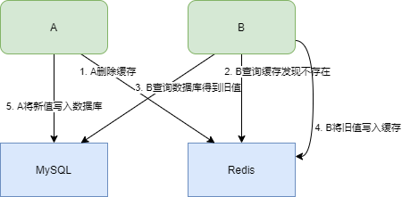

# 如何保证Redis与数据库的双写一致性？

只要用缓存，就可能会涉及到缓存与数据库双存储双写，你只要是双写，就一定会有数据一致性的问题，那么如何解决一致性问题？

### 先更新数据库，再更新缓存

从线程安全角度，假设同时有请求A和请求B进行更新操作，可能会出现

1. 请求A更新了数据库
2. 请求B更新了数据库
3. 请求B更新了缓存
4. 请求A更新了缓存



这就出现了数据库与缓存数据的不一致。

从业务场景角度考虑，如果是一个写数据库场景比较多，而读数据场景比较少的业务需求，采用这种方案就会导致，数据压根还没读到，缓存就被频繁的更新，浪费性能。另外，如果写入数据库的值，并不是直接写入缓存的，而是要经过一系列复杂的计算再写入缓存。那么，每次写入数据库后，都再次计算写入缓存的值，无疑是浪费性能的。显然，删除缓存更为适合。

### 先删除缓存，再更新数据库

该方案会导致不一致的原因是。同时有一个请求A进行更新操作，另一个请求B进行查询操作。那么会出现如下情形:

1. 请求A进行写操作，删除缓存
2. 请求B查询发现缓存不存在
3. 请求B数据库查询得到旧值
4. 请求B将旧值写入缓存
5. 请求A将新值写入数据库



此时就会导致数据库与缓存的不一致。而且，如果缓存不设置过期时间，数据就永远都是脏数据。

解决方法可以采用**延时双删**策略。

```java
public void write(String key ,Object data){
    redis.delKey(key);
    db.updateData(data);
    Thread.sleep(1000);
    redis.delKey(key);
}
```

先淘汰缓存，再写数据库；休眠1秒，再次淘汰缓存 这么做，可以将1秒内所造成的缓存脏数据，再次删除。

**那么，这个1秒怎么确定的，具体该休眠多久呢？**

针对上面的情形，读者应该自行评估自己的项目的读数据业务逻辑的耗时。然后写数据的休眠时间则在读数据业务逻辑的耗时基础上，加几百ms即可。这么做的目的，就是确保读请求结束，写请求可以删除读请求造成的缓存脏数据。

**如果你用了mysql的读写分离架构怎么办？**

在这种情况下，造成数据不一致的原因如下，还是两个请求，一个请求A进行更新操作，另一个请求B进行查询操作。

1. 请求A进行写操作，删除缓存
2. 请求A将数据写入数据库了，
3. 请求B查询缓存发现，缓存没有值
4. 请求B去从库查询，这时，还没有完成主从同步，因此查询到的是旧值
5. 请求B将旧值写入缓存
6. 数据库完成主从同步，从库变为新值 上述情形，就是数据不一致的原因。还是使用双删延时策略。只是，睡眠时间修改为在主从同步的延时时间基础上，加几百ms。

**采用这种同步淘汰策略，吞吐量降低怎么办？**

那就将第二次删除作为异步的。自己起一个线程，异步删除。这样，写的请求就不用沉睡一段时间后了，再返回。这么做，加大吞吐量。

**第二次删除,如果删除失败怎么办？**

第二次删除失败，就会出现如下情形。还是有两个请求，一个请求A进行更新操作，另一个请求B进行查询操作，为了方便，假设是单库：

1. 请求A进行写操作，删除缓存
2. 请求B查询发现缓存不存在
3. 请求B去数据库查询得到旧值
4. 请求B将旧值写入缓存
5. 请求A将新值写入数据库
6. 请求A试图去删除请求B写入对缓存值，结果失败了。

这也就是说。如果第二次删除缓存失败，会再次出现缓存和数据库不一致的问题。

### 先更新数据库，再删除缓存

这种方案是很多工程采用的方案，也被称为“Cache Aside Pattern”。某些情况下也可能会产生数据不一致的问题。

假设有两个请求，一个请求A做查询操作，一个请求B做更新操作，那么会有如下情形产生。

1. 缓存刚好失效
2. 请求A查询数据库，得一个旧值
3. 请求B将新值写入数据库
4. 请求B删除缓存
5. 请求A将查到的旧值写入缓存

这样，脏数据就产生了，然而上面的情况是假设在数据库写请求比读请求还要快。实际上，工程中数据库的读操作的速度远快于写操作的。

### 异步删除缓存失败怎么处理

**方案一**

将删除失败的key放入消息队列，重试删除操作。

1. 更新数据库数据；
2. 缓存因为种种问题删除失败
3. 将需要删除的key发送至消息队列
4. 自己消费消息，获得需要删除的key
5. 继续重试删除操作，直到成功

该方案有一个缺点，对业务线代码造成大量的侵入。

**方案二**

启动一个订阅程序去订阅数据库的binlog，获得需要操作的数据。在应用程序中，另起一段程序，获得这个订阅程序传来的信息，进行删除缓存操作。

1. 更新数据库数据
2. 数据库会将操作信息写入binlog日志当中
3. 订阅程序提取出所需要的数据以及key
4. 另起一段非业务代码，获得该信息
5. 尝试删除缓存操作，发现删除失败
6. 将这些信息发送至消息队列
7. 重新从消息队列中获得该数据，重试操作。

