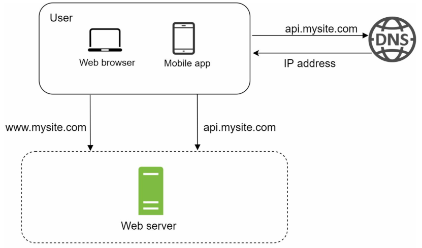
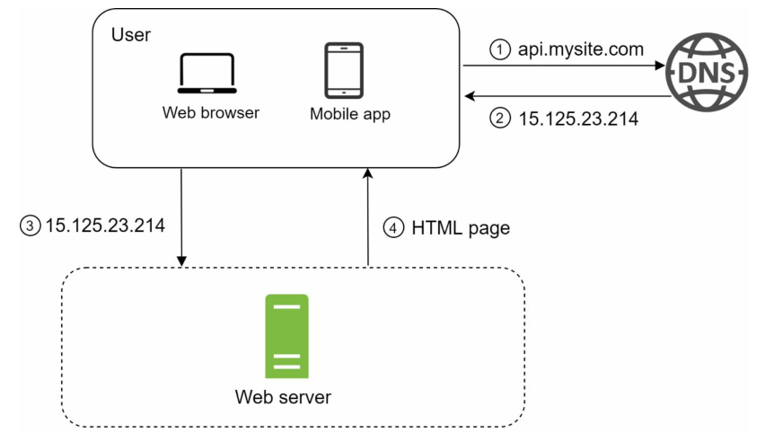
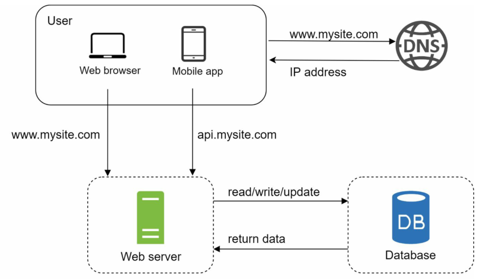
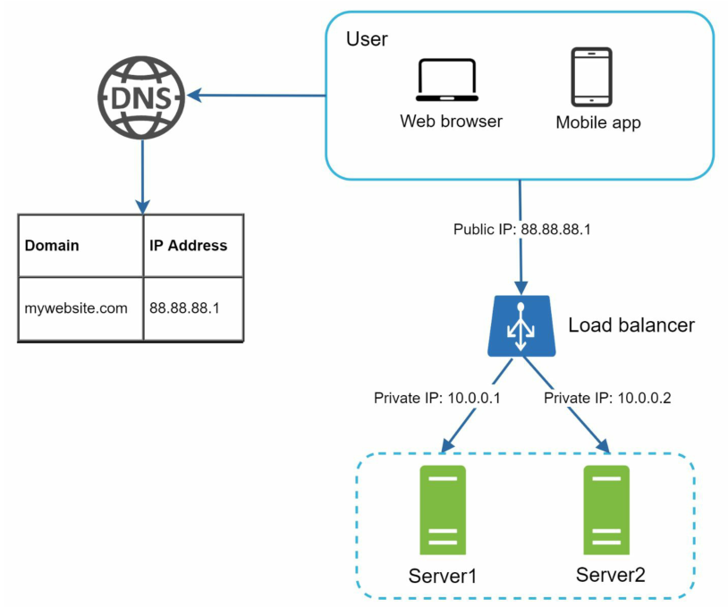

# 从零到百万级用户系统的演进

本文以一个简单的例子介绍如何从零开始向支撑百万级用户的系统演进。

## 单服务器架构

千里之行始于足下，一个复杂的系统也是从简单演变而来。一开始，系统可能没有什么人访问，这时候用一个服务器就足够了，Web应用、数据库、缓存等等都运行在同一个服务器上。

请求流程大致是这样的：

1. 用户通过域名访问网站，例如；api.mysite.com。通常DNS不是我们的服务，而是由第三方所提供
2. DNS将域名解析后的IP地址返回给浏览器或移动app
3. 通过IP地址直接向Web服务器发送HTTP请求
4. Web服务器返回HTML页面或JSON格式的响应。

## 数据库单独部署

随着用户逐步增长，单一的服务器开始遇到瓶颈了，我们可以将Web服务与数据库服务分开来，分别部署到不同的服务器上，方便二者之后独立的扩展。

## 选择哪种数据库

数据库有`关系型数据库`和`非关系型数据库`两类。

关系型数据库也被称为`RDBMS`(relational database management system)或SQL数据库。最流行的关系型数据库有`MySQL`、`Oracle`、`PostgreSQL`等。关系型数据库以表格和行的方式表示和存储数据。不同的表之间可以使用用`join`操作进行关联。

非关系型数据库也被称为`NoSQL`数据库。常用的有`CouchDB`、`Neo4j`、`Cassandra`、`HBase`、`Amazon DynamoDB`等。非关系型数据库有四类：key-value存储、图存储、列式存储、文档存储。非关系型数据库一般不支持`join`操作。

对多数场景来说，直接使用关系型数据库是一个比较好的选择。但某些场景下关系型数据库可能并不合适，比如：当服务有低延迟的要求、非结构化的数据、海量数据存储，这时候就可以选择非关系型数据库。

## 垂直扩展 vs 水平扩展

垂直扩展(Vertical scaling，也叫scale up)，是指给服务器增加更多的CPU、内存等手段实现扩展。水平扩展(Horizontal scaling，也叫scale-out)，是指通过增加更多服务器的手段实现扩展。

垂直扩展比较简单， 因此当流量低时，是一个比较好的选择。但垂直扩展有一些缺点：

* 垂直扩展有上限，不可能给服务器增加无限的CPU和内存。
* 垂直扩展无法实现故障转移（failover）和冗余（redundancy），如果一台服务器挂了，那么整个服务就不可用了。

因此，对大型应用而言，水平扩展是一个更理想的选择。

## 负载均衡

负载均衡（load balancer）可以将流量导向多个服务器来提高性能和可靠性。

