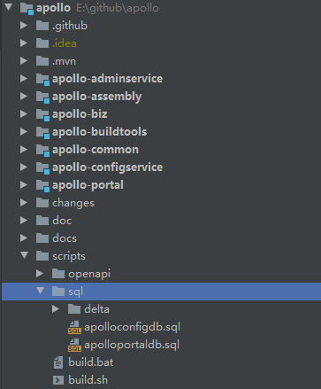
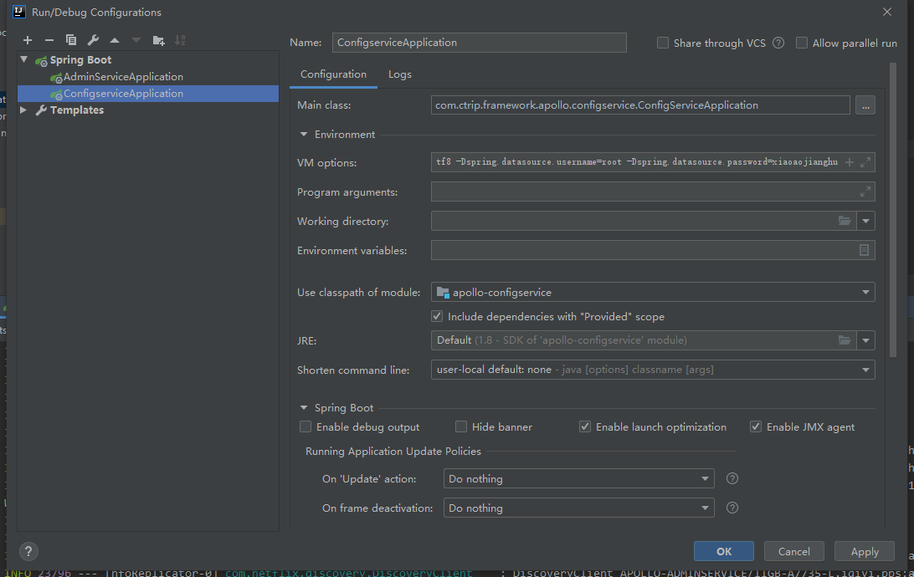
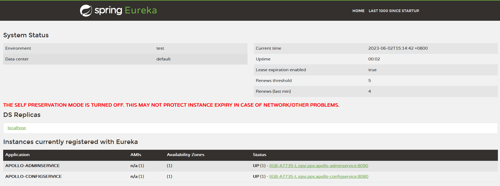
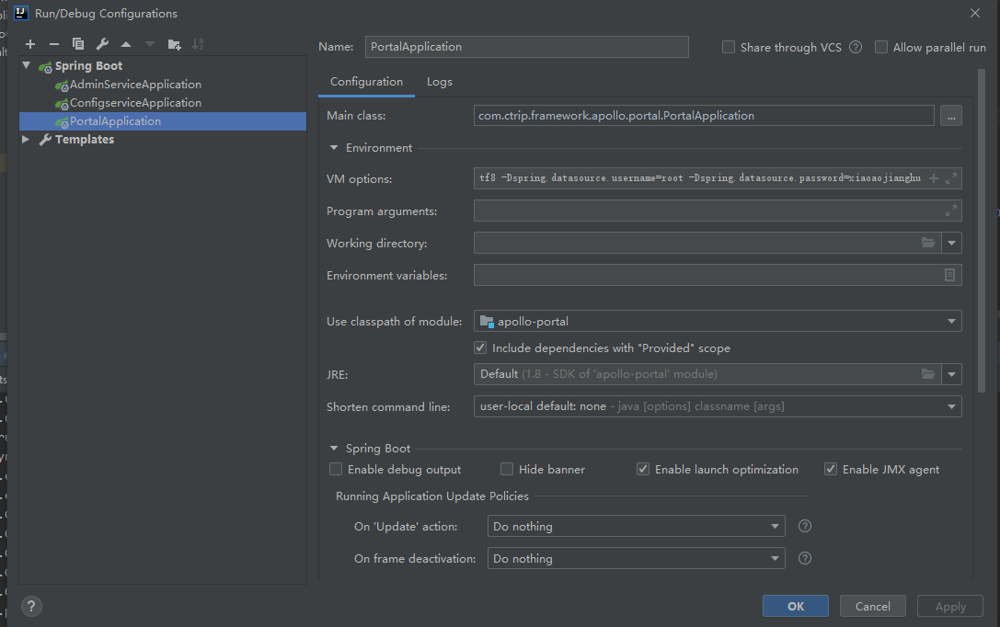
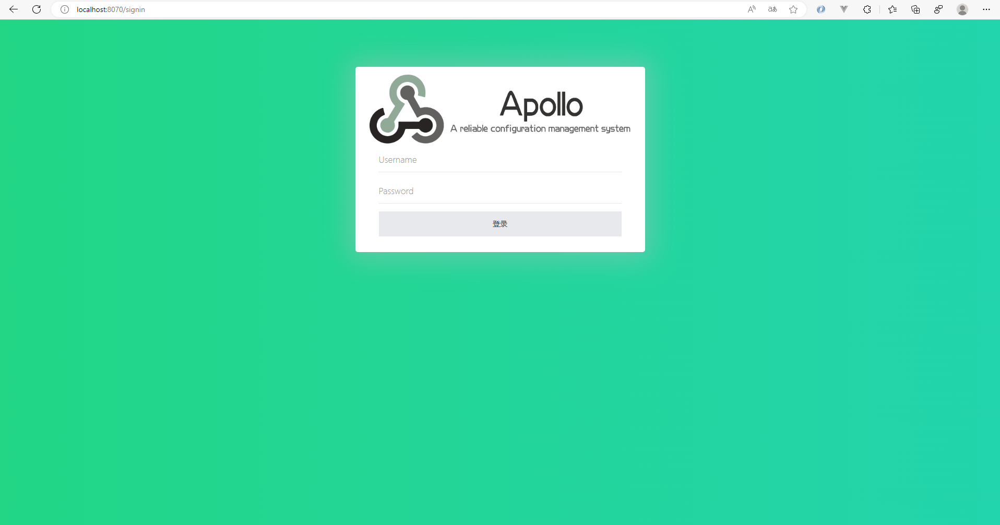

# Apollo调试环境搭建

## 依赖工具

* JDK ：1.8+
* MySQL ：5.6.5+
* Maven
* IntelliJ IDEA

## 获取代码

Apollo服务端项目地址：https://github.com/apolloconfig/apollo

Java客户端项目地址：https://github.com/apolloconfig/apollo-java

通过`git clone`命令拉取`master`分支代码：

```
git clone git@github.com:apolloconfig/apollo.git
git clone git@github.com:apolloconfig/apollo-java.git
```

## 创建数据库

Apollo唯一依赖的就是数据库，服务端有两个数据库：

* ApolloPortalDB
* ApolloConfigDB

在Apollo项目的`script`目录中，提供了两个数据库的初始化脚本



## 启动ConfigService & AdminService

启动`apollo-adminservice`和`admin-configservice`项目，可以基于`apollo-assembly`项目启动，也可以分别启动`ConfigServiceApplication`和`AdminServiceApplication`

新建`ConfigServiceApplication`和`AdminServiceApplication`



* `Main class`: `com.ctrip.framework.apollo.assembly.ApolloApplication`
* `VM options`: 
    > -Dapollo_profile=github
    > -Dspring.datasource.url=jdbc:mysql://localhost:3306/ApolloConfigDB?characterEncoding=utf8
    > -Dspring.datasource.username=root
    > -Dspring.datasource.password=123456
* `program arguments`: `--configservice --adminservice`
* `Use classpath of module`: `apollo-assembly`

分别启动成功，访问`http://localhost:8080`，可以看到`Config Service`和`Admin Service`都已经注册到eureka了



## 启动Portal

类似地，新建`PortalApplication`



* `Main class`: `com.ctrip.framework.apollo.portal.PortalApplication`
* `VM options`: 
    > -Dapollo_profile=github,auth
    > -Ddev_meta=http://localhost:8080/
    > -Dserver.port=8070
    > -Dspring.datasource.url=jdbc:mysql://localhost:3306/ApolloPortalDB?characterEncoding=utf8
    > -Dspring.datasource.username=root
    > -Dspring.datasource.password=123456
* `program arguments`: `--configservice --adminservice`
* `Use classpath of module`: `apollo-assembly`

启动成功后，访问`http://localhost:8070`，使用内置账号登陆即可

* username: Apollo
* password: admin



