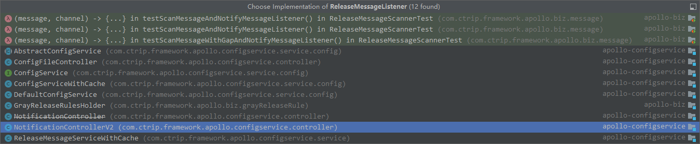

# Apollo源码分析——发送ReleaseMessage

[[toc]]

## 概述

以下内容来自[Apollo配置中心设计](https://www.apolloconfig.com/#/zh/design/apollo-design)

> Admin Service在配置发布后，需要通知所有的Config Service有配置发布，从而Config Service可以通知对应的客户端来拉取最新的配置。
>
> 从概念上来看，这是一个典型的消息使用场景，Admin Service作为producer发出消息，各个Config Service作为consumer消费消息。通过一个消息组件（Message Queue）就能很好的实现Admin Service和Config Service的解耦。
>
> 在实现上，考虑到Apollo的实际使用场景，以及为了尽可能减少外部依赖，我们没有采用外部的消息中间件，而是通过数据库实现了一个简单的消息队列。
 
实现方式如下：
> 1. Admin Service在配置发布后会往ReleaseMessage表插入一条消息记录，消息内容就是配置发布的AppId+Cluster+Namespace，参见DatabaseMessageSender
> 2. Config Service有一个线程会每秒扫描一次ReleaseMessage表，看看是否有新的消息记录，参见ReleaseMessageScanner
> 3. Config Service如果发现有新的消息记录，那么就会通知到所有的消息监听器（ReleaseMessageListener），如NotificationControllerV2，消息监听器的注册过程参见ConfigServiceAutoConfiguration
> 4. NotificationControllerV2得到配置发布的AppId+Cluster+Namespace后，会通知对应的客户端

## ReleaseController

前文提到，`apollo-adminservice`模块`com.ctrip.framework.apollo.adminservice.controller.ReleaseController`的`publish`方法创建Release时，会发送一个Release消息，代码如下所示

```java
@Transactional
@PostMapping("/apps/{appId}/clusters/{clusterName}/namespaces/{namespaceName}/releases")
public ReleaseDTO publish(@PathVariable("appId") String appId,
                            @PathVariable("clusterName") String clusterName,
                            @PathVariable("namespaceName") String namespaceName,
                            @RequestParam("name") String releaseName,
                            @RequestParam(name = "comment", required = false) String releaseComment,
                            @RequestParam("operator") String operator,
                            @RequestParam(name = "isEmergencyPublish", defaultValue = "false") boolean isEmergencyPublish) {
    Namespace namespace = namespaceService.findOne(appId, clusterName, namespaceName);
    if (namespace == null) {
        throw NotFoundException.namespaceNotFound(appId, clusterName, namespaceName);
    }
    Release release = releaseService.publish(namespace, releaseName, releaseComment, operator, isEmergencyPublish);

    //send release message
    Namespace parentNamespace = namespaceService.findParentNamespace(namespace);
    String messageCluster;
    if (parentNamespace != null) {
        messageCluster = parentNamespace.getClusterName();
    } else {
        messageCluster = clusterName;
    }
    messageSender.sendMessage(ReleaseMessageKeyGenerator.generate(appId, messageCluster, namespaceName),
                              Topics.APOLLO_RELEASE_TOPIC);
    return BeanUtils.transform(ReleaseDTO.class, release);
}
```

## ReleaseMessageKeyGenerator

`com.ctrip.framework.apollo.biz.utils.ReleaseMessageKeyGenerator`生成消息内容

```java
// +
private static final Joiner STRING_JOINER = Joiner.on(ConfigConsts.CLUSTER_NAMESPACE_SEPARATOR);

public static String generate(String appId, String cluster, String namespace) {
    return STRING_JOINER.join(appId, cluster, namespace);
}
```

`generate`方法，将`appId`、`cluster`、`namespace`用`+`拼接到一起，例如：`test+default+application`

对同一个Namespace，生成的消息内容是相同的。通过这种方式，我们可以使用最新的 ReleaseMessage 的 id 属性，作为 Namespace 是否发生变更的标识。而 Apollo 确实是通过这样的方式实现，Client 通过不断使用获得到 ReleaseMessage 的 id 属性作为版本号，请求 Config Service 判断是否配置发生了变化。

## MessageSender

`com.ctrip.framework.apollo.biz.message.MessageSender`定义了消息发送者的接口

```java
public interface MessageSender {
    void sendMessage(String message, String channel);
}
```

`com.ctrip.framework.apollo.biz.message.DatabaseMessageSender`是`MessageSender`接口的唯一实现

```java
@Transactional
  public void sendMessage(String message, String channel) {
    logger.info("Sending message {} to channel {}", message, channel);
    if (!Objects.equals(channel, Topics.APOLLO_RELEASE_TOPIC)) {
        logger.warn("Channel {} not supported by DatabaseMessageSender!", channel);
        return;
    }

    Tracer.logEvent("Apollo.AdminService.ReleaseMessage", message);
    Transaction transaction = Tracer.newTransaction("Apollo.AdminService", "sendMessage");
    try {
        ReleaseMessage newMessage = releaseMessageRepository.save(new ReleaseMessage(message));
        if(!toClean.offer(newMessage.getId())){
            logger.warn("Queue is full, Failed to add message {} to clean queue", newMessage.getId());
        }
        transaction.setStatus(Transaction.SUCCESS);
    } catch (Throwable ex) {
        logger.error("Sending message to database failed", ex);
        transaction.setStatus(ex);
        throw ex;
    } finally {
        transaction.complete();
    }
}
```

1. 判断`channel`如果不是`Topics.APOLLO_RELEASE_TOPIC`即`apollo-release`，直接返回
2. 创建ReleaseMessage对象，并调用`releaseMessageRepository.save`保存到数据库中
3. 将ReleaseMessage对象的id加入到`toClean`队列中，`toClean`是`DatabaseMessageSender`的一个阻塞队列，默认长度100

`DatabaseMessageSender`构造方法中创建了一个单线程的线程池`cleanExecutorService`

```java
public DatabaseMessageSender(final ReleaseMessageRepository releaseMessageRepository) {
    cleanExecutorService = Executors.newSingleThreadExecutor(ApolloThreadFactory.create("DatabaseMessageSender", true));
    cleanStopped = new AtomicBoolean(false);
    this.releaseMessageRepository = releaseMessageRepository;
}
```

在`initialize`方法被Spring回调时，会向`cleanExecutorService`线程池中提交一个后台线程任务

```java
@PostConstruct
private void initialize() {
    cleanExecutorService.submit(() -> {
        while (!cleanStopped.get() && !Thread.currentThread().isInterrupted()) {
            try {
                Long rm = toClean.poll(1, TimeUnit.SECONDS);
                if (rm != null) {
                    cleanMessage(rm);
                } else {
                    TimeUnit.SECONDS.sleep(5);
                }
                } catch (Throwable ex) {
                Tracer.logError(ex);
            }
        }
    });
}
```

后台任务会不断从`toClean`队列中获取ReleaseMessage对象的id，如果id存在调用`cleanMessage`方法，否则sleep 5秒后继续从队列中获取id

```java
private void cleanMessage(Long id) {
    //double check in case the release message is rolled back
    ReleaseMessage releaseMessage = releaseMessageRepository.findById(id).orElse(null);
    if (releaseMessage == null) {
        return;
    }
    boolean hasMore = true;
    while (hasMore && !Thread.currentThread().isInterrupted()) {
        List<ReleaseMessage> messages = releaseMessageRepository.findFirst100ByMessageAndIdLessThanOrderByIdAsc(
            releaseMessage.getMessage(), releaseMessage.getId());

        releaseMessageRepository.deleteAll(messages);
        hasMore = messages.size() == 100;

        messages.forEach(toRemove -> Tracer.logEvent(
            String.format("ReleaseMessage.Clean.%s", toRemove.getMessage()), String.valueOf(toRemove.getId())));
    }
}
```

1. 调用`releaseMessageRepository.findById`方法查询id对应的ReleaseMessage对象，避免对象已被删除。
    * 这是因为`DatabaseMessageSender`会在多进程中执行，例如：1) Config Service + Admin Service；2) N * Config Service；3) N * Admin Service
    * 为什么 Config Service 和 Admin Service 都会启动清理任务呢？因为`DatabaseMessageSender`添加了`@Component`注解，而`NamespaceService`注入了 `DatabaseMessageSender` 。而`NamespaceService`被`apollo-adminservice`和`apoll-configservice`项目都引用了，所以都会启动该任务。
2. 循环删除，相同消息内容( ReleaseMessage.message )的老消息，即 Namespace 的老消息。
    * 调用`ReleaseMessageRepository#findFirst100ByMessageAndIdLessThanOrderByIdAsc(message, id)`方法，拉取相同消息内容的 100 条的老消息，按照 id 升序。
    * 调用`ReleaseMessageRepository#delete(messages)`方法，删除老消息。
    * 若拉取不足 100 条，说明无老消息了。

## ReleaseMessageListener

`com.ctrip.framework.apollo.biz.message.ReleaseMessageListener`，ReleaseMessage的监听器接口

```java
public interface ReleaseMessageListener {
    void handleMessage(ReleaseMessage message, String channel);
}
```

`com.ctrip.framework.apollo.biz.message.ReleaseMessageListener`接口的实现类如下图所示



## ReleaseMessageScanner

`com.ctrip.framework.apollo.biz.message.ReleaseMessageScanner`，ReleaseMessage的扫描器，`apollo-configservce`的自动配置类`ConfigServiceAutoConfiguration`中会创建该Bean，并添加一系列的`ReleaseMessageListener`

```java
@Bean
    public ReleaseMessageScanner releaseMessageScanner() {
      ReleaseMessageScanner releaseMessageScanner = new ReleaseMessageScanner(bizConfig,
          releaseMessageRepository);
      //0. handle release message cache
      releaseMessageScanner.addMessageListener(releaseMessageServiceWithCache);
      //1. handle gray release rule
      releaseMessageScanner.addMessageListener(grayReleaseRulesHolder);
      //2. handle server cache
      releaseMessageScanner.addMessageListener(configService);
      releaseMessageScanner.addMessageListener(configFileController);
      //3. notify clients
      releaseMessageScanner.addMessageListener(notificationControllerV2);
      releaseMessageScanner.addMessageListener(notificationController);
      return releaseMessageScanner;
    }
```

`ReleaseMessageScanner`构造方法中创建了一个定时调度的线程池`executorService`

```java
public ReleaseMessageScanner(final BizConfig bizConfig,
      final ReleaseMessageRepository releaseMessageRepository) {
    this.bizConfig = bizConfig;
    this.releaseMessageRepository = releaseMessageRepository;
    listeners = Lists.newCopyOnWriteArrayList();
    executorService = Executors.newScheduledThreadPool(1, ApolloThreadFactory
        .create("ReleaseMessageScanner", true));
    missingReleaseMessages = Maps.newHashMap();
}
```

`ReleaseMessageScanner`实现了Spring的`InitializingBean`，当Spring完成Bean初始化后，回调`afterPropertiesSet`方法，这个方法中向线程池`executorService`提交了一个定时被调度执行的后台任务

```java
@Override
public void afterPropertiesSet() throws Exception {
    databaseScanInterval = bizConfig.releaseMessageScanIntervalInMilli();
    maxIdScanned = loadLargestMessageId();
    executorService.scheduleWithFixedDelay(() -> {
        Transaction transaction = Tracer.newTransaction("Apollo.ReleaseMessageScanner", "scanMessage");
        try {
            scanMissingMessages();
            scanMessages();
            transaction.setStatus(Transaction.SUCCESS);
        } catch (Throwable ex) {
            transaction.setStatus(ex);
            logger.error("Scan and send message failed", ex);
        } finally {
            transaction.complete();
        }
    }, databaseScanInterval, databaseScanInterval, TimeUnit.MILLISECONDS);
}
```

1. 调度的时间间隔`databaseScanInterval`从`bizConfig.releaseMessageScanIntervalInMilli`方法返回，这个参数key是`apollo.message-scan.interval`，默认值是1000ms
2. 调用`loadLargestMessageId`方法，获得最大的ReleaseMessage的id
    ```java
    private long loadLargestMessageId() {
        ReleaseMessage releaseMessage = releaseMessageRepository.findTopByOrderByIdDesc();
        return releaseMessage == null ? 0 : releaseMessage.getId();
    }
    ```
3. 调用`executorService.scheduleWithFixedDelay`提交定时任务，定时任务主要由`scanMissingMessages`和`scanMessages`方法组成

### scanMessages

`scanMessages`方法里while循环不断调用`scanAndSendMessages`方法扫描并发送消息，只要还有更多消息且线程未被中断，就一直循环执行

```java
private void scanMessages() {
    boolean hasMoreMessages = true;
    while (hasMoreMessages && !Thread.currentThread().isInterrupted()) {
      hasMoreMessages = scanAndSendMessages();
    }
}
```

`scanAndSendMessages`方法扫描ReleaseMessage表并回调`ReleaseMessageListener`接口实现

```java
private boolean scanAndSendMessages() {
    //current batch is 500
    List<ReleaseMessage> releaseMessages =
        releaseMessageRepository.findFirst500ByIdGreaterThanOrderByIdAsc(maxIdScanned);
    if (CollectionUtils.isEmpty(releaseMessages)) {
      return false;
    }
    fireMessageScanned(releaseMessages);
    int messageScanned = releaseMessages.size();
    long newMaxIdScanned = releaseMessages.get(messageScanned - 1).getId();
    // check id gaps, possible reasons are release message not committed yet or already rolled back
    if (newMaxIdScanned - maxIdScanned > messageScanned) {
      recordMissingReleaseMessageIds(releaseMessages, maxIdScanned);
    }
    maxIdScanned = newMaxIdScanned;
    return messageScanned == 500;
}
```

1. 扫描时会查询`maxIdScanned`之后按ID升序排序后的前500个ReleaseMessage，500是固定的batch size
2. 调用`fireMessageScanned`通知所有listener
    ```java
    private void fireMessageScanned(Iterable<ReleaseMessage> messages) {
        for (ReleaseMessage message : messages) {
            for (ReleaseMessageListener listener : listeners) {
                try {
                    listener.handleMessage(message, Topics.APOLLO_RELEASE_TOPIC);
                } catch (Throwable ex) {
                    Tracer.logError(ex);
                    logger.error("Failed to invoke message listener {}", listener.getClass(), ex);
                }
            }
        }
    }
    ```
3. 取查询到的列表的size为`messageScanned`，最后一条记录的ID为`newMaxIdScanned`
4. 如果`newMaxIdScanned`和`maxIdScanned`的差值大于`messageScanned`，说明查询到的列表不连续、中间存在空洞，可能是ReleaseMessage记录数据库尚未commit或已经回滚，这种情况时调用`recordMissingReleaseMessageIds`方法将中间空洞缺少的ID记录到`missingReleaseMessages`中
    ```java
    private void recordMissingReleaseMessageIds(List<ReleaseMessage> messages, long startId) {
        for (ReleaseMessage message : messages) {
            long currentId = message.getId();
            if (currentId - startId > 1) {
                for (long i = startId + 1; i < currentId; i++) {
                    missingReleaseMessages.putIfAbsent(i, 1);
                }
            }
            startId = currentId;
        }
    }
    ```

### scanMissingMessages

`scanMissingMessages`方法会从`missingReleaseMessages`中查找曾经缺失的ReleaseMessage，找到的ReleaseMessage会调用`fireMessageScanned`回调listener，并从`missingReleaseMessages`中移除掉

```java
rivate void scanMissingMessages() {
    Set<Long> missingReleaseMessageIds = missingReleaseMessages.keySet();
    Iterable<ReleaseMessage> releaseMessages = releaseMessageRepository
        .findAllById(missingReleaseMessageIds);
    fireMessageScanned(releaseMessages);
    releaseMessages.forEach(releaseMessage -> {
        missingReleaseMessageIds.remove(releaseMessage.getId());
    });
    growAndCleanMissingMessages();
}
```

对于尚未commit的ReleaseMessage，commit后自然会被`scanMissingMessages`扫描到，但回滚的ReleaseMessage是扫描不到的，为了避免`missingReleaseMessages`不断增长，`growAndCleanMissingMessages`方法内部实现了自动清理的逻辑

```java
private void growAndCleanMissingMessages() {
    Iterator<Entry<Long, Integer>> iterator = missingReleaseMessages.entrySet()
        .iterator();
    while (iterator.hasNext()) {
        Entry<Long, Integer> entry = iterator.next();
        if (entry.getValue() > missingReleaseMessageMaxAge) {
            iterator.remove();
        } else {
            entry.setValue(entry.getValue() + 1);
        }
    }
}
```

`missingReleaseMessages`是个Map结构，key是ReleaseMessage对应的ID，value则是生命周期，每次扫描`missingReleaseMessages`时候value会增加1，当大于`missingReleaseMessageMaxAge`时remove掉。`missingReleaseMessageMaxAge`值目前是硬编码为10，不可配置，后续可能会被优化为可配置参数

