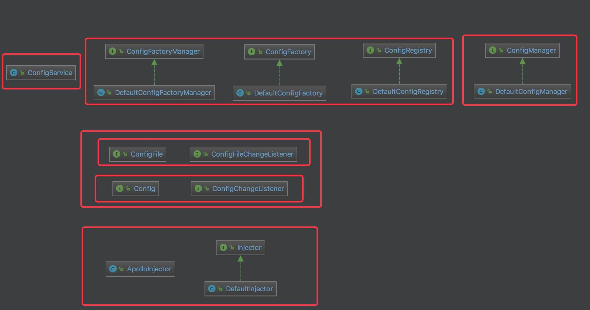
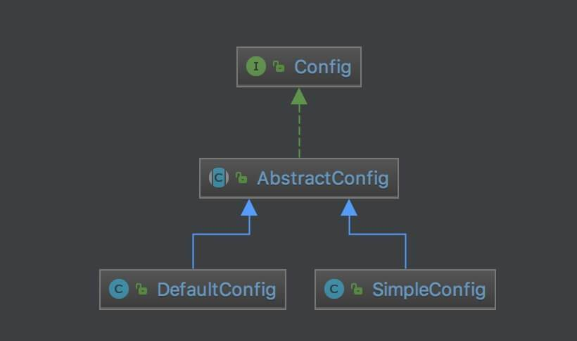

# Apollo 源码解析 —— 客户端 API 配置（一）之一览

## 概述



## ConfigService

`com.ctrip.framework.apollo.ConfigService` ，客户端配置服务，作为配置使用的入口。

### 构造方法

```java
/**
 * 单例
 */
private static final ConfigService s_instance = new ConfigService();

private volatile ConfigManager m_configManager;
private volatile ConfigRegistry m_configRegistry;
```

* `s_instance` 静态，单例。
* `m_configManager` 属性，通过 #getManager() 方法获得。代码如下：
    ```java
    private ConfigManager getManager() {
        if (m_configManager == null) {
            synchronized (this) {
                if (m_configManager == null) {
                    m_configManager = ApolloInjector.getInstance(ConfigManager.class);
                }
            }
        }
        return m_configManager;
    }
    ```
    * 调用 `ApolloInjector#getInstance(Class<T>)` 方法，获得 ConfigManager 单例。
* `m_configRegistry` 属性，通过 #getRegistry() 方法获得。代码如下：
    ```java
    private ConfigRegistry getRegistry() {
        if (m_configRegistry == null) {
            synchronized (this) {
                if (m_configRegistry == null) {
                    m_configRegistry = ApolloInjector.getInstance(ConfigRegistry.class);
                }
            }
        }

        return m_configRegistry;
    }
    ```

### 获得配置对象

在 Apollo 客户端中，有两种形式的配置对象的接口：

* Config ，配置接口
* ConfigFile ，配置文件接口

实际情况下，我们使用 Config 居多。另外，有一点需要注意，Config 和 ConfigFile 差异在于形式，而不是类型。

#### 获得 Config 对象

```java
public static Config getAppConfig() {
    return getConfig(ConfigConsts.NAMESPACE_APPLICATION);
}

public static Config getConfig(String namespace) {
    return s_instance.getManager().getConfig(namespace);
}
```

调用 `ConfigManager#getConfig(namespace)` 方法，获得 Namespace 对应的 Config 对象。在这里，我们可以看出，ConfigManager 是 Config 的管理器。

#### 获得 ConfigFile 对象

```java
public static ConfigFile getConfigFile(String namespace, ConfigFileFormat configFileFormat) {
    return s_instance.getManager().getConfigFile(namespace, configFileFormat);
}
```

调用` ConfigManager#getConfigFile(namespace, ConfigFileFormat)` 方法，获得 Namespace 对应的 ConfigFile 对象。在这里，我们可以看出，ConfigManager 也是 ConfigFile 的管理器。

比 `#getConfig(namespace)` 方法，多了一个类型为 ConfigFileFormat 的方法参数，实际是一致的。因为 ConfigManager 会在方法中，将 ConfigFileFormat 拼接到 namespace 中。代码如下：

```java
public ConfigFile getConfigFile(String namespace, ConfigFileFormat configFileFormat) {
    String namespaceFileName = String.format("%s.%s", namespace, configFileFormat.getValue());
    ......
}
```

### 设置 Config 对象

```java
static void setConfig(Config config) {
    setConfig(ConfigConsts.NAMESPACE_APPLICATION, config);
}

static void setConfig(String namespace, final Config config) {
    s_instance.getRegistry().register(namespace, new ConfigFactory() {
        @Override
        public Config create(String namespace) {
            return config;
        }

        @Override
        public ConfigFile createConfigFile(String namespace, ConfigFileFormat configFileFormat) {
            return null;
        }

    });
}
```

在 Apollo 的设计中，ConfigManager 不允许设置 Namespace 对应的 Config 对象，而是通过 ConfigFactory 统一创建，虽然此时的创建是假的，直接返回了 `config` 方法参数。

### 设置 ConfigFactory 对象

```java
static void setConfigFactory(ConfigFactory factory) {
    setConfigFactory(ConfigConsts.NAMESPACE_APPLICATION, factory);
}

static void setConfigFactory(String namespace, ConfigFactory factory) {
    s_instance.getRegistry().register(namespace, factory);
}
```

和设置 Config 对象类似，也是注册到 ConfigRegistry 中。

## Config & Config File

### Config

`com.ctrip.framework.apollo.Config` ，Config 接口。子类如下图：



#### 获取属性

```java
String getProperty(String key, String defaultValue);

Integer getIntProperty(String key, Integer defaultValue);

Long getLongProperty(String key, Long defaultValue);

Short getShortProperty(String key, Short defaultValue);

Float getFloatProperty(String key, Float defaultValue);

Double getDoubleProperty(String key, Double defaultValue);

Byte getByteProperty(String key, Byte defaultValue);

Boolean getBooleanProperty(String key, Boolean defaultValue);

String[] getArrayProperty(String key, String delimiter, String[] defaultValue);

Date getDateProperty(String key, Date defaultValue);

Date getDateProperty(String key, String format, Date defaultValue);

Date getDateProperty(String key, String format, Locale locale, Date defaultValue);

<T extends Enum<T>> T getEnumProperty(String key, Class<T> enumType, T defaultValue);

/**
 * Return the duration property value(in milliseconds) with the given name, or {@code
 * defaultValue} if the name doesn't exist. Please note the format should comply with the follow
 * example (case insensitive). Examples:
 * <pre>
 *    "123MS"          -- parses as "123 milliseconds"
 *    "20S"            -- parses as "20 seconds"
 *    "15M"            -- parses as "15 minutes" (where a minute is 60 seconds)
 *    "10H"            -- parses as "10 hours" (where an hour is 3600 seconds)
 *    "2D"             -- parses as "2 days" (where a day is 24 hours or 86400 seconds)
 *    "2D3H4M5S123MS"  -- parses as "2 days, 3 hours, 4 minutes, 5 seconds and 123 milliseconds"
 * </pre>
 *
 * @param key          the property name
 * @param defaultValue the default value when name is not found or any error occurred
 * @return the parsed property value(in milliseconds)
 */
long getDurationProperty(String key, long defaultValue);
```

#### 获得属性名集合

```java
Set<String> getPropertyNames();
```

#### 添加配置变化监听器

```java
void addChangeListener(ConfigChangeListener listener);
```

`com.ctrip.framework.apollo.ConfigChangeListener` 接口，代码如下：

```java
public interface ConfigChangeListener {

    /**
     * Invoked when there is any config change for the namespace.
     *
     * @param changeEvent the event for this change
     */
    void onChange(ConfigChangeEvent changeEvent);

}
```

`com.ctrip.framework.apollo.model.ConfigChangeEvent` ，Config 变化事件，代码如下：

```java
public class ConfigChangeEvent {
    
    private final String m_namespace;

    private final Map<String, ConfigChange> m_changes;
}
```

`com.ctrip.framework.apollo.model.ConfigChange` ，配置每个属性变化的信息。代码如下：

```java
public class ConfigChange {

    private final String namespace;

    private final String propertyName;

    private String oldValue;

    private String newValue;

    private PropertyChangeType changeType;
}
```

`com.ctrip.framework.apollo.enums.PropertyChangeType` ，属性变化类型枚举。代码如下：

```java
public enum PropertyChangeType {
    ADDED,
    MODIFIED,
    DELETED
}
```

### ConfigFile

`com.ctrip.framework.apollo.ConfigFile` ，ConfigFile 接口。子类如下图：


#### 获得内容

```java
String getContent();

boolean hasContent();
```

#### 获得 Namespace 名字

```java
String getNamespace();

ConfigFileFormat getConfigFileFormat();
```

#### 添加配置文件变化监听器

```java
void addChangeListener(ConfigFileChangeListener listener);
```

`com.ctrip.framework.apollo.ConfigFileChangeListener` 接口，代码如下：

```java
public interface ConfigFileChangeListener {
    
    /**
     * Invoked when there is any config change for the namespace.
     *
     * @param changeEvent the event for this change
     */
    void onChange(ConfigFileChangeEvent changeEvent);

}
```

`com.ctrip.framework.apollo.model.ConfigFileChangeEvent` ，配置文件改变事件。代码如下：

```java
public class ConfigFileChangeEvent {

    private final String namespace;

    private final String oldValue;

    private String newValue;

    private final PropertyChangeType changeType;
}
```

## ConfigManager

`com.ctrip.framework.apollo.internals.ConfigManager` ，配置_管理器_接口。提供获得 Config 和 ConfigFile 对象的接口，代码如下：

```java
public interface ConfigManager {

    /**
     * Get the config instance for the namespace specified.
     *
     * @param namespace the namespace
     * @return the config instance for the namespace
     */
    Config getConfig(String namespace);

    /**
     * Get the config file instance for the namespace specified.
     *
     * @param namespace        the namespace
     * @param configFileFormat the config file format
     * @return the config file instance for the namespace
     */
    ConfigFile getConfigFile(String namespace, ConfigFileFormat configFileFormat);
}
```

### DefaultConfigManager

`com.ctrip.framework.apollo.internals.DefaultConfigManager` ，实现 ConfigManager 接口，默认配置管理器实现类。

#### 构造方法

```java
private ConfigFactoryManager m_factoryManager;

private Map<String, Config> m_configs = Maps.newConcurrentMap();

private Map<String, ConfigFile> m_configFiles = Maps.newConcurrentMap();

public DefaultConfigManager() {
    m_factoryManager = ApolloInjector.getInstance(ConfigFactoryManager.class);
}
```

当需要获得的 Config 或 ConfigFile 对象不在缓存中时，通过 ConfigFactoryManager ，获得对应的 ConfigFactory 对象，从而创建 Config 或 ConfigFile 对象。

#### 获得 Config 对象

```java
@Override
public Config getConfig(String namespace) {
    Config config = m_configs.get(namespace);
    if (config == null) {
        synchronized (this) {
            config = m_configs.get(namespace);
            if (config == null) {
                ConfigFactory factory = m_factoryManager.getFactory(namespace);
                config = factory.create(namespace);
                m_configs.put(namespace, config);
            }
        }
    }
    return config;
}
```

#### 获得 ConfigFile 对象

```java
@Override
public ConfigFile getConfigFile(String namespace, ConfigFileFormat configFileFormat) {
    String namespaceFileName = String.format("%s.%s", namespace, configFileFormat.getValue());
    ConfigFile configFile = m_configFiles.get(namespaceFileName);
    if (configFile == null) {
        synchronized (this) {
            configFile = m_configFiles.get(namespaceFileName);
            if (configFile == null) {
                ConfigFactory factory = m_factoryManager.getFactory(namespaceFileName);
                configFile = factory.createConfigFile(namespaceFileName, configFileFormat);
                m_configFiles.put(namespaceFileName, configFile);
            }
        }
    }
    return configFile;
}
```

## ConfigFactoryManager

`com.ctrip.framework.apollo.spi.ConfigFactoryManager` ，ConfigFactory 管理器接口。代码如下：

```java
public interface ConfigFactoryManager {

    /**
     * Get the config factory for the namespace.
     *
     * @param namespace the namespace
     * @return the config factory for this namespace
     */
    ConfigFactory getFactory(String namespace);

}
```

ConfigFactoryManager 管理的是 ConfigFactory ，而 ConfigManager 管理的是 Config 。

### DefaultConfigFactoryManager

`com.ctrip.framework.apollo.spi.DefaultConfigFactoryManager` ，ConfigFactoryManager 接口，默认 ConfigFactory 管理器实现类。代码如下：

```java
public class DefaultConfigFactoryManager implements ConfigFactoryManager {

    private ConfigRegistry m_registry;

    private Map<String, ConfigFactory> m_factories = Maps.newConcurrentMap();

    public DefaultConfigFactoryManager() {
        m_registry = ApolloInjector.getInstance(ConfigRegistry.class);
    }

    @Override
    public ConfigFactory getFactory(String namespace) {
        ConfigFactory factory = m_registry.getFactory(namespace);
        if (factory != null) {
            return factory;
        }

        factory = m_factories.get(namespace);
        if (factory != null) {
            return factory;
        }

        factory = ApolloInjector.getInstance(ConfigFactory.class, namespace);
        if (factory != null) {
            return factory;
        }

        factory = ApolloInjector.getInstance(ConfigFactory.class);

        m_factories.put(namespace, factory);

        return factory;
    }

}
```

总的来说，DefaultConfigFactoryManager 的 ConfigFactory 来源有两个：
* ConfigRegistry
* ApolloInjector ，优先指定 Namespace 自定义的 ConfigFactory 对象，否则默认的 ConfigFactory 对象。

## ConfigFactory

`com.ctrip.framework.apollo.spi.ConfigFactory` ，配置工厂接口，其每个接口方法和 ConfigManager 一一对应。代码如下：

```java
public interface ConfigFactory {

    /**
     * Create the config instance for the namespace.
     *
     * @param namespace the namespace
     * @return the newly created config instance
     */
    Config create(String namespace);

    /**
     * Create the config file instance for the namespace
     *
     * @param namespace the namespace
     * @return the newly created config file instance
     */
    ConfigFile createConfigFile(String namespace, ConfigFileFormat configFileFormat);

}
```

### DefaultConfigFactory

`com.ctrip.framework.apollo.spi.DefaultConfigFactory` ，实现 ConfigFactory 接口，默认配置工厂实现类。

#### 构造方法

```java
private static final Logger logger = LoggerFactory.getLogger(DefaultConfigFactory.class);
private ConfigUtil m_configUtil;

public DefaultConfigFactory() {
    m_configUtil = ApolloInjector.getInstance(ConfigUtil.class);
}
```

#### 创建 Config 对象

```java
@Override
public Config create(String namespace) {
    return new DefaultConfig(namespace, createLocalConfigRepository(namespace));
}
```

调用 `#createLocalConfigRepository(name)` 方法，创建 LocalConfigRepository 对象。作为后面创建的 DefaultConfig 对象的 ConfigRepository 。

#### 创建 FileConfig 对象

```java
@Override
public ConfigFile createConfigFile(String namespace, ConfigFileFormat configFileFormat) {
    ConfigRepository configRepository = createLocalConfigRepository(namespace);
    switch (configFileFormat) {
        case Properties:
            return new PropertiesConfigFile(namespace, configRepository);
        case XML:
            return new XmlConfigFile(namespace, configRepository);
        case JSON:
            return new JsonConfigFile(namespace, configRepository);
        case YAML:
            return new YamlConfigFile(namespace, configRepository);
        case YML:
            return new YmlConfigFile(namespace, configRepository);
    }
    return null;
}
```

调用 `#createLocalConfigRepository(name)` 方法，创建 LocalConfigRepository 对象。作为后面创建的 XXXConfigFile 对象的 ConfigRepository 。

#### 创建 LocalConfigRepository 对象

```java
LocalFileConfigRepository createLocalConfigRepository(String namespace) {
    if (m_configUtil.isInLocalMode()) {
        logger.warn("==== Apollo is in local mode! Won't pull configs from remote server for namespace {} ! ====", namespace);
        return new LocalFileConfigRepository(namespace);
    }
    return new LocalFileConfigRepository(namespace, createRemoteConfigRepository(namespace));
}

RemoteConfigRepository createRemoteConfigRepository(String namespace) {
    return new RemoteConfigRepository(namespace);
}
```

* 根据是否为本地模式，单独使用 LocalFileConfigRepository 还是组合使用 LocalFileConfigRepository + RemoteConfigRepository 。
* 那么什么是本地模式呢？ConfigUtil#isInLocalMode() 方法，代码如下：
    ```java
    public boolean isInLocalMode() {
        try {
            Env env = getApolloEnv();
            return env == Env.LOCAL;
        } catch (Throwable ex) {
            //ignore
        }
        return false;
    }
    ```

## ConfigRegistry

`com.ctrip.framework.apollo.spi.ConfigRegistry` ，Config 注册表接口。其中，KEY 为 Namespace 的名字，VALUE 为 ConfigFactory 对象。代码如下：

```java
public interface ConfigRegistry {

    /**
     * Register the config factory for the namespace specified.
     *
     * @param namespace the namespace
     * @param factory   the factory for this namespace
     */
    void register(String namespace, ConfigFactory factory);

    /**
     * Get the registered config factory for the namespace.
     *
     * @param namespace the namespace
     * @return the factory registered for this namespace
     */
    ConfigFactory getFactory(String namespace);

}
```

### DefaultConfigRegistry

`com.ctrip.framework.apollo.spi.DefaultConfigRegistry` ，实现 ConfigRegistry 接口，默认 ConfigFactory 管理器实现类。代码如下：

```java
public class DefaultConfigRegistry implements ConfigRegistry {

    private static final Logger s_logger = LoggerFactory.getLogger(DefaultConfigRegistry.class);

    /**
     * ConfigFactory Map
     */
    private Map<String, ConfigFactory> m_instances = Maps.newConcurrentMap();

    @Override
    public void register(String namespace, ConfigFactory factory) {
        if (m_instances.containsKey(namespace)) { 
            s_logger.warn("ConfigFactory({}) is overridden by {}!", namespace, factory.getClass());
        }
        m_instances.put(namespace, factory);
    }

    @Override
    public ConfigFactory getFactory(String namespace) {
        return m_instances.get(namespace);
    }

}
```

## ApolloInjector

`com.ctrip.framework.apollo.build.ApolloInjector` ，Apollo 注入器，实现依赖注入。

### 构造方法

```java
private static volatile Injector s_injector;

private static final Object lock = new Object();
```

`s_injector` 静态属性，真正的注入器对象。通过 #getInjector() 静态方法获得。代码如下：

```java
private static Injector getInjector() {
    if (s_injector == null) {
        synchronized (lock) {
            if (s_injector == null) {
                try {
                    s_injector = ServiceBootstrap.loadFirst(Injector.class);
                } catch (Throwable ex) {
                    ApolloConfigException exception = new ApolloConfigException("Unable to initialize Apollo Injector!", ex);
                    Tracer.logError(exception);
                    throw exception;
                }
            }
        }
    }
    return s_injector;
}
```

调用 `com.ctrip.framework.foundation.internals.ServiceBootstrap#loadFirst(Class<S>)` 方法，基于 JDK SPI 机制，加载指定服务的首个对象。代码如下：

```java
public class ServiceBootstrap {

    public static <S> S loadFirst(Class<S> clazz) {
        Iterator<S> iterator = loadAll(clazz);
        if (!iterator.hasNext()) {
            throw new IllegalStateException(String.format("No implementation defined in /META-INF/services/%s, please check whether the file exists and has the right implementation class!", clazz.getName()));
        }
        return iterator.next();
    }

    private static <S> Iterator<S> loadAll(Class<S> clazz) {
        ServiceLoader<S> loader = ServiceLoader.load(clazz); // JDK SPI
        return loader.iterator();
    }

}
```

在 `META-INF/services/com.ctrip.framework.apollo.internals.Injector` 中，配置 Injector 的实现类为 DefaultInjector ，如下：

```java
com.ctrip.framework.apollo.internals.DefaultInjector
```

### 获得实例

```java
public static <T> T getInstance(Class<T> clazz) {
    try {
        return getInjector().getInstance(clazz);
    } catch (Throwable ex) {
        Tracer.logError(ex);
        throw new ApolloConfigException(String.format("Unable to load instance for type %s!", clazz.getName()), ex);
    }
}

public static <T> T getInstance(Class<T> clazz, String name) {
    try {
        return getInjector().getInstance(clazz, name);
    } catch (Throwable ex) {
        Tracer.logError(ex);
        throw new ApolloConfigException(
                String.format("Unable to load instance for type %s and name %s !", clazz.getName(), name), ex);
    }
}
```

## Injector

`com.ctrip.framework.apollo.internals.Injector` ，注入器接口。代码如下：

```java
public interface Injector {

    /**
     * Returns the appropriate instance for the given injection type
     */
    <T> T getInstance(Class<T> clazz);

    /**
     * Returns the appropriate instance for the given injection type and name
     */
    <T> T getInstance(Class<T> clazz, String name);

}
```

### DefaultInjector

`com.ctrip.framework.apollo.internals.DefaultInjector` ，实现 Injector 接口，基于 Guice 的注入器实现类。

考虑到 Apollo 会被引入项目中，尽量减少对 Spring 的依赖。但是呢，自身又有 DI 特性的需要，那么引入 Google Guice 是非常好的选择。

#### 构造方法

```java
private com.google.inject.Injector m_injector;

public DefaultInjector() {
    try {
        m_injector = Guice.createInjector(new ApolloModule());
    } catch (Throwable ex) {
        ApolloConfigException exception = new ApolloConfigException("Unable to initialize Guice Injector!", ex);
        Tracer.logError(exception);
        throw exception;
    }
}
```

使用 ApolloModule 类，告诉 Guice 需要 DI 的配置。代码如下：

```java
rivate static class ApolloModule extends AbstractModule {

    @Override
    protected void configure() {
        bind(ConfigManager.class).to(DefaultConfigManager.class).in(Singleton.class);
        bind(ConfigFactoryManager.class).to(DefaultConfigFactoryManager.class).in(Singleton.class);
        bind(ConfigRegistry.class).to(DefaultConfigRegistry.class).in(Singleton.class);
        bind(ConfigFactory.class).to(DefaultConfigFactory.class).in(Singleton.class);
        bind(ConfigUtil.class).in(Singleton.class);
        bind(HttpUtil.class).in(Singleton.class);
        bind(ConfigServiceLocator.class).in(Singleton.class);
        bind(RemoteConfigLongPollService.class).in(Singleton.class);
    }

}
```

#### 获得实例

```java
@Override
public <T> T getInstance(Class<T> clazz) {
    try {
        return m_injector.getInstance(clazz);
    } catch (Throwable ex) {
        Tracer.logError(ex);
        throw new ApolloConfigException(String.format("Unable to load instance for %s!", clazz.getName()), ex);
    }
}

@Override
public <T> T getInstance(Class<T> clazz, String name) {
    // Guice does not support get instance by type and name
    return null;
}
```