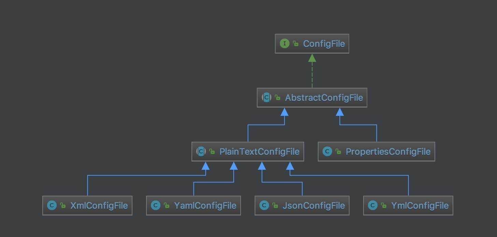

# Apollo 源码解析 —— 客户端 API 配置（三）之 ConfigFile

## 概述

ConfigFile 接口及其子类，关系如下图：



从实现上，ConfigFile 和 Config 超级类似，不同的是，Config 基于 KV 数据结构， 而 ConfigFile 基于 String 数据结构。

## AbstractConfigFile

`com.ctrip.framework.apollo.internals.AbstractConfigFile` ，实现 ConfigFile、RepositoryChangeListener 接口，ConfigFile 抽象类，实现了 1）异步通知监听器、2）计算属性变化等等特性，是 AbstractConfig + DefaultConfig 的功能子集。

### 构造方法

```java
private static final Logger logger = LoggerFactory.getLogger(AbstractConfigFile.class);

private static ExecutorService m_executorService;

protected String m_namespace;

private List<ConfigFileChangeListener> m_listeners = Lists.newCopyOnWriteArrayList();

protected ConfigRepository m_configRepository;

protected AtomicReference<Properties> m_configProperties;

static {
    m_executorService = Executors.newCachedThreadPool(ApolloThreadFactory.create("ConfigFile", true));
}

public AbstractConfigFile(String namespace, ConfigRepository configRepository) {
    m_configRepository = configRepository;
    m_namespace = namespace;
    m_configProperties = new AtomicReference<>();
    initialize();
}

private void initialize() {
    try {
        m_configProperties.set(m_configRepository.getConfig());
    } catch (Throwable ex) {
        Tracer.logError(ex);
        logger.warn("Init Apollo Config File failed - namespace: {}, reason: {}.", m_namespace, ExceptionUtil.getDetailMessage(ex));
    } finally {
        //register the change listener no matter config repository is working or not
        //so that whenever config repository is recovered, config could get changed
        m_configRepository.addChangeListener(this);
    }
}
```

### 获得 Namespace 名字

```java
@Override
public String getNamespace() {
    return m_namespace;
}
```

### 添加配置变更监听器

```java
@Override
public void addChangeListener(ConfigFileChangeListener listener) {
    if (!m_listeners.contains(listener)) {
        m_listeners.add(listener);
    }
}
```

### 触发配置变更监听器们

```java
private void fireConfigChange(final ConfigFileChangeEvent changeEvent) {
    for (final ConfigFileChangeListener listener : m_listeners) {
        m_executorService.submit(new Runnable() {
            @Override
            public void run() {
                String listenerName = listener.getClass().getName();
                Transaction transaction = Tracer.newTransaction("Apollo.ConfigFileChangeListener", listenerName);
                try {
                    listener.onChange(changeEvent);
                    transaction.setStatus(Transaction.SUCCESS);
                } catch (Throwable ex) {
                    transaction.setStatus(ex);
                    Tracer.logError(ex);
                    logger.error("Failed to invoke config file change listener {}", listenerName, ex);
                } finally {
                    transaction.complete();
                }
            }
        });
    }
}
```

### onRepositoryChange

`#onRepositoryChange(namespace, newProperties)` 方法，当 ConfigRepository 读取到配置发生变更时，计算配置变更集合，并通知监听器们。代码如下：

```java
@Override
public synchronized void onRepositoryChange(String namespace, Properties newProperties) {
    if (newProperties.equals(m_configProperties.get())) {
        return;
    }
    Properties newConfigProperties = new Properties();
    newConfigProperties.putAll(newProperties);

    String oldValue = getContent();
    update(newProperties);
    String newValue = getContent();

    PropertyChangeType changeType = PropertyChangeType.MODIFIED;
    if (oldValue == null) {
        changeType = PropertyChangeType.ADDED;
    } else if (newValue == null) {
        changeType = PropertyChangeType.DELETED;
    }

    this.fireConfigChange(new ConfigFileChangeEvent(m_namespace, oldValue, newValue, changeType));

    Tracer.logEvent("Apollo.Client.ConfigChanges", m_namespace);
}
```

调用 `#update(newProperties)` 抽象方法，更新为【新】值。该方法需要子类自己去实现。抽象方法如下：

```java
protected abstract void update(Properties newProperties);
```

## PropertiesConfigFile

`com.ctrip.framework.apollo.internals.PropertiesConfigFile` ，实现 AbstractConfigFile 抽象类，类型为 .properties 的 ConfigFile 实现类。

### 构造方法

```java
private static final Logger logger = LoggerFactory.getLogger(PropertiesConfigFile.class);

protected AtomicReference<String> m_contentCache;

public PropertiesConfigFile(String namespace, ConfigRepository configRepository) {
    super(namespace, configRepository);
    m_contentCache = new AtomicReference<>();
}
```

因为 Properties 是 KV 数据结构，需要将多条 KV 拼接成一个字符串，进行缓存到 m_contentCache 中。

### 更新内容

```java
@Override
protected void update(Properties newProperties) {
    m_configProperties.set(newProperties);
    m_contentCache.set(null);
}
```

### 获得内容

```java
@Override
public String getContent() {
    if (m_contentCache.get() == null) {
        m_contentCache.set(doGetContent());
    }
    return m_contentCache.get();
}

String doGetContent() {
    if (!this.hasContent()) {
        return null;
    }
    try {
        return PropertiesUtil.toString(m_configProperties.get());
    } catch (Throwable ex) {
        ApolloConfigException exception =  new ApolloConfigException(String.format("Parse properties file content failed for namespace: %s, cause: %s", m_namespace, ExceptionUtil.getDetailMessage(ex)));
        Tracer.logError(exception);
        throw exception;
    }
}

@Override
public boolean hasContent() {
    return m_configProperties.get() != null && !m_configProperties.get().isEmpty();
}
```

调用 `PropertiesUtil#toString(Properties)` 方法，将 Properties 拼接成字符串。代码如下：

```java
public static String toString(Properties properties) throws IOException {
    StringWriter writer = new StringWriter();
    properties.store(writer, null);
    StringBuffer stringBuffer = writer.getBuffer();
    filterPropertiesComment(stringBuffer);
    return stringBuffer.toString();
}

static boolean filterPropertiesComment(StringBuffer stringBuffer) {
    //check whether has comment in the first line
    if (stringBuffer.charAt(0) != '#') {
        return false;
    }
    int commentLineIndex = stringBuffer.indexOf("\n");
    if (commentLineIndex == -1) {
        return false;
    }
    stringBuffer.delete(0, commentLineIndex + 1);
    return true;
}
```

因为 `Properties#store(writer, null)` 方法，会自动在首行，添加注释时间。代码如下：

```java
private void store0(BufferedWriter bw, String comments, boolean escUnicode)
    throws IOException
{
    if (comments != null) {
        writeComments(bw, comments);
    }
    bw.write("#" + new Date().toString());
    bw.newLine();
    synchronized (this) {
        for (Enumeration<?> e = keys(); e.hasMoreElements();) {
            String key = (String)e.nextElement();
            String val = (String)get(key);
            key = saveConvert(key, true, escUnicode);
            /* No need to escape embedded and trailing spaces for value, hence
             * pass false to flag.
             */
            val = saveConvert(val, false, escUnicode);
            bw.write(key + "=" + val);
            bw.newLine();
        }
    }
    bw.flush();
}
```

从实现代码，我们可以看出，拼接的字符串，每一行一个 KV 属性。例子如下：

```
key2=value2
key1=value1
```

### 获得 Namespace 名字

```java
@Override
public ConfigFileFormat getConfigFileFormat() {
    return ConfigFileFormat.Properties;
}
```

## PlainTextConfigFile

`com.ctrip.framework.apollo.internals.PlainTextConfigFile` ，实现 AbstractConfigFile 抽象类，纯文本 ConfigFile 抽象类，例如 xml yaml 等等。

### 更新内容

```java
@Override
protected void update(Properties newProperties) {
    m_configProperties.set(newProperties);
}
```

### 获得内容

```java
@Override
public String getContent() {
    if (!this.hasContent()) {
        return null;
    }
    return m_configProperties.get().getProperty(ConfigConsts.CONFIG_FILE_CONTENT_KEY);
}

@Override
public boolean hasContent() {
    if (m_configProperties.get() == null) {
        return false;
    }
    return m_configProperties.get().containsKey(ConfigConsts.CONFIG_FILE_CONTENT_KEY);
}
```

直接从 "content" 配置项，获得配置文本。这也是为什么类名以 PlainText 开头的原因。

PlainTextConfigFile 的子类，代码基本一致，差别在于 #getConfigFileFormat() 实现方法，返回不同的 ConfigFileFormat 。

### XmlConfigFile

`com.ctrip.framework.apollo.internals.XmlConfigFile` ，实现 PlainTextConfigFile 抽象类，类型为 .xml 的 ConfigFile 实现类。代码如下：

```java
public class XmlConfigFile extends PlainTextConfigFile {

    public XmlConfigFile(String namespace, ConfigRepository configRepository) {
        super(namespace, configRepository);
    }

    @Override
    public ConfigFileFormat getConfigFileFormat() {
        return ConfigFileFormat.XML;
    }

}
```

### JsonConfigFile

`com.ctrip.framework.apollo.internals.JsonConfigFile` ，实现 PlainTextConfigFile 抽象类，类型为 .json 的 ConfigFile 实现类。代码如下：

```java
public class JsonConfigFile extends PlainTextConfigFile {

    public JsonConfigFile(String namespace,
                          ConfigRepository configRepository) {
        super(namespace, configRepository);
    }

    @Override
    public ConfigFileFormat getConfigFileFormat() {
        return ConfigFileFormat.JSON;
    }

}
```

### YamlConfigFile

`com.ctrip.framework.apollo.internals.YamlConfigFile` ，实现 PlainTextConfigFile 抽象类，类型为 .yaml 的 ConfigFile 实现类。代码如下：

```java
public class YamlConfigFile extends PlainTextConfigFile {

    public YamlConfigFile(String namespace, ConfigRepository configRepository) {
        super(namespace, configRepository);
    }

    @Override
    public ConfigFileFormat getConfigFileFormat() {
        return ConfigFileFormat.YAML;
    }

}
```

### YmlConfigFile

`com.ctrip.framework.apollo.internals.YmlConfigFile` ，实现 PlainTextConfigFile 抽象类，类型为 .yaml 的 ConfigFile 实现类。代码如下：

```java
public class YmlConfigFile extends PlainTextConfigFile {

    public YmlConfigFile(String namespace, ConfigRepository configRepository) {
        super(namespace, configRepository);
    }

    @Override
    public ConfigFileFormat getConfigFileFormat() {
        return ConfigFileFormat.YML;
    }
    
}
```