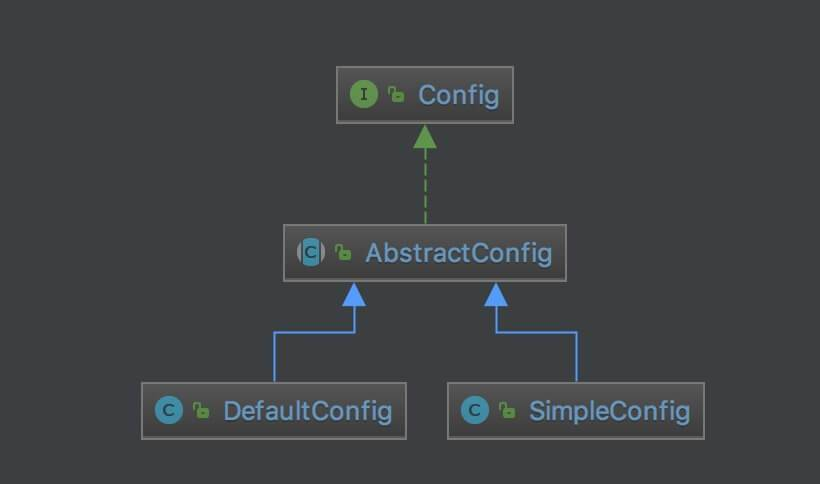

# Apollo 源码解析 —— 客户端 API 配置（二）之 Config

## 概述

本文介绍config接口及其子类，如下图：



## AbstractConfig

`com.ctrip.framework.apollo.internals.AbstractConfig` ，实现 Config 接口，Config 抽象类，实现了1）缓存读取属性值、2）异步通知监听器、3）计算属性变化等等特性。

### 构造方法

```java
private static final Logger logger = LoggerFactory.getLogger(AbstractConfig.class);

private static ExecutorService m_executorService;

private List<ConfigChangeListener> m_listeners = Lists.newCopyOnWriteArrayList();
private ConfigUtil m_configUtil;
private volatile Cache<String, Integer> m_integerCache;
private volatile Cache<String, Long> m_longCache;
private volatile Cache<String, Short> m_shortCache;
private volatile Cache<String, Float> m_floatCache;
private volatile Cache<String, Double> m_doubleCache;
private volatile Cache<String, Byte> m_byteCache;
private volatile Cache<String, Boolean> m_booleanCache;
private volatile Cache<String, Date> m_dateCache;
private volatile Cache<String, Long> m_durationCache;

private Map<String, Cache<String, String[]>> m_arrayCache; // 并发 Map

private List<Cache> allCaches;

private AtomicLong m_configVersion; //indicate config version

static {
    m_executorService = Executors.newCachedThreadPool(ApolloThreadFactory.create("Config", true));
}

public AbstractConfig() {
    m_configUtil = ApolloInjector.getInstance(ConfigUtil.class);
    m_configVersion = new AtomicLong();
    m_arrayCache = Maps.newConcurrentMap();
    allCaches = Lists.newArrayList();
}
```

* Cache 对象，使用 #newCache() 方法创建，代码如下：
    ```java
    private <T> Cache<String, T> newCache() {
        Cache<String, T> cache = CacheBuilder.newBuilder()
            .maximumSize(m_configUtil.getMaxConfigCacheSize())
            .expireAfterAccess(m_configUtil.getConfigCacheExpireTime(), m_configUtil.getConfigCacheExpireTimeUnit())
            .build();
        allCaches.add(cache);
        return cache;
    }
    ```
* `allCaches` 字段，上述 Cache 对象集合，用于 #clearConfigCache() 方法，清空缓存。代码如下：
    ```java
    protected void clearConfigCache() {
        synchronized (this) {
        for (Cache c : allCaches) {
            if (c != null) {
                c.invalidateAll();
            }
        }
        m_configVersion.incrementAndGet();
        }
    }
    ```
### 获得属性值

AbstractConfig 实现了所有的获得属性值的方法，除了 `#getProperty(key, defaultValue)` 方法。我们以 `#getIntProperty(key, defaultValue)` 方法，举例子。代码如下：

```java
@Override
public Integer getIntProperty(String key, Integer defaultValue) {
    try {
        if (m_integerCache == null) {
            synchronized (this) {
                if (m_integerCache == null) {
                    m_integerCache = newCache();
                }
            }
        }
        return getValueFromCache(key, Functions.TO_INT_FUNCTION, m_integerCache, defaultValue);
    } catch (Throwable ex) {
        Tracer.logError(new ApolloConfigException(
                String.format("getIntProperty for %s failed, return default value %d", key,
                        defaultValue), ex));
    }
    return defaultValue;
}
```

`#getValueFromCache(key, Function, cache, defaultValue)` 方法，代码如下：

```java
private <T> T getValueFromCache(String key, Function<String, T> parser, Cache<String, T> cache, T defaultValue) {
    T result = cache.getIfPresent(key);
    if (result != null) {
        return result;
    }
    return getValueAndStoreToCache(key, parser, cache, defaultValue);
}
```

优先，从缓存中，获得属性值。若获取不到，调用 `#getValueAndStoreToCache(key, Function, cache, defaultValue)` 方法，获得值，并更新到缓存。

`#getValueAndStoreToCache(key, Function, cache, defaultValue)` 方法，代码如下：

```java
private <T> T getValueAndStoreToCache(String key, Function<String, T> parser, Cache<String, T> cache, T defaultValue) {
    long currentConfigVersion = m_configVersion.get();
    String value = getProperty(key, null);
    if (value != null) {
        T result = parser.apply(value);
        if (result != null) {
            synchronized (this) {
                if (m_configVersion.get() == currentConfigVersion) {
                    cache.put(key, result);
                }
            }
            return result;
        }
    }
    return defaultValue;
}
```

### Functions

`com.ctrip.framework.apollo.util.function.Functions` ，枚举了所有解析字符串成对应数据类型的 Function 。代码如下：

```java
public interface Functions {

    Function<String, Integer> TO_INT_FUNCTION = new Function<String, Integer>() {
        @Override
        public Integer apply(String input) {
            return Integer.parseInt(input);
        }
    };
    Function<String, Long> TO_LONG_FUNCTION = new Function<String, Long>() {
        @Override
        public Long apply(String input) {
            return Long.parseLong(input);
        }
    };
    Function<String, Short> TO_SHORT_FUNCTION = new Function<String, Short>() {
        @Override
        public Short apply(String input) {
            return Short.parseShort(input);
        }
    };
    Function<String, Float> TO_FLOAT_FUNCTION = new Function<String, Float>() {
        @Override
        public Float apply(String input) {
            return Float.parseFloat(input);
        }
    };
    Function<String, Double> TO_DOUBLE_FUNCTION = new Function<String, Double>() {
        @Override
        public Double apply(String input) {
            return Double.parseDouble(input);
        }
    };
    Function<String, Byte> TO_BYTE_FUNCTION = new Function<String, Byte>() {
        @Override
        public Byte apply(String input) {
            return Byte.parseByte(input);
        }
    };
    Function<String, Boolean> TO_BOOLEAN_FUNCTION = new Function<String, Boolean>() {
        @Override
        public Boolean apply(String input) {
            return Boolean.parseBoolean(input);
        }
    };
    Function<String, Date> TO_DATE_FUNCTION = new Function<String, Date>() {
        @Override
        public Date apply(String input) {
            try {
                return Parsers.forDate().parse(input);
            } catch (ParserException ex) {
                throw new ApolloConfigException("Parse date failed", ex);
            }
        }
    };
    Function<String, Long> TO_DURATION_FUNCTION = new Function<String, Long>() {
        @Override
        public Long apply(String input) {
            try {
                return Parsers.forDuration().parseToMillis(input);
            } catch (ParserException ex) {
                throw new ApolloConfigException("Parse duration failed", ex);
            }
        }
    };

}
```

* `TO_DATE_FUNCTION` 和 `TO_DURATION_FUNCTION` ，具体的解析，使用 `com.ctrip.framework.apollo.util.parser.Parsers`

### 计算配置变更集合

```java
List<ConfigChange> calcPropertyChanges(String namespace, Properties previous, Properties current) {
    if (previous == null) {
        previous = new Properties();
    }

    if (current == null) {
        current = new Properties();
    }

    Set<String> previousKeys = previous.stringPropertyNames();
    Set<String> currentKeys = current.stringPropertyNames();

    Set<String> commonKeys = Sets.intersection(previousKeys, currentKeys); // 交集
    Set<String> newKeys = Sets.difference(currentKeys, commonKeys); // 新集合 - 交集 = 新增
    Set<String> removedKeys = Sets.difference(previousKeys, commonKeys); // 老集合 - 交集 = 移除

    List<ConfigChange> changes = Lists.newArrayList();
    // 计算新增的
    for (String newKey : newKeys) {
        changes.add(new ConfigChange(namespace, newKey, null, current.getProperty(newKey), PropertyChangeType.ADDED));
    }
    // 计算移除的
    for (String removedKey : removedKeys) {
        changes.add(new ConfigChange(namespace, removedKey, previous.getProperty(removedKey), null, PropertyChangeType.DELETED));
    }
    // 计算修改的
    for (String commonKey : commonKeys) {
        String previousValue = previous.getProperty(commonKey);
        String currentValue = current.getProperty(commonKey);
        if (Objects.equal(previousValue, currentValue)) {
            continue;
        }
        changes.add(new ConfigChange(namespace, commonKey, previousValue, currentValue, PropertyChangeType.MODIFIED));
    }

    return changes;
}
```

### 添加配置变更监听器

```java
@Override
public void addChangeListener(ConfigChangeListener listener) {
    if (!m_listeners.contains(listener)) {
        m_listeners.add(listener);
    }
}
```

### 触发配置变更监听器们

```java
protected void fireConfigChange(final ConfigChangeEvent changeEvent) {
    // 缓存 ConfigChangeListener 数组
    for (final ConfigChangeListener listener : m_listeners) {
        m_executorService.submit(new Runnable() {
            @Override
            public void run() {
                String listenerName = listener.getClass().getName();
                Transaction transaction = Tracer.newTransaction("Apollo.ConfigChangeListener", listenerName);
                try {
                    // 通知监听器
                    listener.onChange(changeEvent);
                    transaction.setStatus(Transaction.SUCCESS);
                } catch (Throwable ex) {
                    transaction.setStatus(ex);
                    Tracer.logError(ex);
                    logger.error("Failed to invoke config change listener {}", listenerName, ex);
                } finally {
                    transaction.complete();
                }
            }
        });
    }
}
```

提交到线程池中，异步并发通知监听器们，从而避免有些监听器执行时间过长。

## DefaultConfig

`com.ctrip.framework.apollo.internals.DefaultConfig` ，实现 RepositoryChangeListener 接口，继承 AbstractConfig 抽象类，默认 Config 实现类。

### 构造方法

```java
private static final Logger logger = LoggerFactory.getLogger(DefaultConfig.class);

private final String m_namespace;

private AtomicReference<Properties> m_configProperties;

private ConfigRepository m_configRepository;

private Properties m_resourceProperties;

private RateLimiter m_warnLogRateLimiter;

public DefaultConfig(String namespace, ConfigRepository configRepository) {
    m_namespace = namespace;
    m_resourceProperties = loadFromResource(m_namespace);
    m_configRepository = configRepository;
    m_configProperties = new AtomicReference<>();
    m_warnLogRateLimiter = RateLimiter.create(0.017); // 1 warning log output per minute

    initialize();
}
```

* `m_namespace` 字段，Namespace 的名字。
* `m_configProperties` 字段，配置 Properties 的缓存引用。
* `m_configRepository` 字段，配置 Repository 。DefaultConfig 会从 ConfigRepository 中，加载配置 Properties ，并更新到 m_configProperties 中。
    * `#initialize()` 方法，初始拉取 ConfigRepository 的配置，更新到 m_configProperties 中，并注册自己到 ConfigRepository 为监听器。代码如下：
    ```java
    private void initialize() {
            // 初始化 m_configProperties
            m_configProperties.set(m_configRepository.getConfig());
        } catch (Throwable ex) {
            Tracer.logError(ex);
            logger.warn("Init Apollo Local Config failed - namespace: {}, reason: {}.", m_namespace, ExceptionUtil.getDetailMessage(ex));
        } finally {
            // register the change listener no matter config repository is working or not
            // so that whenever config repository is recovered, config could get changed
            m_configRepository.addChangeListener(this);
        }
    }
    ```
* `m_resourceProperties` 字段，项目下，Namespace 对应的配置文件的 Properties 。代码如下：
    ```java
    private Properties loadFromResource(String namespace) {
        String name = String.format("META-INF/config/%s.properties", namespace);
        InputStream in = ClassLoaderUtil.getLoader().getResourceAsStream(name);
        Properties properties = null;
        if (in != null) {
            properties = new Properties();
            try {
                properties.load(in);
            } catch (IOException ex) {
                Tracer.logError(ex);
                logger.error("Load resource config for namespace {} failed", namespace, ex);
            } finally {
                try {
                    in.close();
                } catch (IOException ex) {
                    // ignore
                }
            }
        }
        return properties;
    }
    ```
    * 读取属性的优先级上，`m_configProperties` > `m_resourceProperties` 。

### 获得属性值

```java
@Override
public String getProperty(String key, String defaultValue) {
    // step 1: check system properties, i.e. -Dkey=value
    String value = System.getProperty(key);

    // step 2: check local cached properties file
    if (value == null && m_configProperties.get() != null) {
        value = m_configProperties.get().getProperty(key);
    }

    /**
     * step 3: check env variable, i.e. PATH=... 
     * normally system environment variables are in UPPERCASE, however there might be exceptions.
     * so the caller should provide the key in the right case
     */
    if (value == null) {
        value = System.getenv(key);
    }

    // step 4: check properties file from classpath
    if (value == null && m_resourceProperties != null) {
        value = (String) m_resourceProperties.get(key);
    }

    if (value == null && m_configProperties.get() == null && m_warnLogRateLimiter.tryAcquire()) {
        logger.warn("Could not load config for namespace {} from Apollo, please check whether the configs are released in Apollo! Return default value now!", m_namespace);
    }

    return value == null ? defaultValue : value;
}
```

### 获得属性名集合

```java
@Override
public Set<String> getPropertyNames() {
    Properties properties = m_configProperties.get();
    if (properties == null) {
        return Collections.emptySet();
    }
    return properties.stringPropertyNames();
}
```

### 计算配置变更集合

因为 DefaultConfig 有多个属性源，所以需要在 `AbstractConfig#calcPropertyChanges(...)` 方法的基础上，进一步计算。代码如下：

```java
private Map<String, ConfigChange> updateAndCalcConfigChanges(Properties newConfigProperties) {
    List<ConfigChange> configChanges = calcPropertyChanges(m_namespace, m_configProperties.get(), newConfigProperties);

    ImmutableMap.Builder<String, ConfigChange> actualChanges = new ImmutableMap.Builder<>();

    /** === Double check since DefaultConfig has multiple config sources ==== **/

    // 1. use getProperty to update configChanges's old value
    for (ConfigChange change : configChanges) {
        change.setOldValue(this.getProperty(change.getPropertyName(), change.getOldValue()));
    }

    //2. update m_configProperties
    m_configProperties.set(newConfigProperties);
    clearConfigCache();

    //3. use getProperty to update configChange's new value and calc the final changes
    for (ConfigChange change : configChanges) {
        change.setNewValue(this.getProperty(change.getPropertyName(), change.getNewValue()));
        switch (change.getChangeType()) {
            case ADDED:
                if (Objects.equals(change.getOldValue(), change.getNewValue())) {
                    break;
                }
                if (change.getOldValue() != null) {
                    change.setChangeType(PropertyChangeType.MODIFIED);
                }
                actualChanges.put(change.getPropertyName(), change);
                break;
            case MODIFIED:
                if (!Objects.equals(change.getOldValue(), change.getNewValue())) {
                    actualChanges.put(change.getPropertyName(), change);
                }
                break;
            case DELETED:
                if (Objects.equals(change.getOldValue(), change.getNewValue())) {
                    break;
                }
                if (change.getNewValue() != null) {
                    change.setChangeType(PropertyChangeType.MODIFIED);
                }
                actualChanges.put(change.getPropertyName(), change);
                break;
            default:
                //do nothing
                break;
        }
    }
    return actualChanges.build();
}
```

### onRepositoryChange

`#onRepositoryChange(namespace, newProperties)` 方法，当 ConfigRepository 读取到配置发生变更时，计算配置变更集合，并通知监听器们。代码如下：

```java
@Override
public synchronized void onRepositoryChange(String namespace, Properties newProperties) {
    if (newProperties.equals(m_configProperties.get())) {
        return;
    }
    Properties newConfigProperties = new Properties();
    newConfigProperties.putAll(newProperties);

    Map<String, ConfigChange> actualChanges = updateAndCalcConfigChanges(newConfigProperties);
    // check double checked result
    if (actualChanges.isEmpty()) {
        return;
    }

    this.fireConfigChange(new ConfigChangeEvent(m_namespace, actualChanges));

    Tracer.logEvent("Apollo.Client.ConfigChanges", m_namespace);
}
```

## SimpleConfig

`com.ctrip.framework.apollo.internals.SimpleConfig` ，实现 RepositoryChangeListener 接口，继承 AbstractConfig 抽象类，精简的 Config 实现类。

从目前代码看来下，用于单元测试。相比 DefaultConfig 来说，少一些特性，大体是相同的。