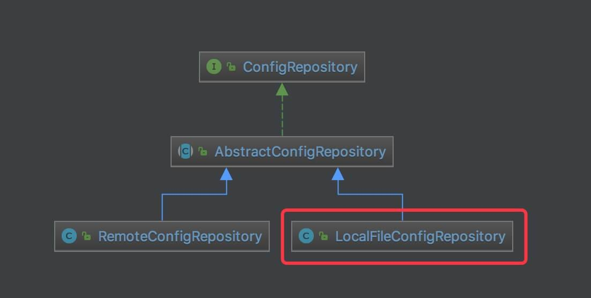

# Apollo 源码解析 —— 客户端 API 配置（四）之 ConfigRepository

## 概述

本文分享 ConfigRepository 接口，及其子类，如下图：



ConfigRepository、AbstractConfigRepository、RemoteConfigRepository ，在 《Apollo 源码解析 —— Client 轮询配置》 中已经完整解析，所以本文仅分享 LocalConfigRepository 的实现。

## LocalFileConfigRepository

`com.ctrip.framework.apollo.internals.LocalFileConfigRepository` ，实现 RepositoryChangeListener 接口，继承 AbstractConfigRepository 抽象类，本地文件配置 Repository 实现类。

### 构造方法

```java
private static final String CONFIG_DIR = "/config-cache";

private final String m_namespace;

private File m_baseDir;

private final ConfigUtil m_configUtil;

private volatile Properties m_fileProperties;

private volatile ConfigRepository m_upstream;

/**
 * Constructor.
 *
 * @param namespace the namespace
 */
public LocalFileConfigRepository(String namespace) {
    this(namespace, null);
}

public LocalFileConfigRepository(String namespace, ConfigRepository upstream) {
    m_namespace = namespace;
    m_configUtil = ApolloInjector.getInstance(ConfigUtil.class);
    this.setLocalCacheDir(findLocalCacheDir(), false);
    this.setUpstreamRepository(upstream);
    this.trySync();
}
```

* `m_baseDir` 字段，本地缓存配置文件目录 。
* `m_fileProperties` 字段，配置文件 Properties 。
* `m_upstream` 字段，上游的 ConfigRepository 对象。一般情况下，使用 RemoteConfigRepository 对象，读取远程 Config Service 的配置。在构造方法中，调用 #setUpstreamRepository(ConfigRepository) 方法，设置 m_upstream 属性，初始拉取 Config Service 的配置，并监听配置变化。
* 调用 `#trySync()` 方法，同步配置。

### findLocalCacheDir

`#findLocalCacheDir()` 方法，获得本地缓存目录。代码如下：

```java
private File findLocalCacheDir() {
    try {
        String defaultCacheDir = m_configUtil.getDefaultLocalCacheDir();
        Path path = Paths.get(defaultCacheDir);
        if (!Files.exists(path)) {
            Files.createDirectories(path);
        }
        if (Files.exists(path) && Files.isWritable(path)) {
            return new File(defaultCacheDir, CONFIG_DIR);
        }
    } catch (Throwable ex) {
        //ignore
    }
    return new File(ClassLoaderUtil.getClassPath(), CONFIG_DIR);
}
```

* 调用 `ConfigUtil#getDefaultLocalCacheDir()` 方法，获得默认缓存配置目录。代码如下：
    ```java
    public String getDefaultLocalCacheDir() {
        String cacheRoot = isOSWindows() ? "C:\\opt\\data\\%s" : "/opt/data/%s";
        return String.format(cacheRoot, getAppId()); // appId
    }
    ```
* 调用 `Files#exists(path)` 方法，判断若默认缓存配置目录不存在，进行创建。但是，可能我们的应用程序没有该目录的权限，此时会导致创建失败。那么就有会出现两种情况：
    * 第一种，有权限，使用 /opt/data/${appId}/ + config-cache 目录。
    * 第二种，无权限，使用 ClassPath/ + config-cache 目录。这个目录，应用程序下，肯定是有权限的。

### setLocalCacheDir

调用 `#setLocalCacheDir(baseDir, syncImmediately)` 方法，设置 m_baseDir 字段。代码如下：

```java
void setLocalCacheDir(File baseDir, boolean syncImmediately) {
    m_baseDir = baseDir;
    this.checkLocalConfigCacheDir(m_baseDir);
    if (syncImmediately) {
        this.trySync();
    }
}
```

* 调用 `#checkLocalConfigCacheDir(baseDir)` 方法，校验本地缓存配置目录是否存在。若不存在，则进行创建。
* 若 `syncImmediately = true` ，则进行同步。目前仅在单元测试中，会出现这种情况。正式的代码，`syncImmediately = false` 。

#### checkLocalConfigCacheDir

```java
private void checkLocalConfigCacheDir(File baseDir) {
    if (baseDir.exists()) {
        return;
    }
    Transaction transaction = Tracer.newTransaction("Apollo.ConfigService", "createLocalConfigDir");
    transaction.addData("BaseDir", baseDir.getAbsolutePath());
    try {
        Files.createDirectory(baseDir.toPath());
        transaction.setStatus(Transaction.SUCCESS);
    } catch (IOException ex) {
        ApolloConfigException exception = new ApolloConfigException(String.format("Create local config directory %s failed", baseDir.getAbsolutePath()), ex);
        Tracer.logError(exception);
        transaction.setStatus(exception);
        logger.warn("Unable to create local config cache directory {}, reason: {}. Will not able to cache config file.", baseDir.getAbsolutePath(), ExceptionUtil.getDetailMessage(ex));
    } finally {
        transaction.complete();
    }
}
```

#### assembleLocalCacheFile

那么完整的缓存配置文件到底路径是什么呢？`${baseDir}/config-cache/ + ${appId}+${cluster} + ${namespace}.properties` ，即 `#assembleLocalCacheFile(baseDir, namespace)` 方法，拼接完整的本地缓存配置文件的地址。代码如下：

```java
File assembleLocalCacheFile(File baseDir, String namespace) {
    String fileName = String.format("%s.properties", Joiner.on(ConfigConsts.CLUSTER_NAMESPACE_SEPARATOR)
            .join(m_configUtil.getAppId(), m_configUtil.getCluster(), namespace));
    return new File(baseDir, fileName);
}
```

#### loadFromLocalCacheFile

`#loadFromLocalCacheFile(baseDir, namespace)` 方法，从缓存配置文件，读取 Properties 。代码如下：

```java
private Properties loadFromLocalCacheFile(File baseDir, String namespace) {
    Preconditions.checkNotNull(baseDir, "Basedir cannot be null");
    File file = assembleLocalCacheFile(baseDir, namespace);
    Properties properties;
    if (file.isFile() && file.canRead()) {
        InputStream in = null;
        try {
            in = new FileInputStream(file);
            properties = new Properties();
            properties.load(in);
            logger.debug("Loading local config file {} successfully!", file.getAbsolutePath());
        } catch (IOException ex) {
            Tracer.logError(ex);
            throw new ApolloConfigException(String.format("Loading config from local cache file %s failed", file.getAbsolutePath()), ex);
        } finally {
            try {
                if (in != null) {
                    in.close();
                }
            } catch (IOException ex) {
                // ignore
            }
        }
    } else {
        throw new ApolloConfigException(String.format("Cannot read from local cache file %s", file.getAbsolutePath()));
    }
    return properties;
}
```

#### persistLocalCacheFile

`#persistLocalCacheFile(baseDir, namespace)` 方法，向缓存配置文件，写入 Properties 。代码如下：

```java
void persistLocalCacheFile(File baseDir, String namespace) {
    if (baseDir == null) {
        return;
    }
    File file = assembleLocalCacheFile(baseDir, namespace);
    OutputStream out = null;
    Transaction transaction = Tracer.newTransaction("Apollo.ConfigService", "persistLocalConfigFile");
    transaction.addData("LocalConfigFile", file.getAbsolutePath());
    try {
        out = new FileOutputStream(file);
        m_fileProperties.store(out, "Persisted by DefaultConfig"); // 写入
        transaction.setStatus(Transaction.SUCCESS);
    } catch (IOException ex) {
        ApolloConfigException exception = new ApolloConfigException(String.format("Persist local cache file %s failed", file.getAbsolutePath()), ex);
        Tracer.logError(exception);
        transaction.setStatus(exception);
        logger.warn("Persist local cache file {} failed, reason: {}.", file.getAbsolutePath(), ExceptionUtil.getDetailMessage(ex));
    } finally {
        if (out != null) {
            try {
                out.close();
            } catch (IOException ex) {
                //ignore
            }
        }
        transaction.complete();
    }
}
```

#### updateFileProperties

`#updateFileProperties(newProperties)` 方法，若 Properties 发生变化，向缓存配置文件，写入 Properties 。代码如下：

```java
private synchronized void updateFileProperties(Properties newProperties) {
    if (newProperties.equals(m_fileProperties)) {
        return;
    }
    this.m_fileProperties = newProperties;
    persistLocalCacheFile(m_baseDir, m_namespace);
}
```

### setUpstreamRepository

`#setUpstreamRepository(ConfigRepository)` 方法，设置 m_upstream 属性，初始拉取 Config Service 的配置，并监听配置变化。代码如下：

```java
@Override
  public void setUpstreamRepository(ConfigRepository upstreamConfigRepository) {
    if (upstreamConfigRepository == null) {
        return;
    }
    //clear previous listener
    if (m_upstream != null) {
         m_upstream.removeChangeListener(this);
    }
    m_upstream = upstreamConfigRepository;
    upstreamConfigRepository.addChangeListener(this);
}
```

### trySyncFromUpstream

`#trySyncFromUpstream()` 方法，从 m_upstream 拉取初始配置，并返回是否拉取成功。代码如下：

```java
private boolean trySyncFromUpstream() {
    if (m_upstream == null) {
        return false;
    }
    try {
        updateFileProperties(m_upstream.getConfig(), m_upstream.getSourceType());
        return true;
    } catch (Throwable ex) {
        Tracer.logError(ex);
        logger
        .warn("Sync config from upstream repository {} failed, reason: {}", m_upstream.getClass(),
              ExceptionUtil.getDetailMessage(ex));
    }
    return false;
}
```

### sync

在非本地模式的情况下，LocalFileConfigRepository 在初始化时，会首先从远程 Config Service 同步( 加载 )配置。若同步(加载)失败，则读取本地缓存的配置文件。

在本地模式的情况下，则只读取本地缓存的配置文件。当然，严格来说，也不一定是缓存，可以是开发者，手动创建的配置文件。

实现代码如下：

```java
@Override
  protected void sync() {
    //sync with upstream immediately
    boolean syncFromUpstreamResultSuccess = trySyncFromUpstream();

    if (syncFromUpstreamResultSuccess) {
        return;
    }

    Transaction transaction = Tracer.newTransaction("Apollo.ConfigService", "syncLocalConfig");
    Throwable exception = null;
    try {
        transaction.addData("Basedir", m_baseDir.getAbsolutePath());
        m_fileProperties = this.loadFromLocalCacheFile(m_baseDir, m_namespace);
        m_sourceType = ConfigSourceType.LOCAL;
        transaction.setStatus(Transaction.SUCCESS);
    } catch (Throwable ex) {
        Tracer.logEvent("ApolloConfigException", ExceptionUtil.getDetailMessage(ex));
        transaction.setStatus(ex);
        exception = ex;
        //ignore
    } finally {
        transaction.complete();
    }

    if (m_fileProperties == null) {
        m_sourceType = ConfigSourceType.NONE;
        throw new ApolloConfigException(
            "Load config from local config failed!", exception);
    }
}
```

### onRepositoryChange

当 RemoteRepositoryConfig 读取到配置变更时，调用 `#onRepositoryChange(name, newProperties)` 方法，更新 m_fileProperties ，并通知监听器们。代码如下：

```java
@Override
  public void onRepositoryChange(String namespace, Properties newProperties) {
    if (newProperties.equals(m_fileProperties)) {
        return;
    }
    Properties newFileProperties = propertiesFactory.getPropertiesInstance();
    newFileProperties.putAll(newProperties);
    updateFileProperties(newFileProperties, m_upstream.getSourceType());
    this.fireRepositoryChange(namespace, newProperties);
}
```

### getConfig

```java
@Override
  public Properties getConfig() {
    if (m_fileProperties == null) {
        sync();
    }
    Properties result = propertiesFactory.getPropertiesInstance();
    result.putAll(m_fileProperties);
    return result;
}
```