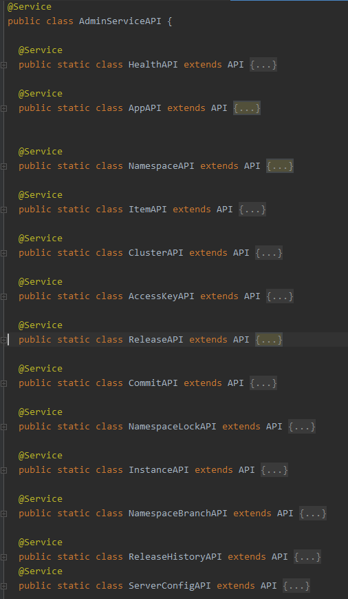

# Apollo源码分析——创建App

## 创建App

由于`Portal`与`Admin Service`所连的数据库不同，`Portal`在向`ApolloPortalDB`写完数据后，会异步调用`Admin Service`向`ApolloConfigDB`写数据。

## Portal

### AppController

创建App的入口在`apollo-portal`模块`com.ctrip.framework.apollo.portal.controller.AppController`中的`create`方法

```java
@PreAuthorize(value = "@permissionValidator.hasCreateApplicationPermission()")
@PostMapping
public App create(@Valid @RequestBody AppModel appModel) {

    App app = transformToApp(appModel);

    App createdApp = appService.createAppInLocal(app);

    publisher.publishEvent(new AppCreationEvent(createdApp));

    Set<String> admins = appModel.getAdmins();
    if (!CollectionUtils.isEmpty(admins)) {
        rolePermissionService
            .assignRoleToUsers(RoleUtils.buildAppMasterRoleName(createdApp.getAppId()),
                admins, userInfoHolder.getUser().getUserId());
    }

    return createdApp;
}
```

1. `transformToApp`将`AppModel`类型的对象转换为`App`类型的对象
2. `appService.createAppInLocal`方法将`App`对象保存到`ApolloPortalDB`数据库
3. 发布一个`AppCreationEvent`类型的事件，触发异步写`ApolloConfigDB`数据库
4. 最后授予`App`管理员的角色

### AppService

`com.ctrip.framework.apollo.portal.service.AppService`中的`createAppInLocal`方法实现保存App对象到`ApolloPortalDB`的逻辑。

```java
@Transactional
public App createAppInLocal(App app) {
    String appId = app.getAppId();
    App managedApp = appRepository.findByAppId(appId);

    if (managedApp != null) {
        throw BadRequestException.appAlreadyExists(appId);
    }

    UserInfo owner = userService.findByUserId(app.getOwnerName());
    if (owner == null) {
        throw new BadRequestException("Application's owner not exist.");
    }
    app.setOwnerEmail(owner.getEmail());

    String operator = userInfoHolder.getUser().getUserId();
    app.setDataChangeCreatedBy(operator);
    app.setDataChangeLastModifiedBy(operator);

    App createdApp = appRepository.save(app);

    appNamespaceService.createDefaultAppNamespace(appId);
    roleInitializationService.initAppRoles(createdApp);

    Tracer.logEvent(TracerEventType.CREATE_APP, appId);

    return createdApp;
}
```

1. 调用`appRepository.findByAppId`查询`appId`对应应用是否已存在，若已经存在抛出`BadRequestException`异常
2. 调用`userService.findByUserId`查询`UserInfo`对象，若用户不存在抛出`BadRequestException`异常
3. 获取当前登录用户并设置到`App`对象中
4. 调用`appRepository.save`保存`App`对象
5. 调用`appNamespaceService.createDefaultAppNamespace`创建默认的`application`命名空间
6. 调用`roleInitializationService.initAppRoles`初始化`App`角色

### AppRepository

`com.ctrip.framework.apollo.portal.repository.AppRepository`接口继承`PagingAndSortingRepository`接口，基于`Spring Data JPA`，提供`App`相关数据库操作的接口

```java
public interface AppRepository extends PagingAndSortingRepository<App, Long> {

  App findByAppId(String appId);

  List<App> findByOwnerName(String ownerName, Pageable page);

  List<App> findByAppIdIn(Set<String> appIds);

  List<App> findByAppIdIn(Set<String> appIds, Pageable pageable);

  Page<App> findByAppIdContainingOrNameContaining(String appId, String name, Pageable pageable);

  @Modifying
  @Query("UPDATE App SET IsDeleted = true, DeletedAt = ROUND(UNIX_TIMESTAMP(NOW(4))*1000), DataChange_LastModifiedBy = ?2 WHERE AppId=?1 and IsDeleted = false")
  int deleteApp(String appId, String operator);
}
```

### AppCreationEvent

`com.ctrip.framework.apollo.portal.listener.AppCreationEvent`继承自`org.springframework.context.ApplicationEvent`，通过构造方法将App对象传入

```java
public class AppCreationEvent extends ApplicationEvent {

  public AppCreationEvent(Object source) {
    super(source);
  }

  public App getApp() {
    Preconditions.checkState(source != null);
    return (App) this.source;
  }
}
```

### CreationListener

对`com.ctrip.framework.apollo.portal.listener.AppCreationEvent`事件的处理逻辑在`com.ctrip.framework.apollo.portal.listenerCreationListener`中

```java
@EventListener
public void onAppCreationEvent(AppCreationEvent event) {
    AppDTO appDTO = BeanUtils.transform(AppDTO.class, event.getApp());
    List<Env> envs = portalSettings.getActiveEnvs();
    for (Env env : envs) {
        try {
            appAPI.createApp(env, appDTO);
        } catch (Throwable e) {
            LOGGER.error("Create app failed. appId = {}, env = {})", appDTO.getAppId(), env, e);
            Tracer.logError(String.format("Create app failed. appId = %s, env = %s", appDTO.getAppId(), env), e);
        }
    }
}
```

1. `com.ctrip.framework.apollo.common.utils.BeanUtils.transform()`方法将`App`对象转换为`AppDTO`对象
2. 调用`com.ctrip.framework.apollo.portal.component.PortalSettings.getActiveEnvs()`获取有效的`Env`列表
3. 遍历`Env`列表，调用`appAPI.createApp()`方法（实际上是调用`Admin Service`的API接口）创建`App`

### AdminServiceAPI

`com.ctrip.framework.apollo.portal.api.AdminServiceAPI`是对`Admin Service`所有接口的封装



`API`是一个抽象类，内部有一个封装了重试机制的`restTemplate`实例

```java
public abstract class API {

  @Autowired
  protected RetryableRestTemplate restTemplate;

}
```

`appAPI.createApp()`方法就是通过`restTemplate`向`Admin Service`发起了创建`App`的调用。

```java
@Service
public static class AppAPI extends API {

    public AppDTO loadApp(Env env, String appId) {
        return restTemplate.get(env, "apps/{appId}", AppDTO.class, appId);
    }

    public AppDTO createApp(Env env, AppDTO app) {
        return restTemplate.post(env, "apps", app, AppDTO.class);
    }

    public void updateApp(Env env, AppDTO app) {
        restTemplate.put(env, "apps/{appId}", app, app.getAppId());
    }

    public void deleteApp(Env env, String appId, String operator) {
        restTemplate.delete(env, "/apps/{appId}?operator={operator}", appId, operator);
    }
}
```

## Admin Service

### AppController

`apollo-adminservice`模块中的`com.ctrip.framework.apollo.adminservice.controller.AppController`，它实现了前面`AppAPI`接口的逻辑

```java
@RestController
public class AppController {

    @PostMapping("/apps")
    public AppDTO create(@Valid @RequestBody AppDTO dto) {
        App entity = BeanUtils.transform(App.class, dto);
        App managedEntity = appService.findOne(entity.getAppId());
        if (managedEntity != null) {
            throw BadRequestException.appAlreadyExists(entity.getAppId());
        }

        entity = adminService.createNewApp(entity);

        return BeanUtils.transform(AppDTO.class, entity);
    }
}
```

1. 调用`com.ctrip.framework.apollo.common.utils.BeanUtils.transform`将`AppDTO`对象转换为`App`对象
2. 调用`appService.findOne`查找`App`，如果`App`已经存在抛出`BadRequestException`异常
3. 调用`adminService.createNewApp`创建`App`

### AdminService

`com.ctrip.framework.apollo.biz.service.AdminService`实现了创建和删除App的逻辑。

```java
@Service
public class AdminService {
    @Transactional
    public App createNewApp(App app) {
        String createBy = app.getDataChangeCreatedBy();
        App createdApp = appService.save(app);

        String appId = createdApp.getAppId();

        appNamespaceService.createDefaultAppNamespace(appId, createBy);

        clusterService.createDefaultCluster(appId, createBy);

        namespaceService.instanceOfAppNamespaces(appId, ConfigConsts.CLUSTER_NAME_DEFAULT, createBy);

        return app;
    }
}
```

1. 调用`appService.save`创建`App`
2. 调用`appNamespaceService.createDefaultAppNamespace`创建`App`默认的`application`命名空间
3. 调用`clusterService.createDefaultCluster`创建`App`默认的`default`集群
4. 调用`namespaceService.instanceOfAppNamespaces`创建`Cluster`默认的命名空间

### AppService

`com.ctrip.framework.apollo.biz.service.AppService`提供App的操作方法，`save`方法代码如下：

```java
@Transactional
public App save(App entity) {
    if (!isAppIdUnique(entity.getAppId())) {
      throw new ServiceException("appId not unique");
    }
    entity.setId(0);//protection
    App app = appRepository.save(entity);

    auditService.audit(App.class.getSimpleName(), app.getId(), Audit.OP.INSERT,
        app.getDataChangeCreatedBy());

    return app;
}
```

1. 调用`isAppIdUnique`判断唯一性
2. 调用`appRepository.save`创建App
3. 记录审计日志

### AppRepository

`com.ctrip.framework.apollo.biz.repository.AppRepository`继承自`org.springframework.data.repository.PagingAndSortingRepository`，提供App的数据访问能力

```java
public interface AppRepository extends PagingAndSortingRepository<App, Long> {

    @Query("SELECT a from App a WHERE a.name LIKE %:name%")
    List<App> findByName(@Param("name") String name);

    App findByAppId(String appId);
}
```