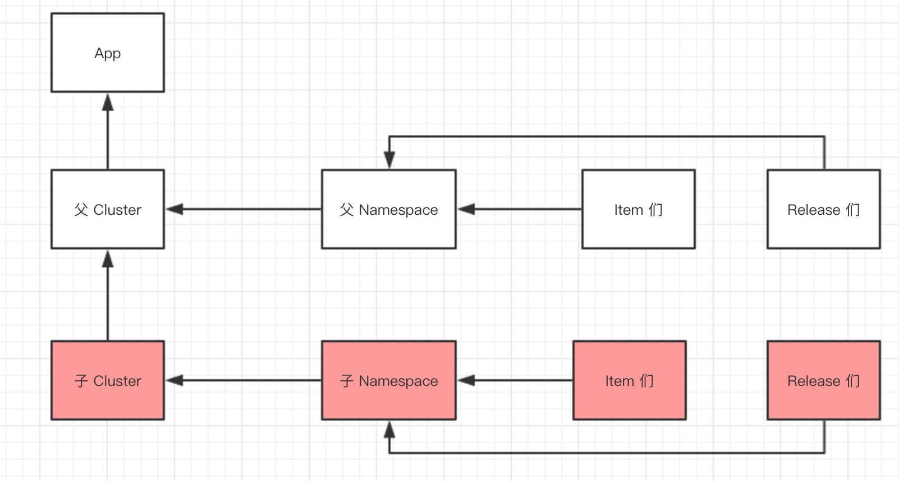

# Apollo源码分析——Portal 创建灰度

## 概述

创建灰度，调用的是创建 Namespace 分支 的 API 。通过创建的子 Namespace ，可以关联其自己定义的 Cluster、Item、Release 等等。关系如下所图所示：



* 创建 Namespace 分支时：
    * 会创建子 Cluster ，指向父 Cluster 。
    * 会创建子 Namespace ，关联子 Namespace 。实际上，子 Namespace 和 父 Namespace 无任何数据字段上的关联。
* 向子 Namespace 添加 Item 时，该 Item 指向子 Namespace 。虽然，代码实现和父 Namespace 是一模一样的。
* 子 Namespace 发布( 灰度发布 ) 和 父 Namespace 发布( 普通发布 ) 在代码实现，有一些差距，后续文章分享。
* 在目前 Apollo 的实现上，可以把分支和灰度等价。

## Portal

### NamespaceBranchController

在 `apollo-portal` 项目中，`com.ctrip.framework.apollo.portal.controller.NamespaceBranchController` ，提供 Namespace 分支的 API

`#createBranch(...)` 方法，创建 Namespace 分支。代码如下：

```java
@PreAuthorize(value = "@permissionValidator.hasModifyNamespacePermission(#appId, #namespaceName, #env)")
@PostMapping(value = "/apps/{appId}/envs/{env}/clusters/{clusterName}/namespaces/{namespaceName}/branches")
public NamespaceDTO createBranch(@PathVariable String appId,
                                 @PathVariable String env,
                                 @PathVariable String clusterName,
                                 @PathVariable String namespaceName) {

    return namespaceBranchService.createBranch(appId, Env.valueOf(env), clusterName, namespaceName);
}
```

### NamespaceBranchService

在 `apollo-portal` 项目中，`com.ctrip.framework.apollo.portal.service.NamespaceBranchService` ，提供 Namespace 分支的 Service 逻辑。

`#createBranch(appId, env, parentClusterName, namespaceName)` 方法，创建并保存 Namespace 分支。代码如下：

```java
@Transactional
public NamespaceDTO createBranch(String appId, Env env, String parentClusterName, String namespaceName) {
    String operator = userInfoHolder.getUser().getUserId();
    return createBranch(appId, env, parentClusterName, namespaceName, operator);
}

@Transactional
public NamespaceDTO createBranch(String appId, Env env, String parentClusterName, String namespaceName, String operator) {
    NamespaceDTO createdBranch = namespaceBranchAPI.createBranch(appId, env, parentClusterName, namespaceName,
            operator);

    Tracer.logEvent(TracerEventType.CREATE_GRAY_RELEASE, String.format("%s+%s+%s+%s", appId, env, parentClusterName,
            namespaceName));
    return createdBranch;

}
```

### NamespaceBranchAPI

`com.ctrip.framework.apollo.portal.api.NamespaceBranchAPI`，实现 API 抽象类，封装对 Admin Service 的 Namespace 分支模块的 API 调用。代码如下：

```java
@Service
public static class NamespaceBranchAPI extends API {

    public NamespaceDTO createBranch(String appId, Env env, String clusterName,
        String namespaceName, String operator) {
        return restTemplate
            .post(env, "/apps/{appId}/clusters/{clusterName}/namespaces/{namespaceName}/branches?operator={operator}",
                  null, NamespaceDTO.class, appId, clusterName, namespaceName, operator);
    }
}
```

## Admin Service

### NamespaceBranchController

在 `apollo-adminservice` 项目中， `com.ctrip.framework.apollo.adminservice.controller.NamespaceBranchController` ，提供 Namespace 分支的 API 。

`#createBranch(...)` 方法，创建 Namespace 分支。代码如下：

```java
@PostMapping("/apps/{appId}/clusters/{clusterName}/namespaces/{namespaceName}/branches")
public NamespaceDTO createBranch(@PathVariable String appId,
                                 @PathVariable String clusterName,
                                 @PathVariable String namespaceName,
                                 @RequestParam("operator") String operator) {

    checkNamespace(appId, clusterName, namespaceName);

    Namespace createdBranch = namespaceBranchService.createBranch(appId, clusterName, namespaceName, operator);

    return BeanUtils.transform(NamespaceDTO.class, createdBranch);
}
```

* 调用 `#checkNamespace(appId, clusterName, namespaceName)` ，校验父 Namespace 是否存在。代码如下：
    ```java
    private void checkNamespace(String appId, String clusterName, String namespaceName) {
        Namespace parentNamespace = namespaceService.findOne(appId, clusterName, namespaceName);
        if (parentNamespace == null) {
        throw BadRequestException.namespaceNotExists(appId, clusterName, namespaceName);
        }
    }
    ```
* 调用 `NamespaceBranchService#createBranch(appId, clusterName, namespaceName, operator)` 方法，创建 Namespace 分支。
* 调用 `BeanUtils#transfrom(Class<T> clazz, Object src)` 方法，将 Namespace 转换成 NamespaceDTO 对象。

### NamespaceBranchService

在 `apollo-biz` 项目中，`com.ctrip.framework.apollo.biz.service.NamespaceBranchService` ，提供 Namespace 分支的 Service 逻辑给 Admin Service 和 Config Service 。

`#createBranch(appId, clusterName, namespaceName, operator)` 方法，创建 Namespace 分支。即，新增子 Cluster 和子 Namespace 。代码如下：

```java
@Transactional
public Namespace createBranch(String appId, String parentClusterName, String namespaceName, String operator){
    Namespace childNamespace = findBranch(appId, parentClusterName, namespaceName);
    if (childNamespace != null){
        throw BadRequestException.namespaceNotExists(appId, parentClusterName, namespaceName);
    }

    Cluster parentCluster = clusterService.findOne(appId, parentClusterName);
    if (parentCluster == null || parentCluster.getParentClusterId() != 0) {
        throw BadRequestException.clusterNotExists(parentClusterName);
    }

    //create child cluster
    Cluster childCluster = createChildCluster(appId, parentCluster, namespaceName, operator);

    Cluster createdChildCluster = clusterService.saveWithoutInstanceOfAppNamespaces(childCluster);

    //create child namespace
    childNamespace = createNamespaceBranch(appId, createdChildCluster.getName(),
                                                        namespaceName, operator);
    return namespaceService.save(childNamespace);
}
```

* 调用 `#findBranch(appId, parentClusterName, namespaceName)` 方法，获得子 Namespace 对象。
* 校验若存在子 Namespace 对象，则抛出 BadRequestException 异常。一个 Namespace 有且仅允许有一个子 Namespace 。
* 调用 `ClusterService#findOne(appId, parentClusterName)` 方法，获得父 Cluster 对象。
* 校验若父 Cluster 对象不存在，则抛出 BadRequestException 异常。
* 调用 `#createChildCluster(appId, parentCluster, namespaceName, operator)` 方法，创建子 Cluster 对象。
* 调用 `ClusterService#saveWithoutInstanceOfAppNamespaces(Cluster)` 方法，保存子 Cluster 对象。
* 调用 `#createNamespaceBranch(appId, createdChildClusterName, namespaceName, operator)` 方法，创建子 Namespace 对象。
* 调用 `NamespaceService#save(childNamespace)` 方法，保存子 Namespace 对象。