[[toc]]

# Netty耗时的业务逻辑应该写在哪儿，有什么注意事项？ 

## 前言

Netty以高性能著称，但是在实际使用中，不可避免会遇到耗时的业务逻辑，那么这些耗时操作应该写在哪儿呢，有什么注意的坑吗？本篇文章将一一总结。原文：​Netty耗时的业务逻辑应该写在哪儿，有什么注意事项？

## Netty线程调度模型回顾

这部分内容前面都有总结，很简单，只要心中有一个图像就能hold住——对于Netty来说，它的每个NIO线程都对应一个转动起来的“轮盘”，即I/O事件监听+I/O事件分类处理+异步任务处理，三件事组成一个“轮盘”循环往复的转动，直到被优雅停机或者异常中断。。。大概结构如下：

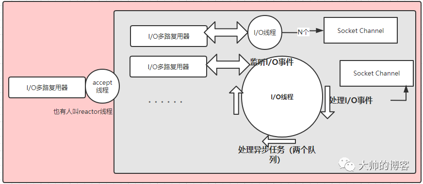

## Netty的NIO线程常见的阻塞场景

知道一个大前提：Netty的ChannelHandler是业务代码和Netty框架交汇的地方（关于pipeline机制的细节后续专题分析，先知道即可），ChannelHandler里的业务逻辑，正常来说是由NioEventLoop（NIO）线程串行执行，以Netty服务端举例，在服务端接收到新消息后，第一步要做的往往是用解码的handler解码消息的字节序列，字节序列解码后就变为了消息对象，第二步将消息对象丢给后续的业务handler处理，此时如果某个业务handler的流程非常耗时，比如需要查询数据库，那么为了避免I/O线程（也就是Netty的NIO线程）被长时间占用，需要使用额外的非I/O线程池来执行这些耗时的业务逻辑，这也是基本操作。

下面看下NIO线程常见的阻塞情况，一共两大类：

* 无意识：在ChannelHandler中编写了可能导致NIO线程阻塞的代码，但是用户没有意识到，包括但不限于查询各种数据存储器的操作、第三方服务的远程调用、中间件服务的调用、等待锁等
* 有意识：用户知道有耗时逻辑需要额外处理，但是在处理过程中翻车了，比如主动切换耗时逻辑到业务线程池或者业务的消息队列做处理时发生阻塞，最典型的有对方是阻塞队列，锁竞争激烈导致耗时，或者投递异步任务给消息队列时异机房的网络耗时，或者任务队列满了导致等待，等等

## JDK的线程池还是Netty的非I/O线程池？

如上一节的分析，不论是哪类原因，都需要使用非I/O线程池处理耗时的业务逻辑，这个操作有两个注意的点，第一个点是需要确定使用什么样的业务线程池，第二个点是这个线程池应该用在哪儿？

比如下面这个Netty线程池使用的架构图，熟悉Netty线程调度模型的人一看就懂，但是具体到非业务线程池的使用细节可能一部分人就不知道了：

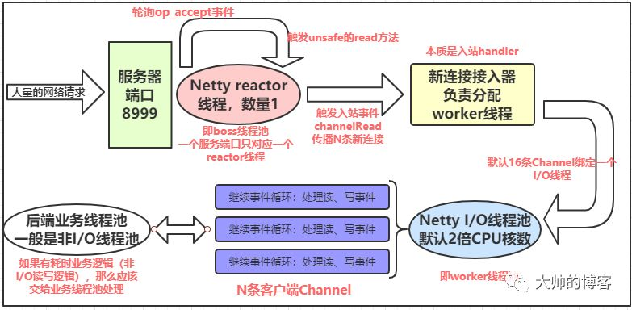

如上图，既然知道了应该将耗时的业务逻辑封装在额外的业务线程池中执行，那么是使用JDK的原生线程池，还是用其它的自定义线程池，比如Netty的线程池呢？

可以通过看Netty的ChannelPipeline源码来找到答案，如下ChannelPipeline接口的注释写的很明白：

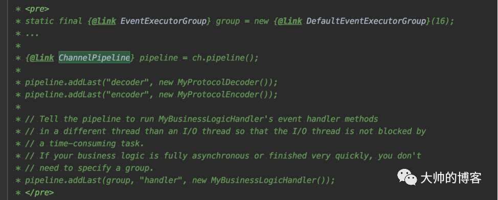

即Netty建议使用它自身提供的业务线程池来驱动非I/O的耗时业务逻辑，如果业务逻辑执行时间很短或者是完全异步的，那么不需要使用额外的非I/O线程池。而且具体用法是Netty在添加handler时，在ChannelPipeline接口提供了一个重载的addLast方法，专用于为对应handler添加Netty业务线程池，如下：

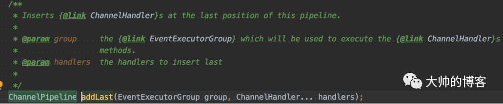

其最终的内部实现如下：

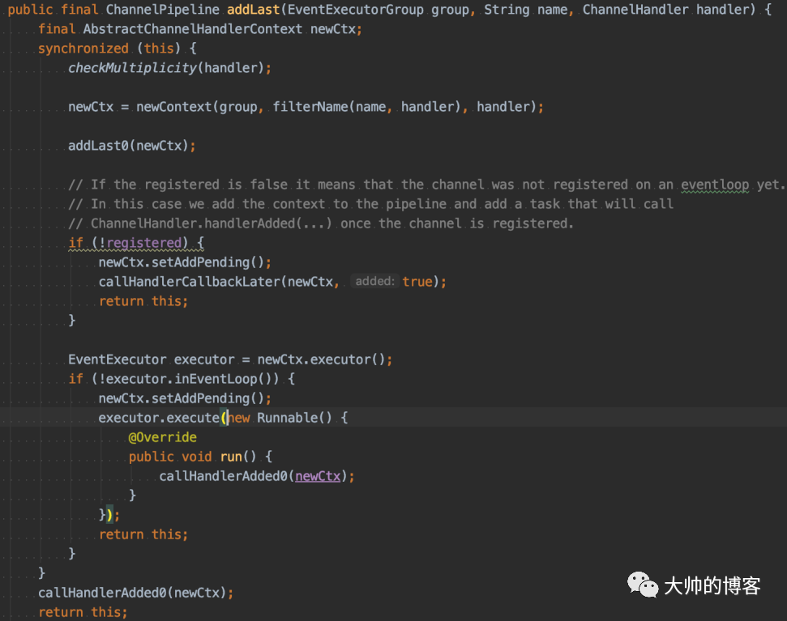

提交的业务线程池——group对象，会被包裹进Netty的pipeline的新节点中，最终会赋值给该handler节点的父类的线程池executor对象，这样后续该handler被执行时，会将执行的任务提交到指定的业务线程池——group执行。如下是pipeline的新节点的数据结构——AbstractChannelHandloerContext：

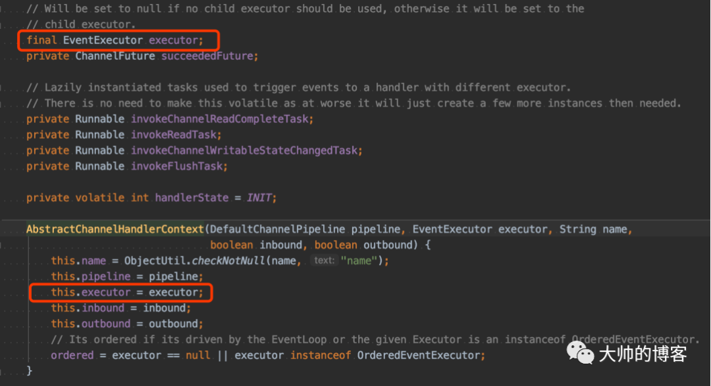

关于Netty的handler添加机制以及pipeline机制后续分析，暂时看不懂没关系，先简单了解。

直接看demo，重点是两个红框的代码：

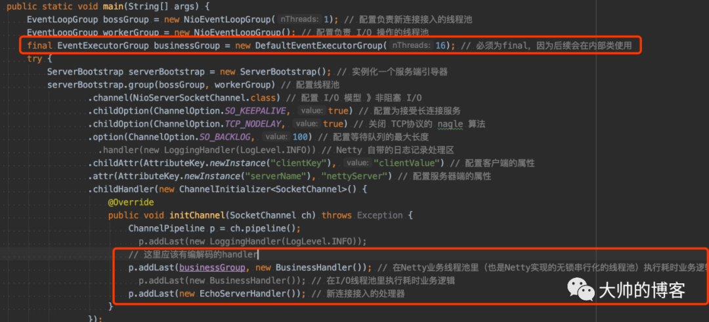

I/O线程池是Nio开头的group，非I/O线程池使用DefaultEventExecutorGroup这个Netty默认实现的线程池。在看第二个红框处，ChannelInitializer内部类里BusinessHandler这个入站处理器使用DefaultEventExecutorGroup执行，该处理器在channelRead事件方法里模拟一个耗时逻辑，如下休眠3s模拟查询大量数据：

回到demo：

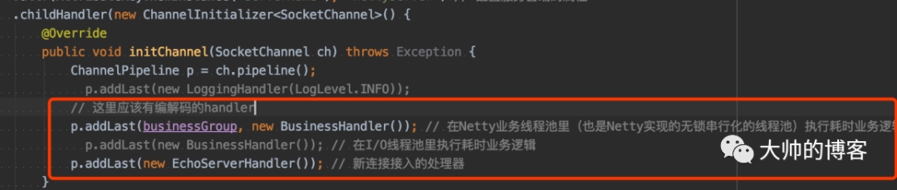

EchoServerHandler也是入站处理器，且被添加在pipeline的最后，那么进入服务器的字节序列会先进入BusinessHandler，再进入EchoServerHandler，下面是测试结果：

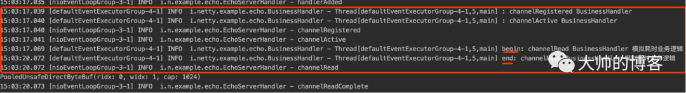

看红框发现BusinessHandler被非I/O线程驱动，EchoServerHandler被NIO线程驱动，它的执行不受耗时业务的影响。且BusinessHandler的channelRead方法内，会将该channelRead事件继续传播出去，因为调用了父类的channelRead方法，如下：

这样会执行到下一个入站handler——EchoServerHandler的channelRead方法。

## 异步的执行结果怎么回到Netty的NIO线程？

我看不少初学者会搞不明白这里，即将异步任务丢给了服务端外部的非I/O线程池执行，那外一客户端需要异步任务的计算结果，这个计算的结果怎么回到Netty的NIO线程呢，即他们怀疑或者说不理解这个异步结果是怎么被Netty发出去给客户端的呢？

可以继续看第3节的demo的执行结果：

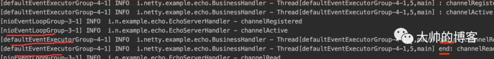

发现BusinessHandler确实是被非I/O线程驱动的，即日志打印的线程名是default开头的，而EchoServerHandler又确实是被NIO线程驱动的，即日志打印的线程是nio开头的，它的执行不受耗时业务的影响。这底层流转到底是怎么回事呢，且看分解。如下是demo里，BusinessHandler的channelRead方法：

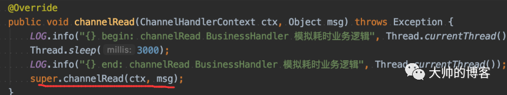

该方法是一个回调的用户事件，当Channel里有数据可读时，Netty会主动调用它，这种机制后续专题总结，这里知道结论即可。注意红线处前面也提到了——会将该channelRead事件继续传播给下一个handler节点，即执行到下一个入站处理器——EchoServerHandler的channelRead方法。而在pipeline上传播这个事件时，Netty会对其驱动的传播过程做一个判断。看如下的invokeChannelRead方法源码：其中参数next是入站节点EchoServerHandler，其executor是NIO线程，核心代码如下红框处——会做一个判断：

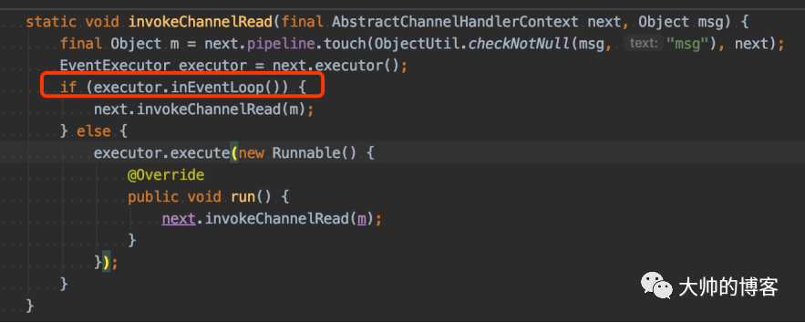

如果当前执行的线程是Netty的NIO线程（就是该Channel绑定的那个NIO线程，即executor，暂时不理解也没关系，知道结论，后续专题分析），那么就直接驱动，如果不是NIO线程，那么会将该流程封装成一个新的task扔到NIO线程的MPSCQ，排队等待被NIO线程处理，这里关于MPSCQ可以参考：Netty的线程调度模型分析（9）。因此将耗时的业务逻辑放到非NIO线程池处理，也不会影响Netty的I/O调度，仍然能通过NIO线程向客户端返回结果。

## JDK的线程池拒绝策略的坑可能导致阻塞

使用过线程池的都知道，如果业务逻辑处理慢，那么会导致线程池的阻塞队列积压任务，当积压任务达到容量上限，JDK有对应的处理策略，一般有如下几个已经提供的拒绝策略：

* ThreadPoolExecutor.AbortPolicy:丢弃任务并抛出RejectedExecutionException异常。
* ThreadPoolExecutor.DiscardPolicy：也是丢弃任务，但是不抛出异常。
* ThreadPoolExecutor.DiscardOldestPolicy：丢弃队列最前面的任务，然后重新尝试执行任务（重复此过程）
* ThreadPoolExecutor.CallerRunsPolicy：由调用线程处理该任务

JDK线程池默认是AbortPolicy，即主动抛出RejectedExecutionException。

回到Netty，如果使用其非I/O线程池不当，可能造成NIO线程阻塞，比如业务上有人会设置线程池满的拒绝策略为CallerRunsPolicy 策略，这导致会由调用方的线程——NioEventLoop线程执行业务逻辑，最终导致NioEventLoop线程可能被长时间阻塞，在服务端就是无法及时的读取新的请求消息。

实际使用Netty时，一定注意这个坑。即当提交的任务的阻塞队列满时，再向队列加入新的任务，千万不能阻塞NIO线程，要么丢弃当前任务，或者使用流控并向业务方和运维人员报警的方式规避这个问题，比如及时的动态扩容，或者提高算法能力，提升机器性能等。

## 使用Netty非I/O线程池的正确姿势

前面其实分析过Netty的EventExecutorGroup线程池，可以参考：Netty的线程调度模型分析（10）——《Netty有几类线程池，它们的区别，以及和JDK线程池区别？》，它也是类似NIO的线程池机制，只不过它没有绑定I/O多路复用器，它和Channel的绑定关系和NIO线程池一样，也是来一个新连接，就用线程选择器选择一个线程与之绑定，后续该连接上的所有非I/O任务，都在这一个线程中串行执行，此时并不能发挥EventExecutorGroup的作用，即使初始值设置100个线程也无济于事。

两句话：

1. 如果所有客户端的并发连接数小于业务线程数，那么建议将请求消息封装成任务投递到后端普通业务线程池执行即可，ChannelHandler不需要处理复杂业务逻辑，也不需要再绑定EventExecutorGroup
2. 如果所有客户端的并发连接数大于等于业务需要配置的线程数，那么可以为业务ChannelHandler绑定EventExecutorGroup——使用addLast的方法

>链接：https://www.cnblogs.com/kubixuesheng/p/12641418.html
> 
>著作权归作者所有。商业转载请联系作者获得授权，非商业转载请注明出处。
