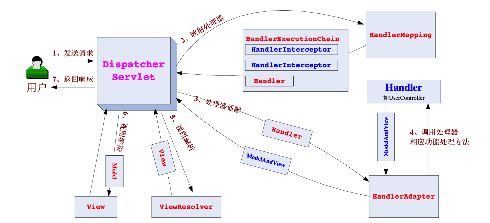
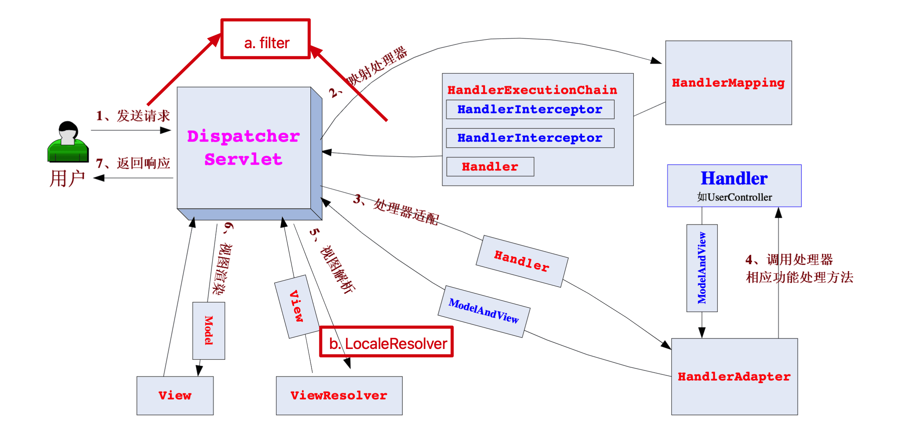
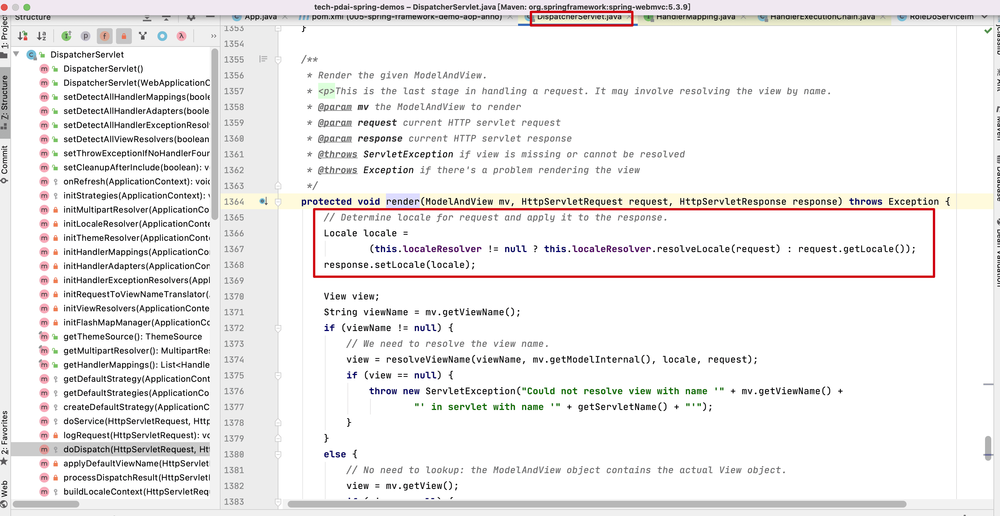
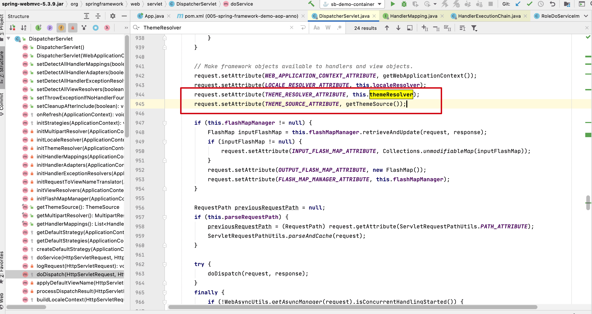
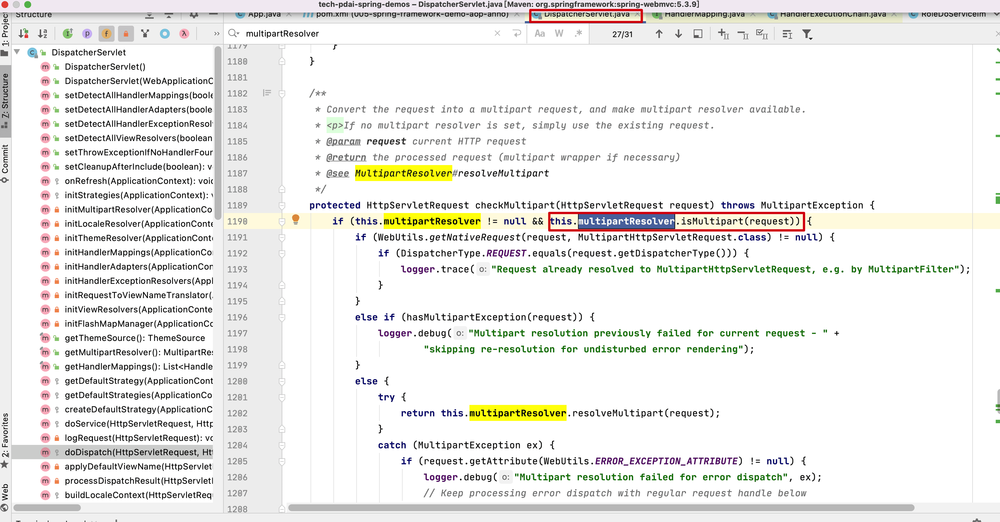

# Spring基础 - SpringMVC请求流程

## 引入

> 前文我们介绍了Spring框架和Spring框架中最为重要的两个技术点（IOC和AOP）

那么问题是，我们如何更好的构建上层的应用呢？比如web 应用？

针对上层的Web应用，SpringMVC诞生了，它也是Spring技术栈中最为重要的一个框架。

## 什么是MVC

> MVC英文是Model View Controller，是模型(model)－视图(view)－控制器(controller)的缩写，一种软件设计规范。本质上也是一种解耦。

用一种业务逻辑、数据、界面显示分离的方法，将业务逻辑聚集到一个部件里面，在改进和个性化定制界面及用户交互的同时，不需要重新编写业务逻辑。MVC被独特的发展起来用于映射传统的输入、处理和输出功能在一个逻辑的图形化用户界面的结构中。

- **Model**（模型）是应用程序中用于处理应用程序数据逻辑的部分。通常模型对象负责在数据库中存取数据。
- **View**（视图）是应用程序中处理数据显示的部分。通常视图是依据模型数据创建的。
- **Controller**（控制器）是应用程序中处理用户交互的部分。通常控制器负责从视图读取数据，控制用户输入，并向模型发送数据。

## 什么是Spring MVC

> 简单而言，Spring MVC是Spring在Spring Container Core和AOP等技术基础上，遵循上述Web MVC的规范推出的web开发框架，目的是为了简化Java栈的web开发。

Spring Web MVC 是一种基于Java 的实现了Web MVC 设计模式的请求驱动类型的轻量级Web 框架，即使用了MVC 架构模式的思想，将 web 层进行职责解耦，基于请求驱动指的就是使用请求-响应模型，框架的目的就是帮助我们简化开 发，Spring Web MVC 也是要简化我们日常Web 开发的。

**相关特性如下**：

- 让我们能非常简单的设计出干净的Web 层和薄薄的Web 层；
- 进行更简洁的Web 层的开发；
- 天生与Spring 框架集成（如IoC 容器、AOP 等）；
- 提供强大的约定大于配置的契约式编程支持；
- 能简单的进行Web 层的单元测试；
- 支持灵活的URL 到页面控制器的映射；
- 非常容易与其他视图技术集成，如 Velocity、FreeMarker 等等，因为模型数据不放在特定的 API 里，而是放在一个 Model 里（Map 数据结构实现，因此很容易被其他框架使用）；
- 非常灵活的数据验证、格式化和数据绑定机制，能使用任何对象进行数据绑定，不必实现特定框架的API；
- 提供一套强大的JSP 标签库，简化JSP 开发；
- 支持灵活的本地化、主题等解析；
- 更加简单的异常处理；
- 对静态资源的支持；
- 支持Restful 风格。

## Spring MVC的请求流程

> Spring Web MVC 框架也是一个基于请求驱动的Web 框架，并且也使用了前端控制器模式来进行设计，再根据请求映射 规则分发给相应的页面控制器（动作/处理器）进行处理。

### 核心架构的具体流程步骤

> 首先让我们整体看一下Spring Web MVC 处理请求的流程：

**核心架构的具体流程步骤**如下：

1. **首先用户发送请求——>DispatcherServlet**，前端控制器收到请求后自己不进行处理，而是委托给其他的解析器进行 处理，作为统一访问点，进行全局的流程控制；
2. **DispatcherServlet——>HandlerMapping**， HandlerMapping 将会把请求映射为 HandlerExecutionChain 对象（包含一 个Handler 处理器（页面控制器）对象、多个HandlerInterceptor 拦截器）对象，通过这种策略模式，很容易添加新 的映射策略；
3. **DispatcherServlet——>HandlerAdapter**，HandlerAdapter 将会把处理器包装为适配器，从而支持多种类型的处理器， 即适配器设计模式的应用，从而很容易支持很多类型的处理器；
4. **HandlerAdapter——>处理器功能处理方法的调用**，HandlerAdapter 将会根据适配的结果调用真正的处理器的功能处理方法，完成功能处理；并返回一个ModelAndView 对象（包含模型数据、逻辑视图名）；
5. **ModelAndView 的逻辑视图名——> ViewResolver**，ViewResolver 将把逻辑视图名解析为具体的View，通过这种策略模式，很容易更换其他视图技术；
6. **View——>渲染**，View 会根据传进来的Model模型数据进行渲染，此处的Model实际是一个Map数据结构，因此很容易支持其他视图技术；
7. **返回控制权给DispatcherServlet**，由DispatcherServlet 返回响应给用户，到此一个流程结束。

### 对上述流程的补充

> 上述流程只是核心流程，这里我们再补充一些其它组件：

1.  **Filter(ServletFilter)**

进入Servlet前可以有preFilter, Servlet处理之后还可有postFilter

2.  **LocaleResolver**

在视图解析/渲染时，还需要考虑国际化(Local)，显然这里需要有LocaleResolver.

3.  **ThemeResolver**

如何控制视图样式呢？SpringMVC中还设计了ThemeSource接口和ThemeResolver，包含一些静态资源的集合(样式及图片等），用来控制应用的视觉风格。

4.  **对于文件的上传请求**？

对于常规请求上述流程是合理的，但是如果是文件的上传请求，那么就不太一样了；所以这里便出现了MultipartResolver。

