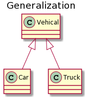
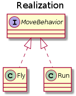
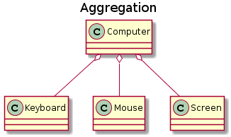
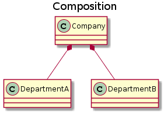
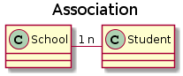
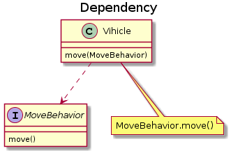

# 面向对象

## 三大特性

### 封装

封装是指将数据以及作用于这些数据的操作组织在同一个抽象数据类型中，并通过访问控制隐藏对象内部实现细节。外部代码无需了解对象内部状态的表示方式，只需要通过对象暴露的接口完成交互。

封装的主要作用包括：

* 降低模块之间的耦合，使模块能够相对独立地开发、测试、优化和修改。
* 降低维护成本，使开发者可以在不影响外部调用方的前提下调整内部实现。
* 提高软件复用性，便于将稳定的对象抽象应用于不同场景。
* 降低大型系统的构建风险，使局部模块可以独立验证和替换。

### 继承

继承用于表达类型之间的 `is-a` 关系。例如，`Cat` 与 `Animal` 可以构成 `is-a` 关系，因此 `Cat` 可以继承 `Animal`，并复用父类中非 `private` 的属性和方法。

继承关系应遵循里氏替换原则，即在使用父类对象的地方，应当能够以子类对象替换，而不破坏程序的正确性。

父类引用指向子类对象称为向上转型。例如，可以使用 `Animal` 类型的引用指向 `Cat` 类型的对象。

### 多态

多态可以分为编译时多态和运行时多态：

* 编译时多态主要表现为方法重载。
* 运行时多态是指对象引用所指向的实际类型在运行期间确定，典型表现为方法重写后的动态分派。

运行时多态通常需要满足以下条件：

* 存在继承或接口实现关系。
* 子类重写父类方法，或实现类实现接口方法。
* 父类或接口引用指向子类或实现类对象。

## 类图

### 泛化关系 (Generalization)

泛化关系用于描述继承关系，在 Java 中使用 `extends` 关键字表示。

### 实现关系 (Realization)

实现关系用于描述类对接口契约的实现，在 Java 中使用 `implements` 关键字表示。

### 聚合关系 (Aggregation)

聚合关系表示整体由部分组成，但整体与部分之间不是强生命周期依赖。整体对象不存在时，部分对象仍然可以独立存在。

### 组合关系 (Composition)

组合关系也表示整体与部分的关系，但二者具有较强的生命周期依赖。整体对象不存在时，部分对象通常也不再独立存在。例如，公司与部门可以建模为组合关系；公司与员工更适合建模为聚合关系，因为员工可以脱离某个具体公司继续存在。

### 关联关系 (Association)

关联关系表示不同类的对象之间存在结构性联系。这类关系通常与对象在系统中的长期协作有关，可以用一对一、一对多、多对多等基数描述。例如，学生与学校之间可以建模为关联关系：一个学校可以有多个学生，一个学生通常隶属于一个学校。

### 依赖关系 (Dependency)

依赖关系表示一个类在实现某项功能时临时使用另一个类。与关联关系相比，依赖关系通常更弱，持续时间也更短。`A` 类依赖 `B` 类的常见形式包括：

* `B` 类作为 `A` 类某个方法中的局部变量。
* `B` 类作为 `A` 类方法的参数。
* `A` 类调用 `B` 类的方法，以完成某项操作。

