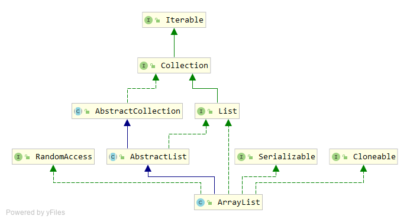

# ArrayList 源码分析

`ArrayList`是一个最常用的列表数据结构，底层基于数组实现。功能上与Java中的数组类似，但是一个动态的数据，它的容量可以随着元素的加入动态增长，而不需要使用者关心。`ArrayList`继承于`AbstractList`，实现了`List`、`RandomAccess`、`Cloneable`、`Serializable`接口。



## 构造函数

`ArrayList`提供了三个重载的构造函数。

```java
public ArrayList(int initialCapacity) {
	super();
    if (initialCapacity < 0)
        throw new IllegalArgumentException("Illegal Capacity: "+
                                            initialCapacity);
	this.elementData = new Object[initialCapacity];
}

public ArrayList() {
	this(10);
}

public ArrayList(Collection<? extends E> c) {
	elementData = c.toArray();
	size = elementData.length;
	// c.toArray might (incorrectly) not return Object[] (see 6260652)
	if (elementData.getClass() != Object[].class)
	    elementData = Arrays.copyOf(elementData, size, Object[].class);
}
```

`ArrayList`在创建对象时可以指定初始的容量大小，不指定时这个值默认时10；也可以基于一个已有的`Collection`对象来创建新的`ArrayList`。

## 内部属性

`ArrayList`中有两个非常重要的内部属性，一个是`elementData`这个`Object`类型的数组，用来实际存储各个元素；另一个是`size`，表示`ArrayList`的实际大小。

```java
/**
 * The array buffer into which the elements of the ArrayList are stored.
 * The capacity of the ArrayList is the length of this array buffer.
 */
private transient Object[] elementData;

/**
 * The size of the ArrayList (the number of elements it contains).
 *
 * @serial
 */
private int size;
```

## 容量调整

`ArrayList`可以认为是一个动态的数组，增加元素时不需要考虑数组的扩容，原因是内部实现了这种扩容的机制。

```java
public void ensureCapacity(int minCapacity) {
	modCount++;
	int oldCapacity = elementData.length;
	if (minCapacity > oldCapacity) {
	    Object oldData[] = elementData;
	    int newCapacity = (oldCapacity * 3)/2 + 1;
    	    if (newCapacity < minCapacity)
		        newCapacity = minCapacity;
            // minCapacity is usually close to size, so this is a win:
            elementData = Arrays.copyOf(elementData, newCapacity);
	}
}
```

`ensureCapacity`方法实现了扩容，主要过程是创建一个新的更大的数组，将原数组中的内容复制过去，并修改`elementData`的引用。

新数组的容量是原来数组的1.5倍（即`newCapacity`）与`minCapacity`中更小的那个。这是JDK 1.6中的计算容量的方式，1.8中的略有不同，更为复杂，感兴趣可以自行看看。

## add方法

```java
public boolean add(E e) {
	ensureCapacity(size + 1);  // Increments modCount!!
	elementData[size++] = e;
	return true;
}

public void add(int index, E element) {
	if (index > size || index < 0)
	    throw new IndexOutOfBoundsException(
		"Index: "+index+", Size: "+size);

	ensureCapacity(size+1);  // Increments modCount!!
	System.arraycopy(elementData, index, elementData, index + 1,
			 size - index);
	elementData[index] = element;
	size++;
}
```

`add`方法很简单，首先调用`ensureCapacity`方法保证数组容量够用不会溢出，然后将新元素添加到数组的末尾。

指定索引位置的`add`方法复杂一些，首先是对`index`的检查，确保所给索引位置在数组之内，调用`ensureCapacity`方法保证数组容量够用，然后以`index`为界将原数组分成前后两半，将后半部分整体右移留出一个空位，最后将新元素放到这个空位上。

`addAll`的两个方法与`add`类似，不同的是参数是一个`Collection`类型的集合，处理过程是类似的。

## remove方法

```java
public E remove(int index) {
	RangeCheck(index);

	modCount++;
	E oldValue = (E) elementData[index];

	int numMoved = size - index - 1;
	if (numMoved > 0)
	    System.arraycopy(elementData, index+1, elementData, index,
			     numMoved);
	elementData[--size] = null; // Let gc do its work

	return oldValue;
}

public boolean remove(Object o) {
	if (o == null) {
            for (int index = 0; index < size; index++)
		if (elementData[index] == null) {
		    fastRemove(index);
		    return true;
		}
	} else {
	    for (int index = 0; index < size; index++)
		if (o.equals(elementData[index])) {
		    fastRemove(index);
		    return true;
		}
        }
	return false;
}

private void fastRemove(int index) {
    modCount++;
    int numMoved = size - index - 1;
    if (numMoved > 0)
        System.arraycopy(elementData, index+1, elementData, index,
                            numMoved);
    elementData[--size] = null; // Let gc do its work
}
```

`remove`方法有两个，一个是删除指定索引位置的元素，一个是删除指定的对象。两个方法比较像，都是找到目标元素，然后将数组中目标元素之后的部分整体向前移动一个位置，然后将数组末尾的元素置为`null`，让`GC`有机会回收对象。