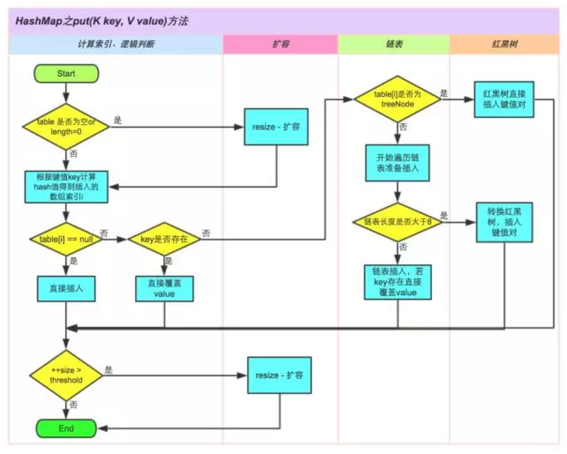
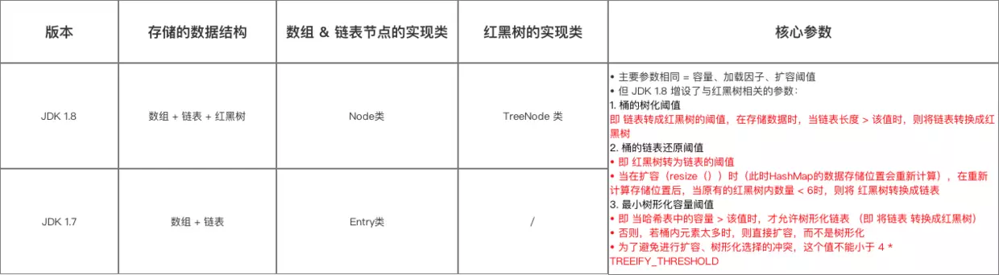
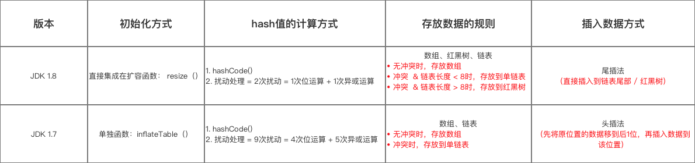
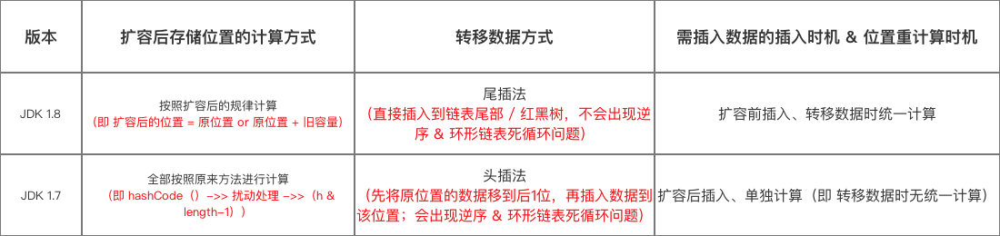

# HashMap 源码分析

HashMap是Java中一个经常用到的容器数据结构，也是面试过程中被问到频率最高的话题之一。常见的问题一般是：HashMap的数据结构是怎样的、HashMap是不是线程安全的、HashMap的死锁是如何发生的，等等。

HashMap在不同的JDK版本中其实现有很大差别，所以一些问题需要限定JDK版本才好解答。下面的分析先以最基础的JDK 1.6版本开始，再扩展到其他的JDK版本。

## HashMap的基本说明

先看下HashMap类上的注释文档，其实说明了很多问题。

> Hash table based implementation of the Map interface. This implementation provides all of the optional map operations, and permits null values and the null key. (The HashMap class is roughly equivalent to Hashtable, except that it is unsynchronized and permits nulls.) This class makes no guarantees as to the order of the map; in particular, it does not guarantee that the order will remain constant over time.

从第一段文字中，我们能得到以下信息：

* HashMap用Hash表的方式实现了Map接口。
* HashMap允许key和value为null。
* HashMap基本等价于Hashtable，除了HashMap是非线程安全的、允许null。从这里也能得到Hashtable中是不允许存在null的。
* HashMap中的元素是无序的，特别是不同时间点HashMap中的元素顺序都有可能不同。

第一段其实就已经提供了很多面试题的答案，比如：

* HashMap中可以存在null吗？
* HashMap是线程安全的吗？
* HashMap是有序的吗？

> This implementation provides constant-time performance for the basic operations (get and put), assuming the hash function disperses the elements properly among the buckets. Iteration over collection views requires time proportional to the "capacity" of the HashMap instance (the number of buckets) plus its size (the number of key-value mappings). Thus, it's very important not to set the initial capacity too high (or the load factor too low) if iteration performance is important.

从第二段，我们得到以下信息：

* HashMap提供了常量级的读写基本操作（假设hash函数能够均匀地将元素散列到各个bucket中）。
* HashMap迭代所需时间复杂度，与HashMap的capacity（即bucket的个数）与size（key-value对的个数）有关。因此，HashMap使用时需要注意，不要将初始的capacity设置的过大，或将负载因子（load factor）设置的过低，否则会影响迭代的效率。

> An instance of HashMap has two parameters that affect its performance: initial capacity and load factor. The capacity is the number of buckets in the hash table, and the initial capacity is simply the capacity at the time the hash table is created. The load factor is a measure of how full the hash table is allowed to get before its capacity is automatically increased. When the number of entries in the hash table exceeds the product of the load factor and the current capacity, the hash table is rehashed (that is, internal data structures are rebuilt) so that the hash table has approximately twice the number of buckets.

> As a general rule, the default load factor (.75) offers a good tradeoff between time and space costs. Higher values decrease the space overhead but increase the lookup cost (reflected in most of the operations of the HashMap class, including get and put). The expected number of entries in the map and its load factor should be taken into account when setting its initial capacity, so as to minimize the number of rehash operations. If the initial capacity is greater than the maximum number of entries divided by the load factor, no rehash operations will ever occur.

> If many mappings are to be stored in a HashMap instance, creating it with a sufficiently large capacity will allow the mappings to be stored more efficiently than letting it perform automatic rehashing as needed to grow the table.

第三段、第四段和第五段具体说明了capacity和load factor是如何影响HashMap的效率。capacity越大、load factor越小，HashMap的效率就越低。

load factor是衡量HashMap容器盈亏程度的一个指标，当HashMap中元素的个数大于capacity * load factor的值的时候，HashMap会进行rehash的操作，rehash实际上是内部数据结构重建的一个过程。默认的load factor是0.75，这是一个折中的值，在大多数情况下运行良好。更大的load factor会降低内存空间的使用率，但是会增加查找时的时间消耗。

> Note that this implementation is not synchronized. If multiple threads access a hash map concurrently, and at least one of the threads modifies the map structurally, it must be synchronized externally. (A structural modification is any operation that adds or deletes one or more mappings; merely changing the value associated with a key that an instance already contains is not a structural modification.) This is typically accomplished by synchronizing on some object that naturally encapsulates the map. If no such object exists, the map should be "wrapped" using the {@link Collections#synchronizedMap Collections.synchronizedMap} method. This is best done at creation time, to prevent accidental unsynchronized access to the map:
> ```
> Map m = Collections.synchronizedMap(new HashMap(...));
> ```

这一段说明了HashMap是非线程安全的。如果有多线程使用的情况，要么由调用者在HashMap外部进行同步，要么使用通过`Collections.synchronizedMap`包装后的线程安全的Map容器。

> The iterators returned by all of this class's "collection view methods" are fail-fast: if the map is structurally modified at any time after the iterator is created, in any way except through the iterator's own remove method, the iterator will throw a ConcurrentModificationException. Thus, in the face of concurrent modification, the iterator fails quickly and cleanly, rather than risking arbitrary, non-deterministic behavior at an undetermined time in the future.

> Note that the fail-fast behavior of an iterator cannot be guaranteed as it is, generally speaking, impossible to make any hard guarantees in the presence of unsynchronized concurrent modification. Fail-fast iterators throw ConcurrentModificationException on a best-effort basis. Therefore, it would be wrong to write a program that depended on this exception for its correctness: the fail-fast behavior of iterators should be used only to detect bugs.

最后两段提到了一个叫`fail-fast`的机制。HashMap会判断在迭代过程中是否有其他人的操作修改了内部结构，是的话会抛出一个ConcurrentModificationException异常。一般出现这个异常就说明有其他线程并发地修改了HashMap了。这种快速失败的机制能够使问题尽早的暴露出来。但需要注意的是，快速失败的机制仅仅是作为一种监控预警的功能存在，不能用它来判断是否存在着并发。

## HashMap的数据结构

简单来说，HashMap使用了数组+链表的数据结构，数组用于存储key-value数据，链表用于解决hash冲突。

### HashMap的构造函数

我们从HashMap的构造函数开始。HashMap中的构造函数有几个，除了参数不同外，最终通过重载调用到下面这个构造函数。

```java
public HashMap(int initialCapacity, float loadFactor) {
    if (initialCapacity < 0)
        throw new IllegalArgumentException("Illegal initial capacity: " +
                                            initialCapacity);
    if (initialCapacity > MAXIMUM_CAPACITY)
        initialCapacity = MAXIMUM_CAPACITY;
    if (loadFactor <= 0 || Float.isNaN(loadFactor))
        throw new IllegalArgumentException("Illegal load factor: " +
                                            loadFactor);

    // Find a power of 2 >= initialCapacity
    int capacity = 1;
    while (capacity < initialCapacity)
        capacity <<= 1;

    this.loadFactor = loadFactor;
    threshold = (int)(capacity * loadFactor);
    table = new Entry[capacity];
    init();
}
```

构造函数的开始是参数的检查。initialCapacity如果大于MAXIMUM_CAPACITY（这个值是 1 << 30）的话，会被转为MAXIMUM_CAPACITY。接下来是将initialCapacity整形到最接近initialCapacity的2的N次幂，这主要是从效率方面的考虑，后面会再单独介绍原因。

然后就是根据计算得到的capacity和loadFactor（默认0.75），计算一个阈值，这个阈值后面用来控制HashMap是否进行rehash。最后创建一个类型是Entry的table数组，用来保存key-value数据。这个Entry就是我们使用HashMap迭代时常用到的Entry类型。

init方法是一个空方法，没有实现，当继承HashMap时作为一个扩展点进行自定义的初始化操作。

### HashMap的内部属性

从HashMap的内部属性，能看到我们前面提到的一些关键数据，包括默认的初始capacity、默认的load factor，等等。

```java
    /**
     * The default initial capacity - MUST be a power of two.
     */
    static final int DEFAULT_INITIAL_CAPACITY = 16;

    /**
     * The maximum capacity, used if a higher value is implicitly specified
     * by either of the constructors with arguments.
     * MUST be a power of two <= 1<<30.
     */
    static final int MAXIMUM_CAPACITY = 1 << 30;

    /**
     * The load factor used when none specified in constructor.
     */
    static final float DEFAULT_LOAD_FACTOR = 0.75f;

    /**
     * The table, resized as necessary. Length MUST Always be a power of two.
     */
    transient Entry[] table;

    /**
     * The number of key-value mappings contained in this map.
     */
    transient int size;

    /**
     * The next size value at which to resize (capacity * load factor).
     * @serial
     */
    int threshold;

    /**
     * The load factor for the hash table.
     *
     * @serial
     */
    final float loadFactor;

    /**
     * The number of times this HashMap has been structurally modified
     * Structural modifications are those that change the number of mappings in
     * the HashMap or otherwise modify its internal structure (e.g.,
     * rehash).  This field is used to make iterators on Collection-views of
     * the HashMap fail-fast.  (See ConcurrentModificationException).
     */
    transient volatile int modCount;

    /**
     * The table, resized as necessary. Length MUST Always be a power of two.
     */
    transient Entry[] table;
```

### put方法

```java
public V put(K key, V value) {
    if (key == null)
        return putForNullKey(value);
    int hash = hash(key.hashCode());
    int i = indexFor(hash, table.length);
    for (Entry<K,V> e = table[i]; e != null; e = e.next) {
        Object k;
        if (e.hash == hash && ((k = e.key) == key || key.equals(k))) {
            V oldValue = e.value;
            e.value = value;
            e.recordAccess(this);
            return oldValue;
        }
    }

    modCount++;
    addEntry(hash, key, value, i);
    return null;
}
```

`put`方法最开始会检测key是否为null，如果是的话会调用`putForNullKey`进行特殊处理。这也是为什么HashMap能够支持null的原因。

```java
private V putForNullKey(V value) {
    for (Entry<K,V> e = table[0]; e != null; e = e.next) {
        if (e.key == null) {
            V oldValue = e.value;
            e.value = value;
            e.recordAccess(this);
            return oldValue;
        }
    }
    modCount++;
    addEntry(0, null, value, 0);
    return null;
}
```

`putForNullKey`其实只会把key为null的数据放到table数组中第一个位置上。table中的Entry实际上是一个链表，因此需要遍历这个链表去寻找key为null的Entry。

回到`put`方法。HashMap使用一个hash方法来计算key的散列值，根据计算得到的散列值决定放到table数组中的哪个位置上。

```java
/**
 * Applies a supplemental hash function to a given hashCode, which
 * defends against poor quality hash functions.  This is critical
 * because HashMap uses power-of-two length hash tables, that
 * otherwise encounter collisions for hashCodes that do not differ
 * in lower bits. Note: Null keys always map to hash 0, thus index 0.
 */
static int hash(int h) {
    // This function ensures that hashCodes that differ only by
    // constant multiples at each bit position have a bounded
    // number of collisions (approximately 8 at default load factor).
    h ^= (h >>> 20) ^ (h >>> 12);
    return h ^ (h >>> 7) ^ (h >>> 4);
}
```

这里插入介绍下散列值的计算。

hash函数传入的参数实际上是调用key.hashCode方法返回的一个哈希值，这是一个int类型的整数。如果直接拿这个数作为下标访问HashMap的table数组的话，考虑到2进制32位带符号的int值范围从-2147483648到2147483648，这加起来大概40亿的映射空间，只要hashCode方法映射的比较均匀，一般是很难出现碰撞的。

但问题是一个40亿长度的数组，内存是放不下的。用之前还要先对数组的长度取模运算，得到的余数才能用来访问数组下标。源码中是再`indexFor`这个函数里完成的。

```java
static int indexFor(int h, int length) {
    return h & (length-1);
}
```

实现很简单，就是把散列值与数组长度做一个与运算。这也正好解释了为什么HashMap的数组长度要取2的整次幂。因为这样，（数组长度 - 1）正好相当于一个“低位掩码”，与操作的结果就是散列值的高位全部归零，值保留地位值，用来做数组下标访问。以初始长度16为例，16-1=15。2进制表示是00000000 00000000 00001111。和某散列值做“与”操作如下，结果就是截取了最低的四位值。

```
    10100101 11000100 00100101
&	00000000 00000000 00001111
------------------------------
	00000000 00000000 00000101
```

但这时候问题就来了，这样就算散列值分布的再松散，要是只取最后几位的话，碰撞也会很严重。hash函数通过若干次的移位、异或操作，把hashCode重新变得松散，降低碰撞发生的可能。

继续说回到`put`方法。再计算得到table的下标位置后，将会遍历这个位置上的链表，根据key去寻找链表上的Entry元素，找到的话更新Entry上的value值。如果没有找到，此时会调用`addEntry`方法，向链表中新增加一个Entry对象。

```java
void addEntry(int hash, K key, V value, int bucketIndex) {
	Entry<K,V> e = table[bucketIndex];
    table[bucketIndex] = new Entry<K,V>(hash, key, value, e);
    if (size++ >= threshold)
        resize(2 * table.length);
}
```

`addEntry`里可以看到，新增加的Entry将会放到链表的头部。这点也是有的面试官会问到的一点细节。

`put`方法的返回值也是一个容易忽视的细节，对于更新操作，会返回之前的旧value值；对于新增操作，会返回null。

### get方法

```java
public V get(Object key) {
    if (key == null)
        return getForNullKey();
    int hash = hash(key.hashCode());
    for (Entry<K,V> e = table[indexFor(hash, table.length)];
            e != null;
            e = e.next) {
        Object k;
        if (e.hash == hash && ((k = e.key) == key || key.equals(k)))
            return e.value;
    }
    return null;
}

private V getForNullKey() {
    for (Entry<K,V> e = table[0]; e != null; e = e.next) {
        if (e.key == null)
            return e.value;
    }
    return null;
}
```

`get`方法与`put`方法很像，首先也是对key的判空，如果是的话走一个特殊处理逻辑`getForNullKey`。否则的话，根据key的hashCode计算访问table时的下标，然后遍历table该位置上的链表，根据key寻找Entry元素，找到的话返回其value值。没有找到的话，`get`方法返回null。

### rehash

在`addEntry`方法中，我们会看到一个`resize`的方法调用，这里进行`reshash`的处理。

HashMap的`rehash`主要目的是解决Hash冲突带来的查找效率问题。随着HashMap中元素的不断添加，Hash冲突的可能性也越来越大，table中链表也将越来越长，HashMap查找时如遇到key冲突，将会遍历这个列表，因此查询耗时也将越来越长。`rehash`的目的在于重新构造一个table数组，把原来table中各个链表重新散列到这个新数组上，这个新数组的容量更大，因此出现冲突的机会就会减少，查询耗时也会降低。

```java
void resize(int newCapacity) {
    Entry[] oldTable = table;
    int oldCapacity = oldTable.length;
    if (oldCapacity == MAXIMUM_CAPACITY) {
        threshold = Integer.MAX_VALUE;
        return;
    }

    Entry[] newTable = new Entry[newCapacity];
    transfer(newTable);
    table = newTable;
    threshold = (int)(newCapacity * loadFactor);
}

void transfer(Entry[] newTable) {
    Entry[] src = table;
    int newCapacity = newTable.length;
    for (int j = 0; j < src.length; j++) {
        Entry<K,V> e = src[j];
        if (e != null) {
            src[j] = null;
            do {
                Entry<K,V> next = e.next;
                int i = indexFor(e.hash, newCapacity);
                e.next = newTable[i];
                newTable[i] = e;
                e = next;
            } while (e != null);
        }
    }
}
```

`resize`方法和`transfer`方法会新创建一个newTable数组，将原来table数组中的数据全部迁移到newTable中，这个过程中会重新调用`indexFor`方法计算在newTable中的位置。

### 快速失败

我们前面提到了一个`fail-fast`的快速失败机制。

在HashMap中的属性中有一个`modCount`的属性，可以理解为记录了HashMap被修改的次数。在添加元素和删除元素的操作中，都会更新这个计数。

HashMap的每个迭代器`HashIterator`初始化时，会用变量`expectedModCount`记录此刻的HashMap的`modCount`值。在的`nextEntry`方法中，迭代时会判断HashMap的`modCount`是否等于`expectedModCount`，是的话会抛出`ConcurrentModificationException`异常。`modCount`的值被修改，只会发生在添加元素和删除元素时，表明HashMap在迭代的过程中被修改了，一般是发生在多线程访问的情况。

## JDK 1.7中的HashMap

JDK 1.7的HashMap与JDK 1.6基本相同，除了几点不同

### 建立哈希表的方式

table的初始化改为了懒加载方式，即在HashMap的构造函数中不会创建table数组，而是在写操作前判断一次是否是`EMPTY_TABLE`，是的话会调用`inflateTable`构建table数组。

```java
private void inflateTable(int toSize) {
    // Find a power of 2 >= toSize
    int capacity = roundUpToPowerOf2(toSize);

    threshold = (int) Math.min(capacity * loadFactor, MAXIMUM_CAPACITY + 1);
    table = new Entry[capacity];
    initHashSeedAsNeeded(capacity);
}

final boolean initHashSeedAsNeeded(int capacity) {
    boolean currentAltHashing = hashSeed != 0;
    boolean useAltHashing = sun.misc.VM.isBooted() &&
            (capacity >= Holder.ALTERNATIVE_HASHING_THRESHOLD);
    boolean switching = currentAltHashing ^ useAltHashing;
    if (switching) {
        hashSeed = useAltHashing
            ? sun.misc.Hashing.randomHashSeed(this)
            : 0;
    }
    return switching;
}
```

`inflateTable`最后调用了一个`hashSeed`方法，这个方法是用来依据容量决定是否需要初始化hashSeed，hashSeed默认是0，如果初始化hashSeed，它的值将会是一个随机值。

### ALTERNATIVE_HASHING_THRESHOLD 与 hashSeed

1.7中的HashMap有一个常量`ALTERNATIVE_HASHING_THRESHOLD_DEFAULT`。

```java
/**
 * The default threshold of map capacity above which alternative hashing is
 * used for String keys. Alternative hashing reduces the incidence of
 * collisions due to weak hash code calculation for String keys.
 * <p/>
 * This value may be overridden by defining the system property
 * {@code jdk.map.althashing.threshold}. A property value of {@code 1}
 * forces alternative hashing to be used at all times whereas
 * {@code -1} value ensures that alternative hashing is never used.
 */
static final int ALTERNATIVE_HASHING_THRESHOLD_DEFAULT = Integer.MAX_VALUE;
```
大意是说，`ALTERNATIVE_HASHING_THRESHOLD_DEFAULT`是一个默认的阈值，当一个键值对的键是String类型时，且map的容量达到了这个阈值，就启用备用哈希（alternative hashing）。备用哈希可以减少String类型的key计算哈希码（更容易）发生哈希碰撞的发生率。该值可以通过定义系统属性`jdk.map.althashing.threshold`来指定。如果该值是1，表示强制总是使用备用哈希；如果是-1则表示禁用。

HashMap有一个静态内部类Holder，它的作用是在虚拟机启动后根据jdk.map.althashing.threshold和ALTERNATIVE_HASHING_THRESHOLD_DEFAULT初始化ALTERNATIVE_HASHING_THRESHOLD，相关代码如下：

```java
/**
 * holds values which can't be initialized until after VM is booted.
 */
private static class Holder {

    /**
        * Table capacity above which to switch to use alternative hashing.
        */
    static final int ALTERNATIVE_HASHING_THRESHOLD;

    static {
        String altThreshold = java.security.AccessController.doPrivileged(
            new sun.security.action.GetPropertyAction(
                "jdk.map.althashing.threshold"));

        int threshold;
        try {
            threshold = (null != altThreshold)
                    ? Integer.parseInt(altThreshold)
                    : ALTERNATIVE_HASHING_THRESHOLD_DEFAULT;

            // disable alternative hashing if -1
            if (threshold == -1) {
                threshold = Integer.MAX_VALUE;
            }

            if (threshold < 0) {
                throw new IllegalArgumentException("value must be positive integer.");
            }
        } catch(IllegalArgumentException failed) {
            throw new Error("Illegal value for 'jdk.map.althashing.threshold'", failed);
        }

        ALTERNATIVE_HASHING_THRESHOLD = threshold;
    }
}
```

`Holder`中维护的`ALTERNATIVE_HASHING_THRESHOLD`是触发启用备用哈希的阈值，该值表示，如果容器的容量（注意是容量，不是实际大小）达到了该值，容器应该启用备用哈希。

在`initHashSeedAsNeeded(int capacity)`方法中，会判断如果容器的`容量>=ALTERNATIVE_HASHING_THRESHOLD`，就会生成一个随机的哈希种子`hashSeed`，该种子会在`put`方法调用过程中的`hash`方法中使用到：

```java
final int hash(Object k) {
    int h = hashSeed;
    if (0 != h && k instanceof String) {
        return sun.misc.Hashing.stringHash32((String) k);
    }

    h ^= k.hashCode();

    // This function ensures that hashCodes that differ only by
    // constant multiples at each bit position have a bounded
    // number of collisions (approximately 8 at default load factor).
    h ^= (h >>> 20) ^ (h >>> 12);
    return h ^ (h >>> 7) ^ (h >>> 4);
}
```

## JDK 1.8中的HashMap

1.8中的HashMap引入了红黑树的数据结构。我们知道，1.6中的HashMap使用了数组+链表的方式实现，在1.8中，当链表的长度超过了`TREEIFY_THRESHOLD`指定的阈值（默认值是8）时，将链表转换成红黑树。相对地，当红黑树的长度小于`UNTREEIFY_THRESHOLD`设置的阈值时（默认是6）时，将红黑树转换成链表。

同以前版本的HashMap一样，内部数据结构中最重要的一个是table数组，不同的是，1.8中的table数组是一个叫做`Node`类型的数组。

```java
/**
 * The table, initialized on first use, and resized as
 * necessary. When allocated, length is always a power of two.
 * (We also tolerate length zero in some operations to allow
 * bootstrapping mechanics that are currently not needed.)
 */
transient Node<K,V>[] table;
```

`Node`是HasMap的一个内部类，实现了`Map.Entry`接口，作用同1.6中的`Entry`类型类似。

```java
static class Node<K,V> implements Map.Entry<K,V> {
    final int hash;
    final K key;
    V value;
    Node<K,V> next;

    Node(int hash, K key, V value, Node<K,V> next) {
        this.hash = hash;
        this.key = key;
        this.value = value;
        this.next = next;
    }

    ...
}
```

HashMap在1.8中的put方法相对复杂了很多，大致流程如下：



1. 判断键值对数组table[i]是否为空或为null，否则执行resize()进行扩容；
2. 根据键值key计算hash值得到插入的数组索引i，如果table[i]==null，直接新建节点添加，转向⑥，如果table[i]不为空，转向3；
3. 判断table[i]的首个元素是否和key一样，如果相同直接覆盖value，否则转向4，这里的相同指的是hashCode以及equals；
4. 判断table[i] 是否为treeNode，即table[i] 是否是红黑树，如果是红黑树，则直接在树中插入键值对，否则转向5；
5. 遍历table[i]，判断链表长度是否大于8，大于8的话把链表转换为红黑树，在红黑树中执行插入操作，否则进行链表的插入操作；遍历过程中若发现key已经存在直接覆盖value即可；
6. 插入成功后，判断实际存在的键值对数量size是否超多了最大容量threshold，如果超过，进行扩容。

源码如下：

```java
public V put(K key, V value) {
    return putVal(hash(key), key, value, false, true);
}

final V putVal(int hash, K key, V value, boolean onlyIfAbsent,
                boolean evict) {
    Node<K,V>[] tab; Node<K,V> p; int n, i;
    if ((tab = table) == null || (n = tab.length) == 0)
        n = (tab = resize()).length;
    if ((p = tab[i = (n - 1) & hash]) == null)
        tab[i] = newNode(hash, key, value, null);
    else {
        Node<K,V> e; K k;
        if (p.hash == hash &&
            ((k = p.key) == key || (key != null && key.equals(k))))
            e = p;
        else if (p instanceof TreeNode)
            e = ((TreeNode<K,V>)p).putTreeVal(this, tab, hash, key, value);
        else {
            for (int binCount = 0; ; ++binCount) {
                if ((e = p.next) == null) {
                    p.next = newNode(hash, key, value, null);
                    if (binCount >= TREEIFY_THRESHOLD - 1) // -1 for 1st
                        treeifyBin(tab, hash);
                    break;
                }
                if (e.hash == hash &&
                    ((k = e.key) == key || (key != null && key.equals(k))))
                    break;
                p = e;
            }
        }
        if (e != null) { // existing mapping for key
            V oldValue = e.value;
            if (!onlyIfAbsent || oldValue == null)
                e.value = value;
            afterNodeAccess(e);
            return oldValue;
        }
    }
    ++modCount;
    if (++size > threshold)
        resize();
    afterNodeInsertion(evict);
    return null;
}
```

1.8中不同的一点是，处理哈希冲突的时候，链表的插入位置是尾部，而不是像以前版本那样插入在链表的头部。

与`put`方法类似，`get`、`remove`等其他方法同样需要处理红黑树的情况，不再赘述。

### 1.8 的不同点

HashMap 的实现在 JDK 1.7 和 JDK 1.8 差别较大，具体区别如下：

1. 数据结构



2. 获取数据时



3. 扩容机制



# Reference

[理解HashMap](https://segmentfault.com/a/1190000018520768)

[Java源码分析：HashMap 1.8 相对于1.7 到底更新了什么？](https://juejin.im/post/5aa5d8d26fb9a028d2079264)