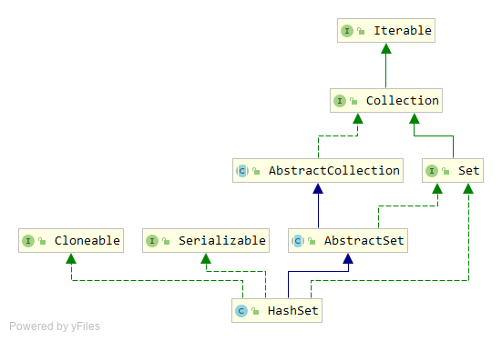

# HashSet 源码分析

`HashSet`是最常用到的`Set`接口实现，底层使用了哈希表的实现，实际上内部直接使用了`HashMap`。`HashSet`不保证集合内的顺序；允许`null`存在；提供了常数级的操作方法。

## 类继承结构



1. `HashSet`继承自`AbstractSet`抽象类。
2. `HashSet`实现了`Set`、`Cloneable`、`Serializable`接口。
3. `AbstractSet`抽象类继承自`AbstractCollection`抽象类。

## 内部属性

```java
private transient HashMap<E,Object> map;

// Dummy value to associate with an Object in the backing Map
private static final Object PRESENT = new Object();
```

`map`属性是一个`HashMap`类型的实例，也就是`HashSet`中哈希表实现的基础。`PRESENT`属性是一个`Object`类型的实例，作为哈希表`KV`结构中`value`的存在。

## 构造函数

```java
public HashSet() {
	map = new HashMap<E,Object>();
}

public HashSet(Collection<? extends E> c) {
	map = new HashMap<E,Object>(Math.max((int) (c.size()/.75f) + 1, 16));
	addAll(c);
}

public HashSet(int initialCapacity, float loadFactor) {
	map = new HashMap<E,Object>(initialCapacity, loadFactor);
}

public HashSet(int initialCapacity) {
	map = new HashMap<E,Object>(initialCapacity);
}

HashSet(int initialCapacity, float loadFactor, boolean dummy) {
	map = new LinkedHashMap<E,Object>(initialCapacity, loadFactor);
}
```

`HashSet`有5个重载的构造函数，围绕哈希表的构造展开。

这几个构造函数中有一个不带`public`修饰符的构造函数，里面使用了`LinkedHashMap`类型，这个构造函数是包访问级别的，用来提供给`LinkedHashSet`使用，对于开发者来说是不可用的。`dummy`这个属性其实是无用的，纯属为了解决和其他同名构造函数的重载时的冲突问题，其实传啥都是没用的。

## 主要方法

`Set`接口包含的方法：

```java
int size();

boolean isEmpty();

boolean contains(Object o);

Iterator<E> iterator();

Object[] toArray();

<T> T[] toArray(T[] a);

boolean add(E e);

boolean remove(Object o);

boolean containsAll(Collection<?> c);

boolean addAll(Collection<? extends E> c);

boolean retainAll(Collection<?> c);

boolean removeAll(Collection<?> c);

void clear();

boolean equals(Object o);

int hashCode();
```

`Set`接口中部分方法是在`AbstractSet`和`AbstractCollection`两个抽象类中实现的。其他与底层实现数据结构相关的方法，是在`HashSet`中通过代理`HashMap`方法实现。

例如：

```java

public boolean add(E e) {
	return map.put(e, PRESENT)==null;
}

public boolean remove(Object o) {
	return map.remove(o)==PRESENT;
}
```

其他方法也是类似的实现逻辑。