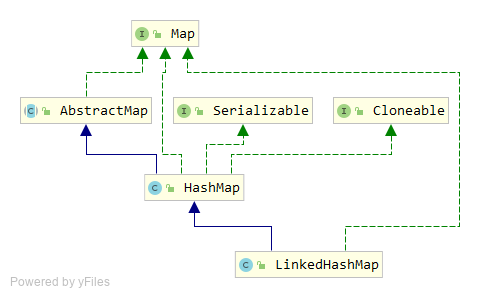

# LinkedHashMap 源码分析

`LinkedHashMap`是基于哈希表与链表的`Map`接口实现，能够保证顺序性，这是与`HashMap`明显不同的一点。

## 类继承结构

`LinkedHashMap`继承自`HashMap`，且实现了`Map`接口。因此，`HashMap`的所有能力和特性，`LinkedHashMap`均具备。



## 源码分析

### 构造函数

`LinkedHashMap`提供了几个重载的构造函数，最终执行到的是：

```java
public LinkedHashMap(int initialCapacity,
            float loadFactor,
                        boolean accessOrder) {
    super(initialCapacity, loadFactor);
    this.accessOrder = accessOrder;
}
```

这里面`initialCapacity`与`loadFactor`的含义同`HashMap`中一样，表示容器的初始大小与负载因子，事实上也是直接通过`super`去调用`HashMap`的构造函数。

`accessOrder`是一个特殊的属性。通过这个属性的注释我们得知，当`accessOrder`为`true`时使用访问顺序，为`false`时使用插入顺序。`accessOrder`在其他重载的构造函数中，默认是`false`，因此`LinkedHashMap`默认是使用插入顺序。

```java
/**
 * The iteration ordering method for this linked hash map: <tt>true</tt>
 * for access-order, <tt>false</tt> for insertion-order.
 *
 * @serial
 */
private final boolean accessOrder;
```

插入顺序好说，访问顺序不太好理解，我们先看个例子：

```java
Map<Integer, String> map = new LinkedHashMap<Integer, String>(16, 0.75f, true);
map.put(1, "a");
map.put(2, "b");
map.put(3, "c");
map.put(4, "d");

for (Map.Entry<Integer, String> entry : map.entrySet()) {
    System.out.println(entry.getKey() + " -> " + entry.getValue());
}

map.get(1);
map.get(2);

for (Map.Entry<Integer, String> entry : map.entrySet()) {
    System.out.println(entry.getKey() + " -> " + entry.getValue());
}
```

输出：

```
1 -> a
2 -> b
3 -> c
4 -> d
3 -> c
4 -> d
1 -> a
2 -> b
```

第一次访问时1、2、3、4的顺序进行了输出，而在进行过`get`操作后再访问，就变成了3、4、1、2的顺序。

这就是基于访问的顺序，`get`一个元素后，这个元素就被加到了最后。

### init 初始化

还记得`HashMap`中有一个空的`init`方法吗？`LinkedHashMap`就实现了这个`init`方法，从而在构造函数被调用的时候辗转调用到`init`方法。

```java
void init() {
    header = new Entry<K,V>(-1, null, null, null);
    header.before = header.after = header;
}
```

`init`方法中创建了一个链表`header`，`LinkedHashMap`能够实现按顺序的迭代，其实就是遍历这个`header`链表的过程。

### Entry 内部类

`header`链表中每个元素的类型是`LinkedHashMap`中的内部类`Entry`。这个`Entry`继承自`HashMap.Entry`，增加了两个新的属性`before`和`after`，这两个属性是实现`LinkedHashMap`顺序性的关键。

通过`before`和`after`属性，将容器中元素的先后顺序记录下来，这一步是在`Entry`内部类的`addBefore`方法中实现的。

```java
private void addBefore(Entry<K,V> existingEntry) {
    after  = existingEntry;
    before = existingEntry.before;
    before.after = this;
    after.before = this;
}
```

`addBefore`是通过`addEntry` -> `createEntry` -> `addBefore`的调用链最终被调用到的，而`addEntry`这个方法，其实是重写了`HashMap`中的`addEntry`方法。

### removeEldestEntry 方法

我们在`addEntry`方法中看到了一个`removeEldestEntry`方法的调用：

```java
void addEntry(int hash, K key, V value, int bucketIndex) {
    createEntry(hash, key, value, bucketIndex);

    // Remove eldest entry if instructed, else grow capacity if appropriate
    Entry<K,V> eldest = header.after;
    if (removeEldestEntry(eldest)) {
        removeEntryForKey(eldest.key);
    } else {
        if (size >= threshold)
            resize(2 * table.length);
    }
}
```

`LinkedHashMap`提供了一个默认的`removeEldestEntry`实现，返回`false`。可以看出来，如果`removeEldestEntry`返回了`true`，那么`LinkedHashMap`将会把最久不用的一个元素删除。

基于这个特性，我们可以使用`LinkedHashMap`来实现`LRU`算法，实现一个缓存的组件。

在`removeEldestEntry`方法的注释上也看到一个例子，比如当容器中元素个数大于某个数值时，`removeEldestEntry`就返回true，从而再向容器添加元素时将会删除掉最老的那个元素，使容器维持在一个合理的大小。

```java
    /**
     * Returns <tt>true</tt> if this map should remove its eldest entry.
     * This method is invoked by <tt>put</tt> and <tt>putAll</tt> after
     * inserting a new entry into the map.  It provides the implementor
     * with the opportunity to remove the eldest entry each time a new one
     * is added.  This is useful if the map represents a cache: it allows
     * the map to reduce memory consumption by deleting stale entries.
     *
     * <p>Sample use: this override will allow the map to grow up to 100
     * entries and then delete the eldest entry each time a new entry is
     * added, maintaining a steady state of 100 entries.
     * <pre>
     *     private static final int MAX_ENTRIES = 100;
     *
     *     protected boolean removeEldestEntry(Map.Entry eldest) {
     *        return size() > MAX_ENTRIES;
     *     }
     * </pre>
     *
     * <p>This method typically does not modify the map in any way,
     * instead allowing the map to modify itself as directed by its
     * return value.  It <i>is</i> permitted for this method to modify
     * the map directly, but if it does so, it <i>must</i> return
     * <tt>false</tt> (indicating that the map should not attempt any
     * further modification).  The effects of returning <tt>true</tt>
     * after modifying the map from within this method are unspecified.
     *
     * <p>This implementation merely returns <tt>false</tt> (so that this
     * map acts like a normal map - the eldest element is never removed).
     *
     * @param    eldest The least recently inserted entry in the map, or if
     *           this is an access-ordered map, the least recently accessed
     *           entry.  This is the entry that will be removed it this
     *           method returns <tt>true</tt>.  If the map was empty prior
     *           to the <tt>put</tt> or <tt>putAll</tt> invocation resulting
     *           in this invocation, this will be the entry that was just
     *           inserted; in other words, if the map contains a single
     *           entry, the eldest entry is also the newest.
     * @return   <tt>true</tt> if the eldest entry should be removed
     *           from the map; <tt>false</tt> if it should be retained.
     */
    protected boolean removeEldestEntry(Map.Entry<K,V> eldest) {
        return false;
    }
```

### 再谈 accessOrder

在向容器添加元素的时候，新加入的元素是放到`header`链表的最后，因此`removeEldestEntry`所要删除的元素其实是链表头部的元素，见`addEntry`方法中的`Entry<K,V> eldest = header.after;`这一句。

我们在前面提到了`LinkedHashMap`支持两种顺序，访问顺序和插入顺序。对于插入顺序，新插入的元素放到了链表最后，表头元素自然是最久未使用的元素。而对于访问顺序而言，由于可能存在的访问操作，使得访问顺序与元素插入时所构建的顺序不一致，因此需要额外维护。这部分逻辑在`Entry`内部类的`recordAccess`方法中，会把新访问的元素重新放到链表的尾部。

```java
/**
 * This method is invoked by the superclass whenever the value
 * of a pre-existing entry is read by Map.get or modified by Map.set.
 * If the enclosing Map is access-ordered, it moves the entry
 * to the end of the list; otherwise, it does nothing.
 */
void recordAccess(HashMap<K,V> m) {
    LinkedHashMap<K,V> lm = (LinkedHashMap<K,V>)m;
    if (lm.accessOrder) {
        lm.modCount++;
        remove();
        addBefore(lm.header);
    }
}
```

`recordAccess`方法则是在`get`方法中被调用，从而维护访问顺序。