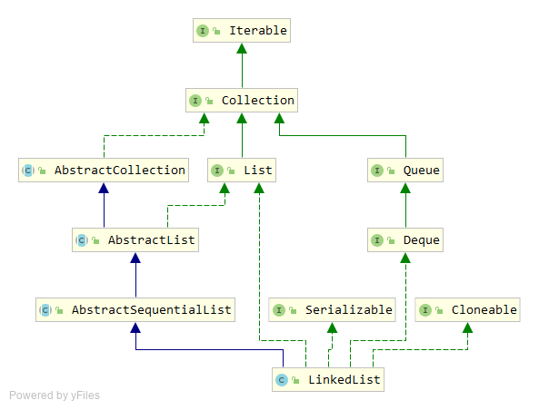

# LinkedList 源码分析

`LinkedList`是另一个`List`接口的实现，底层基于链表实现。`LinkedList`继承于`AbstractSequentialList`，实现了`List`、`Deque`、`Cloneable`、`Serializable`接口。



## Entry内部类

`Entry`是`LinkedList`的一个私有内部类，表示链表中的一个节点。`Entry`有`next`和`previous`两个属性，分别指向前后节点，因此它是一个双向链表的实现。

```java
private static class Entry<E> {
	E element;
	Entry<E> next;
	Entry<E> previous;

	Entry(E element, Entry<E> next, Entry<E> previous) {
	    this.element = element;
	    this.next = next;
	    this.previous = previous;
	}
}
```

## 内部属性

同`ArrayList`类似，`LinkedList`内部也有两个重要的属性，`header`是已经创建号的链表头结点，`size`是链表的长度，也就是`LinkedList`的容量。

```java
private transient Entry<E> header = new Entry<E>(null, null, null);
private transient int size = 0;
```

## 构造函数

`LinkedList`有两个构造函数，一个是无参构造函数，将`header`的头和尾都指向`header`；另一个接受一个`Collection`类型的参数，调用`addAll`方法初始化到链表中。

```java
public LinkedList() {
    header.next = header.previous = header;
}

public LinkedList(Collection<? extends E> c) {
	this();
	addAll(c);
}
```

## add方法

`add`方法就是一个向链表中添加元素的过程，这个新元素会添加到链表的尾部。

```java
public boolean add(E e) {
	addBefore(e, header);
    return true;
}

private Entry<E> addBefore(E e, Entry<E> entry) {
	Entry<E> newEntry = new Entry<E>(e, entry, entry.previous);
	newEntry.previous.next = newEntry;
	newEntry.next.previous = newEntry;
	size++;
	modCount++;
	return newEntry;
}
```

也可以使用`addFirst`或`addLast`方法将元素添加到链表的头部和尾部。`addLast`与`add`的实现一致。

```java
public void addFirst(E e) {
	addBefore(e, header.next);
}

public void addLast(E e) {
	addBefore(e, header);
}
```

## remove方法

`remove`方法将元素从链表中移除。`LinkedList`提供了多种`remove`方法的实现，方便进行各种情形下的删除元素操作。

`remove`方法包括：

```java
public boolean remove(Object o) {}
public E remove(int index) {}
public E remove() {}
public E removeFirst() {}
public E removeLast() {}
```

核心的`remove`方法是一个私有方法，实现上就是一个链表中删除元素的过程。

```java
private E remove(Entry<E> e) {
	if (e == header)
	    throw new NoSuchElementException();

    E result = e.element;
	e.previous.next = e.next;
	e.next.previous = e.previous;
    e.next = e.previous = null;
    e.element = null;
	size--;
	modCount++;
    return result;
}
```

## Deque接口中的方法

`LinkedList`也实现了`Deque`接口，因此提供了相关方法的实现，基本都是链表相关的操作，包括：

```java
void addFirst(E e);
void addLast(E e);
boolean offerFirst(E e);
boolean offerLast(E e);
E removeFirst();
E removeLast();
E pollFirst();
E pollLast();
E getFirst();
E getLast();
E peekFirst();
E peekLast();
boolean removeFirstOccurrence(Object o);
boolean removeLastOccurrence(Object o);

// *** Queue methods ***
boolean add(E e);
boolean offer(E e);
E remove();
E poll();
E element();
E peek();

// *** Stack methods ***
void push(E e);
E pop();

// *** Collection methods ***
boolean remove(Object o);
boolean contains(Object o);
public int size();
Iterator<E> iterator();
Iterator<E> descendingIterator();
```

`poll`开头的方法除返回元素外还会删除元素，`peek`开头的方法仅仅返回元素而不会删除元素。

`remove`开头的方法类似`poll`，除返回元素外还会删除元素；`get`开头的方法类似`peek`，仅仅返回元素而不会删除元素。

当链表是空时，`peek`和`poll`开头的方法会返回`null`；而`remove`和`get`开头的方法会抛出异常。