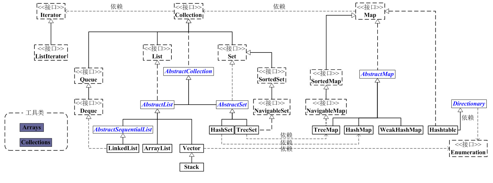

# Java 集合框架

Java 集合框架提供了常用的数据结构抽象及其实现，包括列表、集合、队列、栈、映射等类型，主要位于 `java.util` 包及其子包中。

## 集合接口

集合框架的核心接口可以分为两类：一类是以 `Collection` 为根接口的单元素集合，另一类是以 `Map` 为根接口的键值映射结构。

`Collection` 主要包含 `List`、`Set` 和 `Queue` 等分支。`List` 是有序且可重复的线性结构，每个元素具有索引，主要实现包括 `ArrayList`、`LinkedList`、`Vector`、`Stack` 等。`Set` 不允许重复元素，但不一定无序：`HashSet` 不保证迭代顺序，`LinkedHashSet` 按插入顺序迭代，`TreeSet` 按排序规则迭代。`HashSet` 底层通常基于 `HashMap` 实现，`TreeSet` 底层通常基于 `TreeMap` 实现。

`Map` 是键值对映射结构，每个映射项包含 `key` 和 `value`。常见实现包括 `HashMap`、`LinkedHashMap`、`TreeMap`、`WeakHashMap`、`Hashtable`、`ConcurrentHashMap` 等。

`Iterator` 是集合遍历的主要迭代器接口，支持在遍历期间通过迭代器删除元素。`Enumeration` 是 JDK 1.0 引入的早期遍历接口，常见于 `Vector`、`Hashtable` 等旧集合类，也可由其他 API 返回；与 `Iterator` 相比，它不提供删除元素的能力。
