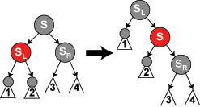

# 了解红黑树

树是一种数据结构，是一个由N个节点组成的具有层次结构的集合。树中的每个节点均有（且只有）一个父节点，没有父节点的节点称为根节点。节点可以有多个字节点，没有子节点的节点称为叶节点。因为这种数据结构呈现出的形状像一棵树，因此称其为树，只不过这棵树是倒过来的。

树是一类数据结构，有众多的种类，例如：二叉树、平衡二叉树、红黑树、B树、B+树、哈夫曼树等。

## 二叉树

二叉树是最基础的树结构。

二叉树的每个节点最多有两个子节点，除此之外没有任何限制。

## 二叉查找树

相对于二叉树，二叉查找树有一些特殊的要求：

* 如果二叉查找树的左子树不为空，那么它的左子树上的任意节点的值都小于根节点的值。
* 如果二叉查找树的右子树不为空，那么它的右子树上的任意节点的值都大于根节点的值。

也就是说，二叉查找树的左子树中任意节点的值都小于右子树中任意节点的值。而且，在左子树和右子树中也同样形成了二叉查找树。

根据二叉查找树的特点，我们可以使用二分查找在树中进行元素搜索：如果查找的元素大于根节点，则在树的右边进行搜索；如果小于根节点，则在树的左边进行搜索。如果等于根节点，则直接返回；所以二叉查找树的查询效率远远高于二叉树。

## 平衡二叉树

平衡二叉树又称为AVL树。

考虑二叉查找树的极端情况，一个二叉查找树的左子树为空、只有右子树（右子树为空同理），那么二叉查找树就退化成一个链表的结构，此时在二叉查找树中进行查找就变成了链表的遍历，失去了二叉查找树原有的性能。

AVL树就是为了解决这一问题。

AVL树要求左右子树的高度差的绝对值不能大于1，也就是说左右子树的高度差只能为-1、0、1。

## 红黑树

红黑树是另一种解决二叉查找树不平衡的树结构。

AVL树通过限制左右子树的高度差不能大于1来实现树的平衡，红黑树则使用节点的颜色来维持树的平衡。

AVL树是严格的平衡树，因此在增加或者删除节点的时候，根据不同情况，旋转的次数比红黑树要多；红黑树是弱平衡的，用非严格的平衡来换取增删节点时候旋转次数的降低；所以简单说，搜索的次数远远大于插入和删除，那么选择AVL树，如果搜索，插入删除次数几乎差不多，应该选择红黑树。

红黑树有如下要求：

1. 节点是红色或黑色。
2. 根节点是黑色。
3. 每个叶子节点都是黑色的空节点（NIL节点或null节点）。
4. 每个红色节点的两个子节点都是黑色。(从每个叶子到根的所有路径上不能有两个连续的红色节点)
5. 从任一节点到其每个叶子的所有路径都包含相同数目的黑色节点。

**NIL节点是就是一个假想的或是无实在意义的节点，所有应该指向NULL的指针，都看成指向了NIL节点。包括叶节点的子节点指针或是根节点的父指针（均是指向null的）**

下图是一个典型的红黑树结构。


因为红黑树是一种特殊的二叉查找树，因此红黑树上的只读操作与普通的二叉查找树的只读操作相同。然而，在红黑树上进行插入操作和删除操作会导致不再符合红黑树的性质。恢复红黑树的性质需要少量（O(log n)）的颜色变更（实际是非常快速的）和不超过三次的树旋转（对于插入操作是两次）。虽然插入和删除很复杂，但操作时间仍可以保持为O(log n)次。

### 左旋和右旋

插入节点或删除节点都可能会造成红黑树的不平衡，必须进行调整，使之重新符合红黑树的规则。调整方法有两种，变色和旋转，旋转又分为左旋转和右旋转。


参照`TreeMap`中的左旋和右旋代码：

```java
private void rotateLeft(Entry<K,V> p) {
    if (p != null) {
        Entry<K,V> r = p.right;
        p.right = r.left;
        if (r.left != null)
            r.left.parent = p;
        r.parent = p.parent;
        if (p.parent == null)
            root = r;
        else if (p.parent.left == p)
            p.parent.left = r;
        else
            p.parent.right = r;
        r.left = p;
        p.parent = r;
    }
}

private void rotateRight(Entry<K,V> p) {
    if (p != null) {
        Entry<K,V> l = p.left;
        p.left = l.right;
        if (l.right != null) l.right.parent = p;
        l.parent = p.parent;
        if (p.parent == null)
            root = l;
        else if (p.parent.right == p)
            p.parent.right = l;
        else p.parent.left = l;
        l.right = p;
        p.parent = l;
    }
}
```

### 插入

在红黑树中新插入的节点都是红色的，原因是插入红色节点比插入黑色节点破坏红黑树的可能性更小。插入黑色节点会改变黑色高度（违背规则5），但是插入红色节点只有一半的机会会违背规则4。另外，违背规则4比违背规则5更好修正。

我们将要插入的节点记为N，N的父节点记为P，N的祖父节点记为G，N的叔父节点（父节点的兄弟节点）记为U。


**情形1**

新节点N位于树的根上，没有父节点。在这种情况下，将它重绘为黑色以满足性质2。

**情形2**

新节点N的父节点P是黑色的，所以性质4仍然满足。在这种情形下，树仍然是有效的。性质5也未受到破坏，尽管新节点N有两个黑色叶子子节点，但由于新节点N是红色的，通过它的每个子节点的路径同通过它所取代的黑色的叶子的路径同样数目的黑色节点，所以仍然满足这个性质。

注意，在以下情形下假定新节点的父节点为红色，所以它有祖父节点；因为如果父节点是根节点，那父节点就应当是黑色。所以新节点总有一个叔父节点，尽管在情形4和5下它可能是叶子节点。

**情形3**


如果父节点P和叔父节点U都是红色，如上图所示。此时新插入节点N作为P的左子节点或右子节点都属于情形3，这里的图仅显示N作为P左子的情形。我们可以将他们两个重绘为黑色并重绘祖父节点G为红色（用来保证性质5）。现在的新节点N有了一个黑色的父节点P。因为通过父节点P或叔父节点U的任何路径都必定通过祖父节点G，在这些路径上的黑节点数目没有改编，但是，红色的祖父节点G可能是根节点，这就违背了性质2，也有可能祖父节点G的父节点是红色的，这就违反了性质4。为了解决这个问题，我们在祖父节点G上递归地进行**情形1**的整个过程（把G当成是新插入的节点进行各种情形的检查）。

注意，在余下的情形下，我们假定父节点P是其祖父节点G的左子节点。如果它是右子节点，情形4和情形5的左和右应当对调。

**情形4**


父节点P是红色而叔父节点U是黑色或缺少，并且新节点N是其父节点P的右子节点而父节点P又是其父节点的左子节点。在这种情形下，我们进行一次左旋转调换新节点和其父节点的角色；接着，我们按情形5处理以前的父节点P以解决仍然失效的性质4.注意这个改编会导致某些路径通过他们以前不通过的新节点N（比如途中1号叶子节点）或不通过节点P（比如途中3号叶子节点），但由于这两个节点都是红色的，所以性质5仍然有效。

**情形5**


父节点P是红色而叔父节点U是黑色或缺少，新节点N是其父节点的左子节点，而父节点P又是其父节点G的左子节点。在这种情形下，我们进行针对祖父节点G的一次右旋转；在旋转产生的树中，以前的父节点现在是新节点N和以前的祖父节点G的父节点。我们知道以前的祖父节点G是黑色，否则父节点P就不可能是红色（如果P和G都是红色就违反了性质4，所以G必须是黑色）。我们切换以前的父节点P和祖父节点G的颜色，结果的树满足性质4。性质5也仍然满足，因为通过这三个节点中任何一个的所有路径以前都通过祖父节点G，现在他们都通过以前的父节点P。在各自的情形下，这都是三个节点中唯一的黑色节点。

### 删除 ###

如果需要删除的节点有两个儿子，那么问题ke可以被转化成另一个只有一个儿子的节点的问题。对于二叉查找树，在删除带有两个非叶子的儿子节点的时候，我们要么找到它左子树中的最大元素，要么找到它右子树中的最小元素，并把它的值转移到要删除的节点中。我们接着删除我们从中复制出值的那个节点，它必定有少于两个非叶子的儿子。因为只是复制了一个值没有复制颜色，不违反任何性质，这就把问题简化为如何删除最多有一个儿子的节点的问题。它不关心这个节点是最初要删除的节点还是我们从中复制出值的那个节点。

在余下的部分中，我们只需要讨论删除只有一个儿子的节点（如果它两个儿子都为空，即均为叶子，我们任意将其中一个看作它的儿子）。如果我们删除一个红色节点（此时该节点的儿子都将作为叶子节点），它的父亲和儿子一定是黑色的。所以我们可以简单地用它的黑色儿子替换它，并不会破坏性质3和性质4.通过被删除节点的所有路径只是少了一个红色节点，这样可以继续保证性质5.另一个中简单情况是在被删除节点是黑色而它的儿子是红色的时候，如果只是去除这个黑色节点，用它的红色儿子顶替上来的话，会破坏性质5，但是如果我们重回它的儿子为黑色，则曾经通过它的所有路径将通过它的黑色儿子，这样可以继续保持性质5。

需要进一步讨论的是在要删除的节点和它的儿子二者都是黑色的时候，这是一种复杂的情况（这种情况下该节点的两个儿子都是叶子节点，否则若其中一个儿子是黑色非叶子节点，另一个儿子是叶子节点，那么从该节点通过非叶子节点儿子的路径上的黑色节点数最小为2，而从该节点到另一个叶子节点儿子的路径上的黑色节点数为1，违反了性质5）。我们首先把要删除的节点替换为它的儿子。出于方便，称呼这个儿子为N（在新的位置上），称呼它的兄弟（它父亲的另一个儿子）为S，使用P称呼N的父亲，SL称呼S的左儿子，SR称呼S的右儿子。


如果N和它初始的父亲是黑色，则删除它的父亲导致通过N的路径都比不通过它的路径少了一个黑色节点。因为这违反了性质5，树需要被重新平衡。有几种情形需要考虑：

**情形1**: N是新的根。在这种情形下，我们就做完了。我们从所有路径去除了一个黑色节点，而新根是黑色的，所以性质都保持着。

**情形2**： S是红色。在这种情形下我们在N的父亲上做左旋转，把红色兄弟转换成N的祖父，我们接着对调N的父亲和祖父的颜色。完成这两个操作后，尽管所有路径上黑色节点的数目没有改变，但现在N有了一个黑色的兄弟和一个红色的父亲（它的新兄弟是黑色因为它是红色S的一个儿子），所以我们可以接下去按情形4、情形5或情形6来处理。


**情形3**： N的父亲、S和S的儿子都是黑色的。在这种情形下，我们简单的重绘S为红色。结果是通过S的所有路径，它们就是以前不通过N的那些路径，都少了一个黑色节点。因为删除N的初始的父亲使通过N的所有路径少了一个黑色节点，这使事情都平衡了起来。但是，通过P的所有路径现在比不通过P的路径少了一个黑色节点，所以仍然违反性质5。要修正这个问题，我们要从情形1开始，在P上做重新平衡处理。


**情形4**： S和S的儿子都是黑色，但是N的父亲是红色。在这种情形下，我们简单的交换N的兄弟和父亲的颜色。这不影响不通过N的路径的黑色节点的数目，但是它在通过N的路径上对黑色节点数目增加了一，添补了在这些路径上删除的黑色节点。


**情形5**： S是黑色，S的左儿子是红色，S的右儿子是黑色，而N是它父亲的左儿子。在这种情形下我们在S上做右旋转，这样S的左儿子成为S的父亲和N的新兄弟。我们接着交换S和它的新父亲的颜色。所有路径仍有同样数目的黑色节点，但是现在N有了一个黑色兄弟，他的右儿子是红色的，所以我们进入了情形6。N和它的父亲都不受这个变换的影响。



**情形6**： S是黑色，S的右儿子是红色，而N是它父亲的左儿子。在这种情形下我们在N的父亲上做左旋转，这样S成为N的父亲（P）和S的右儿子的父亲。我们接着交换N的父亲和S的颜色，并使S的右儿子为黑色。子树在它的根上的仍是同样的颜色，所以性质3没有被违反。但是，N现在增加了一个黑色祖先：要么N的父亲变成黑色，要么它是黑色而S被增加为一个黑色祖父。所以，通过N的路径都增加了一个黑色节点。

此时，如果一个路径不通过N，则有两种可能性：

* 它通过N的新兄弟。那么它以前和现在都必定通过S和N的父亲，而它们只是交换了颜色。所以路径保持了同样数目的黑色节点。
* 它通过N的新叔父，S的右儿子。那么它以前通过S、S的父亲和S的右儿子，但是现在只通过S，它被假定为它以前的父亲的颜色，和S的右儿子，它被从红色改变为黑色。合成效果是这个路径通过了同样数目的黑色节点。

在任何情况下，在这些路径上的黑色节点数目都没有改变。所以我们恢复了性质4。在示意图中的白色节点可以是红色或黑色，但是在变换前后都必须指定相同的颜色。


### TreeMap中的实现

回过头来再看TreeMap中插入和删除后红黑树的修复，处理过程与前面分析的各个步骤对应。

```java
private void fixAfterInsertion(Entry<K,V> x) {
    x.color = RED;

    while (x != null && x != root && x.parent.color == RED) {
        if (parentOf(x) == leftOf(parentOf(parentOf(x)))) {
            Entry<K,V> y = rightOf(parentOf(parentOf(x)));
            if (colorOf(y) == RED) {
                setColor(parentOf(x), BLACK);
                setColor(y, BLACK);
                setColor(parentOf(parentOf(x)), RED);
                x = parentOf(parentOf(x));
            } else {
                if (x == rightOf(parentOf(x))) {
                    x = parentOf(x);
                    rotateLeft(x);
                }
                setColor(parentOf(x), BLACK);
                setColor(parentOf(parentOf(x)), RED);
                rotateRight(parentOf(parentOf(x)));
            }
        } else {
            Entry<K,V> y = leftOf(parentOf(parentOf(x)));
            if (colorOf(y) == RED) {
                setColor(parentOf(x), BLACK);
                setColor(y, BLACK);
                setColor(parentOf(parentOf(x)), RED);
                x = parentOf(parentOf(x));
            } else {
                if (x == leftOf(parentOf(x))) {
                    x = parentOf(x);
                    rotateRight(x);
                }
                setColor(parentOf(x), BLACK);
                setColor(parentOf(parentOf(x)), RED);
                rotateLeft(parentOf(parentOf(x)));
            }
        }
    }
    root.color = BLACK;
}

private void fixAfterDeletion(Entry<K,V> x) {
    while (x != root && colorOf(x) == BLACK) {
        if (x == leftOf(parentOf(x))) {
            Entry<K,V> sib = rightOf(parentOf(x));

            if (colorOf(sib) == RED) {
                setColor(sib, BLACK);
                setColor(parentOf(x), RED);
                rotateLeft(parentOf(x));
                sib = rightOf(parentOf(x));
            }

            if (colorOf(leftOf(sib))  == BLACK &&
                colorOf(rightOf(sib)) == BLACK) {
                setColor(sib, RED);
                x = parentOf(x);
            } else {
                if (colorOf(rightOf(sib)) == BLACK) {
                    setColor(leftOf(sib), BLACK);
                    setColor(sib, RED);
                    rotateRight(sib);
                    sib = rightOf(parentOf(x));
                }
                setColor(sib, colorOf(parentOf(x)));
                setColor(parentOf(x), BLACK);
                setColor(rightOf(sib), BLACK);
                rotateLeft(parentOf(x));
                x = root;
            }
        } else { // symmetric
            Entry<K,V> sib = leftOf(parentOf(x));

            if (colorOf(sib) == RED) {
                setColor(sib, BLACK);
                setColor(parentOf(x), RED);
                rotateRight(parentOf(x));
                sib = leftOf(parentOf(x));
            }

            if (colorOf(rightOf(sib)) == BLACK &&
                colorOf(leftOf(sib)) == BLACK) {
                setColor(sib, RED);
                x = parentOf(x);
            } else {
                if (colorOf(leftOf(sib)) == BLACK) {
                    setColor(rightOf(sib), BLACK);
                    setColor(sib, RED);
                    rotateLeft(sib);
                    sib = leftOf(parentOf(x));
                }
                setColor(sib, colorOf(parentOf(x)));
                setColor(parentOf(x), BLACK);
                setColor(leftOf(sib), BLACK);
                rotateRight(parentOf(x));
                x = root;
            }
        }
    }

    setColor(x, BLACK);
}
```

## 参考资料

[红黑树](https://wikipedia.hk.wjbk.site/wiki/%E7%BA%A2%E9%BB%91%E6%A0%91)