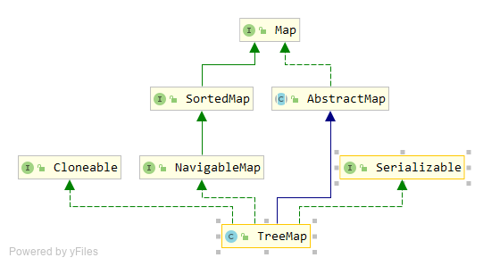
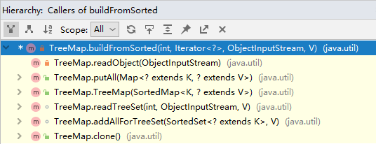

# TreeMap 源码分析

`TreeMap`是另一个经常会用到的`Map`类型数据结构。`HashMap`不保证数据有序，`LinkedHashMap`保证数据可以保持插入顺序（或访问顺序），而如果希望`Map`能够保持`key`的大小顺序的时候，就可以使用`TreeMap`了。

## 类继承结构



1. `TreeMap`继承自`AbstractMap`抽象类。
2. `TreeMap`实现了`NavigableMap`、`Cloneable`、`Serializable`接口。
3. `NavigableMap`接口继承自`SortedMap`接口。
4. `SortedMap`接口继承自`Map`接口。

`SortedMap`在`Map`的基础上，提供了基于`key`的全序排列。`NavigableMap`顾名思义是可导航的`Map`，它在`SortedMap`的基础上，提供了获取小于或大于给定`Key`的元素。

`SortedMap`接口包含的方法：

```java
public interface SortedMap<K,V> extends Map<K,V> {
    // 返回比较大小的comparator
    Comparator<? super K> comparator();
    // 返回key在[fromKey, toKey)范围内的Map子集
    SortedMap<K,V> subMap(K fromKey, K toKey);
    // 返回小于key的Map子集
    SortedMap<K,V> headMap(K toKey);
    // 返回大于等于key的Map子集
    SortedMap<K,V> tailMap(K fromKey);
    // 返回Map中第一个key
    K firstKey();
    // 返回Map中最后一个key
    K lastKey();
    // 返回所有Key构成的有序集合
    Set<K> keySet();
    // 返回所有Value构成的有序集合
    Collection<V> values();
    // 返回所有Entry构成的有序集合
    Set<Map.Entry<K, V>> entrySet();
}
```

`NavigableMap`接口包含的方法：

```java
public interface NavigableMap<K,V> extends SortedMap<K,V> {
    // 返回小于key的第一个元素
    Map.Entry<K,V> lowerEntry(K key);
    // 返回小于key的第一个键
    K lowerKey(K key);
    // 返回小于等于key的第一个元素
    Map.Entry<K,V> floorEntry(K key);
    // 返回小于等于key的第一个键
    K floorKey(K key);
    // 返回大于或者等于key的第一个元素
    Map.Entry<K,V> ceilingEntry(K key);
    // 返回大于或者等于key的第一个键
    K ceilingKey(K key);
    // 返回大于key的第一个元素
    Map.Entry<K,V> higherEntry(K key);
    // 返回大于key的第一个键
    K higherKey(K key);
    // 返回集合中第一个元素
    Map.Entry<K,V> firstEntry();
    // 返回集合中最后一个元素
    Map.Entry<K,V> lastEntry();
    // 返回集合中第一个元素，并从集合中删除
    Map.Entry<K,V> pollFirstEntry();
    // 返回集合中最后一个元素，并从集合中删除
    Map.Entry<K,V> pollLastEntry();
    // 返回一个逆序的Map视图
    NavigableMap<K,V> descendingMap();
    // 返回一个可导航的key集合
    NavigableSet<K> navigableKeySet();
    // 返回一个逆序的key集合视图
    NavigableSet<K> descendingKeySet();
    // 返回一个从fromKey到toKey范围内的Map子集，边界是否包含由fromInclusive和toInclusive设置
    NavigableMap<K,V> subMap(K fromKey, boolean fromInclusive,
                             K toKey,   boolean toInclusive);
    // 返回小于toKey的Map子集，边界是否包含由inclusive设置
    NavigableMap<K,V> headMap(K toKey, boolean inclusive);
    // 返回大于fromKey的Map子集，边界是否包含由inclusive设置
    NavigableMap<K,V> tailMap(K fromKey, boolean inclusive);
    // 等价于 subMap(fromKey, true, toKey, false)
    SortedMap<K,V> subMap(K fromKey, K toKey);
    // 等价于 headMap(toKey, false)
    SortedMap<K,V> headMap(K toKey);
    // 等价于 tailMap(fromKey, true)
    SortedMap<K,V> tailMap(K fromKey);
}
```

## TreeMap 构造函数

`TreeMap`有4个重载的构造函数。

```java
public TreeMap() {
    comparator = null; 
}

public TreeMap(Comparator<? super K> comparator) {
    this.comparator = comparator;
}

public TreeMap(Map<? extends K, ? extends V> m) {
    comparator = null;
    putAll(m);
}

public TreeMap(SortedMap<K, ? extends V> m) {
    comparator = m.comparator();
    try {
        buildFromSorted(m.size(), m.entrySet().iterator(), null, null);
    } catch (java.io.IOException cannotHappen) {
    } catch (ClassNotFoundException cannotHappen) {
    }
}
```

其中比较重要的是`comparator`这个属性，实现了`Comparator`这个接口，它决定了`TreeMap`中元素的顺序。如果在构造函数中未指定`comparator`属性，那么将使用`key`来决定顺序，此时要求`key`必须是一个实现了`Comparable`接口的类型，否则的话会出问题。

`buildFromSorted`这个方法是一个内部的私有方法，被多个方法调用，主要功能是从有序数据中构建树结构。



关于红黑树，后面会单独用一篇文章介绍，这里不再详细说明了。

## exportEntry 包装方法

在调用`TreeMap`的`lowerEntry`、`floorEntry`等“导航”方法时，`TreeMap`会将结果使用`exportEntry`方法进行包装，返回的是一个`AbstractMap.SimpleImmutableEntry`类型，这是一个只读的数据结构，当调用诸如`setValue`等方法的时候，会抛出`UnsupportedOperationException`异常。

```java
static <K,V> Map.Entry<K,V> exportEntry(TreeMap.Entry<K,V> e) {
    return (e == null) ? null :
        new AbstractMap.SimpleImmutableEntry<>(e);
}
```

## lowerEntry 方法

`lowerEntry`方法返回比所给定key小的最大key的Entry元素。

```java
public Map.Entry<K,V> lowerEntry(K key) {
    return exportEntry(getLowerEntry(key));
}

final Entry<K,V> getLowerEntry(K key) {
    Entry<K,V> p = root;
    while (p != null) {
        int cmp = compare(key, p.key);
        if (cmp > 0) {
            if (p.right != null)
                p = p.right;
            else
                return p;
        } else {
            if (p.left != null) {
                p = p.left;
            } else {
                Entry<K,V> parent = p.parent;
                Entry<K,V> ch = p;
                while (parent != null && ch == parent.left) {
                    ch = parent;
                    parent = parent.parent;
                }
                return parent;
            }
        }
    }
    return null;
}
```


## put 方法

```java
public V put(K key, V value) {
    Entry<K,V> t = root;
    if (t == null) {
        compare(key, key); // type (and possibly null) check

        root = new Entry<>(key, value, null);
        size = 1;
        modCount++;
        return null;
    }
    int cmp;
    Entry<K,V> parent;
    // split comparator and comparable paths
    Comparator<? super K> cpr = comparator;
    if (cpr != null) {
        do {
            parent = t;
            cmp = cpr.compare(key, t.key);
            if (cmp < 0)
                t = t.left;
            else if (cmp > 0)
                t = t.right;
            else
                return t.setValue(value);
        } while (t != null);
    }
    else {
        if (key == null)
            throw new NullPointerException();
        @SuppressWarnings("unchecked")
            Comparable<? super K> k = (Comparable<? super K>) key;
        do {
            parent = t;
            cmp = k.compareTo(t.key);
            if (cmp < 0)
                t = t.left;
            else if (cmp > 0)
                t = t.right;
            else
                return t.setValue(value);
        } while (t != null);
    }
    Entry<K,V> e = new Entry<>(key, value, parent);
    if (cmp < 0)
        parent.left = e;
    else
        parent.right = e;
    fixAfterInsertion(e);
    size++;
    modCount++;
    return null;
}
```

`put`方法的大致处理流程如下：

1. 判断红黑树的根节点是否为空，如果为空的情况，那么直接把本次`put`操作的键值对作为根节点。
2. 根据`comparator`属性是否为空，决定遍历红黑树时如何判断顺序。
3. 如果`comparator`不为空，那么使用`comparator`比较红黑树中每个节点与`key`的大小；如果`comparator`，那么使用`key`的`compareTo`方法比较红黑树中节点与`key`的大小，此时会有一次强制类型转换。
4. 在比较完红黑树中节点与`key`的大小后，找到了插入节点的位置，创建`Entry`对象放入树中，并调用`fixAfterInsertion`维护红黑树的平衡。

## get 方法

```java
public V get(Object key) {
    Entry<K,V> p = getEntry(key);
    return (p==null ? null : p.value);
}

final Entry<K,V> getEntry(Object key) {
    // Offload comparator-based version for sake of performance
    if (comparator != null)
        return getEntryUsingComparator(key);
    if (key == null)
        throw new NullPointerException();
    @SuppressWarnings("unchecked")
        Comparable<? super K> k = (Comparable<? super K>) key;
    Entry<K,V> p = root;
    while (p != null) {
        int cmp = k.compareTo(p.key);
        if (cmp < 0)
            p = p.left;
        else if (cmp > 0)
            p = p.right;
        else
            return p;
    }
    return null;
}

final Entry<K,V> getEntryUsingComparator(Object key) {
    @SuppressWarnings("unchecked")
        K k = (K) key;
    Comparator<? super K> cpr = comparator;
    if (cpr != null) {
        Entry<K,V> p = root;
        while (p != null) {
            int cmp = cpr.compare(k, p.key);
            if (cmp < 0)
                p = p.left;
            else if (cmp > 0)
                p = p.right;
            else
                return p;
        }
    }
    return null;
}
```

`get`方法的大致流程如下：

1. 判断`comparator`是否为空，如果不为空，那么调用`getEntryUsingComparator`方法通过`comparator`在树中进行查找。
2. 否则使用`key`的`compareTo`方法，比较`key`的大小并在树中进行查找。


## 小结

* `TreeMap`中`key`不能为空，否则会抛出空指针。