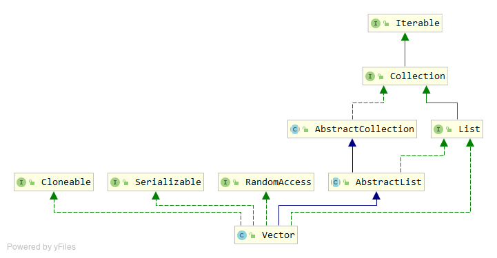

# Vector 源码分析

`Vector`的功能类似于`ArrayList`，它更为古老，从JDK 1.0时代就有了。

`Vector`同样继承于`AbstractList`，实现了`List`、`RandomAccess`、`Cloneable`、`Serializable`接口。



`Vector`的底层同样基于数组实现，内部处理过程也类似，添加元素时实现了数组的动态扩容。不同的是，`Vector`是一个线程安全的数据结构，通过`synchronized`关键字保证了多线程环境下的安全。

## 内部属性

```java
protected Object[] elementData;
protected int elementCount;
protected int capacityIncrement;
```

与`ArrayList`类似，`Vector`内部同样使用一个`elementData`数组来存储，使用`elementCount`来记录`Vector`实际存储的元素数量；不同的是，多了一个`capacityIncrement`字段，用于数组动态扩容时参与计算的。

## 构造函数

`Vector`提供了4个重载的构造函数：

```java
public Vector(int initialCapacity, int capacityIncrement) {
	super();
    if (initialCapacity < 0)
        throw new IllegalArgumentException("Illegal Capacity: "+
                                            initialCapacity);
	this.elementData = new Object[initialCapacity];
	this.capacityIncrement = capacityIncrement;
}

public Vector(int initialCapacity) {
	this(initialCapacity, 0);
}

public Vector() {
	this(10);
}

public Vector(Collection<? extends E> c) {
	elementData = c.toArray();
	elementCount = elementData.length;
	// c.toArray might (incorrectly) not return Object[] (see 6260652)
	if (elementData.getClass() != Object[].class)
	    elementData = Arrays.copyOf(elementData, elementCount, Object[].class);
}
```

`Vector`默认的初始容量`elementCount`是10，默认的`capacityIncrement`是0。

## 扩容

`Vector`的增删等操作与`ArrayList`差不多，唯一不太一样的是扩容的计算，这部分代码在`ensureCapacityHelper`方法中。

```java
private void ensureCapacityHelper(int minCapacity) {
	int oldCapacity = elementData.length;
	if (minCapacity > oldCapacity) {
	    Object[] oldData = elementData;
	    int newCapacity = (capacityIncrement > 0) ?
		    (oldCapacity + capacityIncrement) : (oldCapacity * 2);
    	if (newCapacity < minCapacity) {
		    newCapacity = minCapacity;
	    }
        elementData = Arrays.copyOf(elementData, newCapacity);
	}
}
```

根据`capacityIncrement`的不同，每次扩容计算出的容量也不同。如果在创建`Vector`时设置了`capacityIncrement`，那么计算出的新容量是原容量加上`capacityIncrement`；如果未设置，那么新容量是原容量的2倍。