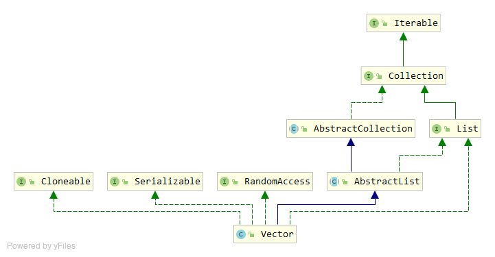

# Vector 源码分析

`Vector` 的功能类似于 `ArrayList`，是 JDK 1.0 起提供的早期列表实现。

`Vector`同样继承于`AbstractList`，实现了`List`、`RandomAccess`、`Cloneable`、`Serializable`接口。



`Vector` 底层同样基于数组实现，添加元素时会进行动态扩容。不同的是，`Vector` 的主要方法使用 `synchronized` 修饰，单个方法调用具备同步保护。但由于同步粒度较粗，在现代代码中通常优先使用 `ArrayList`，并在确有并发需求时选择更合适的并发容器或外部同步策略。

## 内部属性

```java
protected Object[] elementData;
protected int elementCount;
protected int capacityIncrement;
```

与 `ArrayList` 类似，`Vector` 使用 `elementData` 数组存储元素，使用 `elementCount` 记录实际元素数量。`capacityIncrement` 用于参与扩容计算。

## 构造函数

`Vector`提供了4个重载的构造函数：

```java
public Vector(int initialCapacity, int capacityIncrement) {
	super();
    if (initialCapacity < 0)
        throw new IllegalArgumentException("Illegal Capacity: "+
                                            initialCapacity);
	this.elementData = new Object[initialCapacity];
	this.capacityIncrement = capacityIncrement;
}

public Vector(int initialCapacity) {
	this(initialCapacity, 0);
}

public Vector() {
	this(10);
}

public Vector(Collection<? extends E> c) {
	elementData = c.toArray();
	elementCount = elementData.length;
	// c.toArray might (incorrectly) not return Object[] (see 6260652)
	if (elementData.getClass() != Object[].class)
	    elementData = Arrays.copyOf(elementData, elementCount, Object[].class);
}
```

`Vector` 默认构造方法会创建长度为 10 的底层数组，此时 `elementCount` 为 0，`capacityIncrement` 默认为 0。

## 扩容

`Vector` 的增删操作与 `ArrayList` 类似，主要差异之一在于扩容计算方式。相关逻辑位于 `ensureCapacityHelper` 方法中。

```java
private void ensureCapacityHelper(int minCapacity) {
	int oldCapacity = elementData.length;
	if (minCapacity > oldCapacity) {
	    Object[] oldData = elementData;
	    int newCapacity = (capacityIncrement > 0) ?
		    (oldCapacity + capacityIncrement) : (oldCapacity * 2);
    	if (newCapacity < minCapacity) {
		    newCapacity = minCapacity;
	    }
        elementData = Arrays.copyOf(elementData, newCapacity);
	}
}
```

根据`capacityIncrement`的不同，每次扩容计算出的容量也不同。如果在创建`Vector`时设置了`capacityIncrement`，那么计算出的新容量是原容量加上`capacityIncrement`；如果未设置，那么新容量是原容量的2倍。
