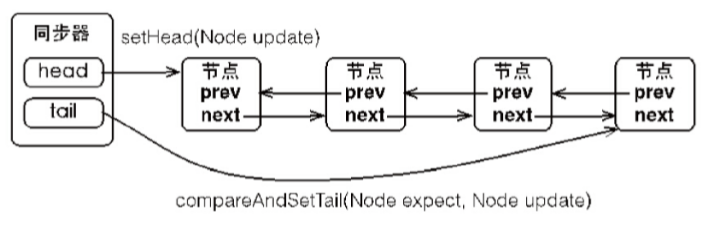
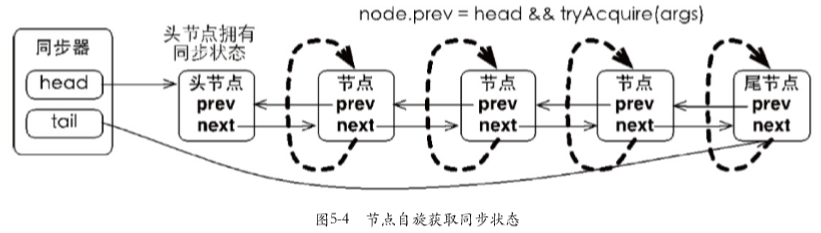
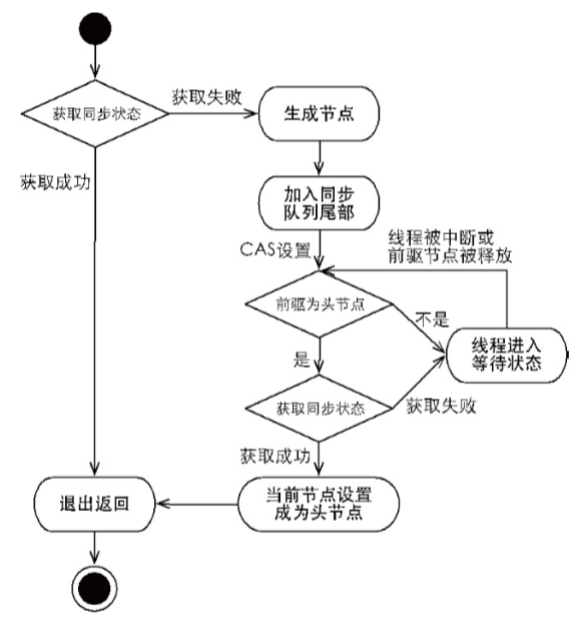
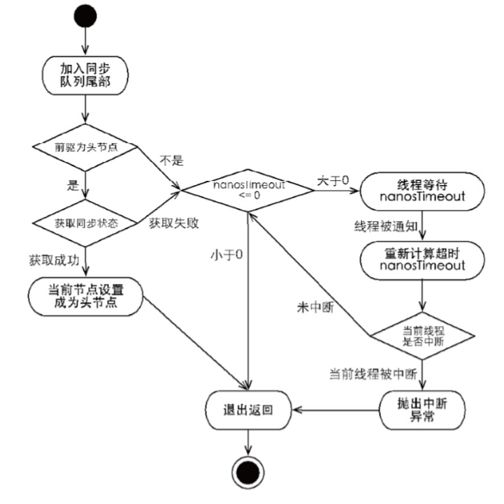

# 队列同步器

队列同步器`AbstractQueuedSynchronizer`是用来构建锁或者其他同步组件的基础框架，它使用了一个int成员变量表示同步状态，通过内置的FIFO队列来完成资源获取线程的排队工作。

同步器的主要使用方式是继承，子类通过继承同步器并实现它的抽象方法来管理同步状态，在抽象方法的实现过程中免不了要对同步状态进行更改，这是就需要使用同步器提供的3个方法，`getSTat()`、`setState(int newState)`和`compareAndSetState(int expect, int updte)`，来进行操作，因为它们能够保证状态的改变是安全的。子类推荐被定义为自定义同步组件中的静态内部类，同步器自身没有实现任何同步接口，它仅仅是定义了若干同步状态获取和释放的方法来供自定义同步组件使用。同步器既可以支持独占式地获取同步状态，也可以支持共享式地获取同步状态，这样就可以方便实现不同类型的同步组件。

同步器是实现锁（也可以是任意同步组件）的关键，在锁的实现中聚合同步器，利用同步器实现锁的语义。可以这样理解二者的关系：锁是面向使用者的，它定义了使用者与锁交互的接口，隐藏了实现细节；同步器面向的是锁的是闲着，它简化锁的实现方式，屏蔽了同步状态管理、线程的排队、等待与唤醒等底层操作。

## 队列同步器的实现分析

### 同步队列

同步器依赖内部的同步队列（一个FIFO双向队列）来完成同步状态的管理，当前线程获取同步状态失败时，同步器会将当前线程以及等待状态等信息构造成一个节点（Node）并将其加入同步队列，同时会阻塞当前线程，当同步状态释放时，会把首节点中的线程唤醒，使其再次尝试获取同步状态。

同步队列中的节点用来保存获取同步状态失败的线程引用、等待状态以及前驱和后继节点。节点包括的属性有：

**int waitStatus**

表示等待状态，包含如下状态：

1. `CANCELLED`，值为`1`，由于在同步队列中等待的线程等待超时或者被中断，需要从同步队列中取消等待，节点进入该状态将不会变化。
2. `signal`，值为`-1`，后继节点的线程处于等待状态，而当前节点的线程如果释放了同步状态或者被取消，将会通知后继节点，使后继节点的线程得以运行。
3. `CONDITION`，值为`-2`，节点在等待队列中，节点线程等待在`Condition`上，当其他线程对`Condition`调用了`signal()`方法后，该节点将会从等待队列中转义到同步队列中，加入到对同步状态的读取中。
4. `PROPAGATE`，值为`-3`，表示下一次共享式同步状态获取将会无条件地被传播下去。
5. `INITIAL`，值为`0`，初始状态

**Node prev**

表示前驱系欸但，当节点加入同步队列时被设置（尾部添加）。

**Node next**

表示后继节点。

**Node nextWaiter**

等待队列中的后继节点。如果当前节点时共享的，那么这个字段将是一个SHARED常量，也就是说节点类型（独占和共享）和等待队列中的后继节点公用同一个字段。

**Trhead thread**

获取同步状态的线程。


节点是构成同步队列的基础，同步器拥有首节点和尾节点，没有成功获取同步状态的线程将会成为节点加入该队列的尾部。同步队列的基本结构如图所示。



同步器包含两个节点类型的引用，一个指向头节点，另一个指向尾节点。当一个线程成功获取了同步状态，其他线程将无法获取到同步状态，转而被构造成为节点并加入到同步队列中，而这个加入队列的过程必须要保证线程安全，因此同步器提供了一个基于CAS的设置尾节点的方法：`compareAndSetTail(Node expect, Node update)`，它需要传递当前线程认为的尾节点和当前节点，只有设置成功后，当前节点菜正式与之前的尾节点建立关联。

同步队列遵循FIFO，首节点是获取同步状态成功的姐姐点，首节点的线程在释放同步状态时，将会唤醒后继节点，而后继节点将会在获取同步状态成功时将自己设置为首节点。由于只有一个线程能够成功获取到同步状态，因此设置首节点的方法并不需要使用CAS来保证，它只需要将首节点设置成为原首节点的后继节点并断开首节点的next引用即可。

### 独占式同步状态获取与释放

通过调用同步器的`acquire(int arg)`方法可以获取同步状态，该方法对中断不敏感，也就是由于线程获取同步状态失败后进入同步队列中，后续对线程进行中断操作时，线程不会从同步队列中移出。该方法代码如下所示：

```java
public final void acquire(int arg) {        
    if (!tryAcquire(arg) &&            
        acquireQueued(addWaiter(Node.EXCLUSIVE), arg))            selfInterrupt(); 
}
```

上述代码主要完成了同步状态获取、节点构造、加入同步队列以及在同步队列中自旋等待的相关操作，其主要逻辑是：首先调用自定义同步器实现的`tryAcquire(int arg)`方法，该方法保证线程安全的获取同步状态，如果同步状态获取失败，则构造同步节点（独占式Node.EXCLUSIVE，同一时刻只能由一个线程成功获取同步状态），并通过`addWaiter(Node node)`方法将该节点加入到同步队列的尾部，最后调用`acquireQueued(Node node, int arg)`方法，是得该节点 以“死循环”的方式获取同步状态。如果获取不到则阻塞节点中的线程，而被阻塞线程的唤醒主要依靠前驱节点的出队或阻塞线程被中断来实现。

下面具体分析。首先是节点的构造以及加入同步队列。

```java
private Node addWaiter(Node mode) {
    Node node = new Node(Thread.currentThread(), mode);
    // Try the fast path of enq; backup to full enq on failure
    Node pred = tail;
    if (pred != null) {
        node.prev = pred;
        if (compareAndSetTail(pred, node)) {
            pred.next = node;
            return node;
        }
    }
    enq(node);
    return node;
}

private Node enq(final Node node) {
    for (;;) {
        Node t = tail;
        if (t == null) { // Must initialize
            Node h = new Node(); // Dummy header
            h.next = node;
            node.prev = h;
            if (compareAndSetHead(h)) {
                tail = node;
                return h;
            }
        }
        else {
            node.prev = t;
            if (compareAndSetTail(t, node)) {
                t.next = node;
                return t;
            }
        }
    }
}
```

上述代码通过使用`compareAndSetTail(Node expect, Node update)`方法来确保节点能够被线程安全地添加。试想一下：如果使用一个普通的`LinkedList`来维护节点之间的关系，那么当一个线程获取了同步状态，而其他多个线程由于调用`tryAcquire(int arg)`方法获取同步状态失败而并发地被添加到`LinkedList`时，`LinkedList`将难以保证`Node`的正确添加，最终的结果可能时节点数量有偏差，而且顺序也是混乱的。

在`enq(final Node node)`方法中，同步器通过“死循环”来保证节点的正确添加，在“死循环”中只有通过CAS将节点设置称为尾节点之后，当前线程才能从该方法返回，否则，当前线程不断地长视设置。可以看出，`enq(final Node node)`方法将并发添加节点的请求通过CAS变得“串行化”了。

节点进入同步队列之后，就进入一个“自旋”的过程，每个节点（或者说每个线程）都在自省地观察，当条件满足，获取到了同步状态，就可以从这个自旋过程中退出，否则依旧留在这个自旋过程中（并会阻塞节点的线程）。

```java
final boolean acquireQueued(final Node node, int arg) {
    try {
        boolean interrupted = false;
        for (;;) {
            final Node p = node.predecessor();
            if (p == head && tryAcquire(arg)) {
                setHead(node);
                p.next = null; // help GC
                return interrupted;
            }
            if (shouldParkAfterFailedAcquire(p, node) &&
                parkAndCheckInterrupt())
                interrupted = true;
        }
    } catch (RuntimeException ex) {
        cancelAcquire(node);
        throw ex;
    }
}
```

在`acquireQueued(final Node node, int arg)`方法中，当前线程在“死循环”中长视获取同步状态，而只有前驱节点是头节点才能够尝试获取同步状态，原因有两个：

1. 头节点是成功获取到同步状态的节点，而头节点的线程释放了同步状态之后，将会唤醒其后继节点，后继节点的线程被唤醒后需要检查自己的前驱节点是否是头节点。
2. 维护同步队列的FIFO原则。该方法中，节点自旋获取同步状态的行为如下图所示。



由于非首节点线程前驱节点出队或者被中断而从等待状态返回，随后检查自己的前驱是否是头节点，如果是则尝试获取同步状态。可以看到节点和节点之间在循环检查的过程中基本不相互通信，而是简单地判断自己的前驱是否尾头节点，这样就使得节点的释放规则符合FIFO，并且也便于对过早通知的处理（过早通知是指前驱节点不是头节点的线程由于中断而被唤醒）。

独占式同步状态获取流程，也就是`acquire(int arg)`方法调用流程，如下图所示。



上图中，前驱节点尾头节点且能够获取同步状态的判断条件和线程进入等待状态时获取同步状态的自旋过程。当同步状态获取成功之后，当前线程从`accquire(int arg)`方法返回，如果对于锁这种并发组件而言，代表着当前线程获取了锁。

当前线程获取同步状态并执行了相应逻辑之后，就需要释放同步状态，使得后续节点能够继续获取同步状态。通过调用同步器的`release(int arg)`方法可以释放同步状态，该方法在释放了同步状态之后，会唤醒其后继节点（进而使后继节点重新尝试获取同步状态）。

```java
public final boolean release(int arg) {
    if (tryRelease(arg)) {
        Node h = head;
        if (h != null && h.waitStatus != 0)
            unparkSuccessor(h);
        return true;
    }
    return false;
}
```

该方法执行时，会唤醒头节点的后继节点线程，`unparkSuccessor(Node node)`方法使用`LockSupport`来唤醒处于等待状态的线程。

分析了独占式同步状态获取和释放过程之后，适当做个总结：在获取同步状态时，同步器维护一个同步队列，获取状态失败的线程都会被加入到队列中并在队列中进行自旋；移出队列（或停止自旋）的条件时前驱节点为头节点且成功获取了同步状态。在释放同步状态时，同步器调用`tryRelease(int arg)`方法释放同步状态，然后唤醒头节点的后继节点。

### 共享式同步状态获取与释放

共享式获取与独占式获取最重要的区别在于同一时刻能否有多个线程同时获取到同步状态。以文件的读写为例，如果一个线程在对文件进行读操作，那么这一时刻对于改文件的写操作均被阻塞，而读操作能够同时进行。写操作要求对资源的独占式访问，而读操作可以是共享式访问。

通过调用同步器的`acquireShared(int arg)`方法可以共享式地获取同步状态。

```java
public final void acquireShared(int arg) {
    if (tryAcquireShared(arg) < 0)
        doAcquireShared(arg);
}

private void doAcquireShared(int arg) {
    final Node node = addWaiter(Node.SHARED);
    try {
        boolean interrupted = false;
        for (;;) {
            final Node p = node.predecessor();
            if (p == head) {
                int r = tryAcquireShared(arg);
                if (r >= 0) {
                    setHeadAndPropagate(node, r);
                    p.next = null; // help GC
                    if (interrupted)
                        selfInterrupt();
                    return;
                }
            }
            if (shouldParkAfterFailedAcquire(p, node) &&
                parkAndCheckInterrupt())
                interrupted = true;
        }
    } catch (RuntimeException ex) {
        cancelAcquire(node);
        throw ex;
    }
}
```

在`acquireShared(int arg)`方法中，同步器调用`tryAcquireShared(int arg)`方法尝试获取同步状态，`tryAcquireShared(int arg)`方法返回值为int类型，当返回值大于等于0时，表示能够获取到同步状态。因此，在共享式获取的自旋过程中，成功获取到同步状态并退出自旋的条件就是`tryAcquireShared(int arg)`方法返回值大于等于0。可以看到，在`tryAcquireShared(int arg)`方法的自旋过程中，如果当前节点的前驱节点是头节点时，尝试获取同步状态，如果返回值大于等于0，表示该次获取同步状态成功并从自旋过程中退出。

与独占式一样，共享式获取也需要释放同步状态，通过调用`releaseShared(int arg)`方法可以释放同步状态。

```java
public final boolean releaseShared(int arg) {
    if (tryReleaseShared(arg)) {
        doReleaseShared();
        return true;
    }
    return false;
}
```

该方法在释放同步状态之后，将会唤醒后续处于等待状态的节点。对于能够支持多个线程同时访问的并发组件（比如`Semaphore`），它和独占式主要区别在于`tryReleaseShared(int arg)`方法必须确保同步状态（或者资源数）线程安全释放，一般是通过循环和CAS来保证的，因为释放同步状态的操作会同时来自多个线程。

### 独占式超时获取同步状态

通过调用同步器的`doAcquireNanos(int arg, long nonosTimeout)`方法可以超时获取同步状态，即在指定的时间段内获取同步状态，如果获取到同步状态则返回true，否则返回false。该方法提供了传统Java同步操作（比如synchronized关键字）所不具备的特性。

在Java5之前，当一个线程获取不到锁而被阻塞在synchronized之外时，对该线程进行中断操作，此时该线程的中断标志位会被修改，但线程依旧会阻塞在synchronized上，等待着获取锁。在Java5中，同步器提供了`acquireInterruptibly(int arg)`方法，这个方法在等待获取同步状态时，如果当前线程被中断，会立刻返回，并抛出InterruptedException。

超时获取同步状态过程可以被视为响应中断获取同步状态过程的“增强版”，`doAcquireNanos(int arg, long nonosTimeout)`方法在支持响应中断的基础上，增加了超时获取的特性。针对超时获取，主要需要计算出需要睡眠的时间间隔`nanosTimeout`，为了防止过早通知，`nanosTimeout`的计算公式为：`nanosTimeout -= now - lastTime`，其中`now`为当前唤醒时间，`lastTime`为上次唤醒时间，如果`nanosTimeout`大于0则表示超时时间未到，需要继续睡眠`nanosTimeout`纳秒，反之，表示已经超时。

```java
private boolean doAcquireNanos(int arg, long nanosTimeout)
    throws InterruptedException {
    long lastTime = System.nanoTime();
    final Node node = addWaiter(Node.EXCLUSIVE);
    try {
        for (;;) {
            final Node p = node.predecessor();
            if (p == head && tryAcquire(arg)) {
                setHead(node);
                p.next = null; // help GC
                return true;
            }
            if (nanosTimeout <= 0) {
                cancelAcquire(node);
                return false;
            }
            if (nanosTimeout > spinForTimeoutThreshold &&
                shouldParkAfterFailedAcquire(p, node))
                LockSupport.parkNanos(this, nanosTimeout);
            long now = System.nanoTime();
            nanosTimeout -= now - lastTime;
            lastTime = now;
            if (Thread.interrupted())
                break;
        }
    } catch (RuntimeException ex) {
        cancelAcquire(node);
        throw ex;
    }
    // Arrive here only if interrupted
    cancelAcquire(node);
    throw new InterruptedException();
}
```

该方法在自旋过程中，当节点的前驱节点为头节点时尝试获取同步状态，如果获取成功则从该方法返回，这个过程和独占式同步获取的过程类似，但是在同步状态获取失败的处理上有所不同。如果当前线程获取同步状态失败，则判断是否超时（`nanosTimeout`小于等于0表示已经超时），如果没有超时，重新计算超时间间隔`nanosTimeout`，然后使当前线程等待`nanosTimeout`纳秒（当已到设置的超时时间，该线程会从`LockSupport.parkNanos(Object blocker, long nanos)`方法返回）。

如果`nanosTimeout`小于等于`spinForTimeoutThreshold`（1000纳秒）时，将不会使线程进行超时等待，而是进入快速的自旋过程，非常短的超时等待无法做到十分精确，如果这时再进行超时等待，相反会让`nanosTimeout`的超时从整体上表现得反而不精确。因此，再超时非常短的场景下，同步器将会进入无条件的快速自旋


