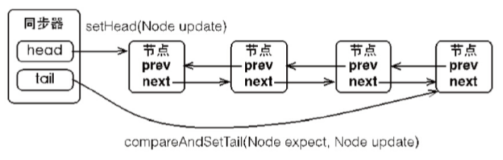
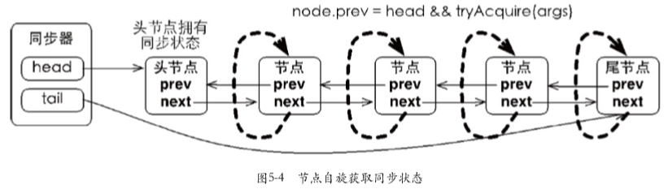
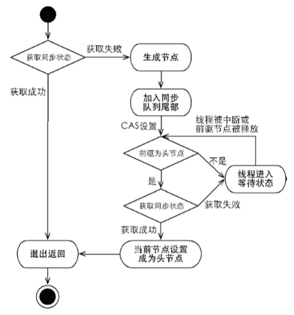
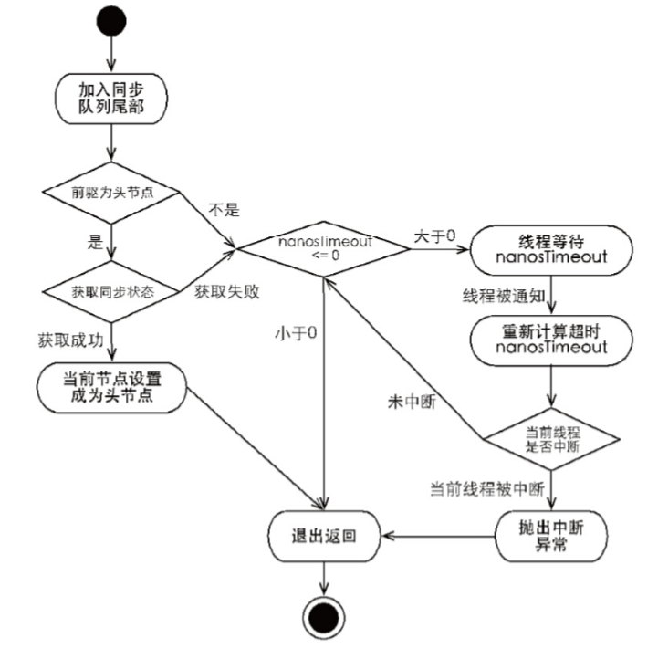

# 队列同步器

队列同步器`AbstractQueuedSynchronizer`是用来构建锁或者其他同步组件的基础框架，它使用了一个int成员变量表示同步状态，通过内置的FIFO队列来完成资源获取线程的排队工作。

同步器的主要使用方式是继承。子类通过实现 `tryAcquire`、`tryRelease`、`tryAcquireShared`、`tryReleaseShared` 或 `isHeldExclusively` 等方法管理同步状态，并使用同步器提供的 `getState()`、`setState(int newState)` 和 `compareAndSetState(int expect, int update)` 访问状态。其中只有 `compareAndSetState` 提供原子的条件更新；`getState` 和 `setState` 具有 `volatile` 读写语义，并不把任意复合操作自动变为原子操作。子类通常定义为自定义同步组件的静态内部类。

同步器是实现锁及其他同步组件的基础。锁面向使用者，定义获取和释放等交互接口；同步器面向锁的实现者，封装同步状态管理、线程排队、等待与唤醒等底层操作。

## 队列同步器的实现分析

### 同步队列

同步器依赖内部的同步队列（一个FIFO双向队列）来完成同步状态的管理，当前线程获取同步状态失败时，同步器会将当前线程以及等待状态等信息构造成一个节点（Node）并将其加入同步队列，同时会阻塞当前线程，当同步状态释放时，会把首节点中的线程唤醒，使其再次尝试获取同步状态。

同步队列中的节点用来保存获取同步状态失败的线程引用、等待状态以及前驱和后继节点。节点包括的属性有：

**int waitStatus**

表示等待状态，包含如下状态：

1. `CANCELLED`，值为`1`，由于在同步队列中等待的线程等待超时或者被中断，需要从同步队列中取消等待，节点进入该状态将不会变化。
2. `signal`，值为`-1`，后继节点的线程处于等待状态，而当前节点的线程如果释放了同步状态或者被取消，将会通知后继节点，使后继节点的线程得以运行。
3. `CONDITION`，值为 `-2`，表示节点位于条件队列中，线程正在某个 `Condition` 上等待。其他线程调用 `signal()` 后，该节点会从条件队列转移到同步队列，重新参与同步状态的竞争。
4. `PROPAGATE`，值为`-3`，表示下一次共享式同步状态获取将会无条件地被传播下去。
5. `INITIAL`，值为`0`，初始状态

**Node prev**

表示前驱节点，在节点加入同步队列尾部时设置。

**Node next**

表示后继节点。

**Node nextWaiter**

等待队列中的后继节点。如果当前节点是共享节点，那么这个字段将是一个 `SHARED` 常量，也就是说节点类型（独占和共享）和等待队列中的后继节点共用同一个字段。

**Thread thread**

获取同步状态的线程。


节点是构成同步队列的基础，同步器拥有首节点和尾节点，没有成功获取同步状态的线程将会成为节点加入该队列的尾部。同步队列的基本结构如图所示。



同步器包含两个节点类型的引用，一个指向头节点，另一个指向尾节点。当一个线程成功获取同步状态后，其他线程无法获取同步状态，会被构造为节点并加入同步队列。入队过程必须保证线程安全，因此同步器提供了基于 CAS 的设置尾节点方法：`compareAndSetTail(Node expect, Node update)`。该方法需要传入当前线程认为的尾节点和当前节点，只有设置成功后，当前节点才正式与之前的尾节点建立关联。

同步队列整体遵循 FIFO，但取消节点、重新竞争和调度会使它不等同于严格公平锁。头节点是最近一次成功获取同步状态后留下的哨兵节点，其 `thread` 和 `prev` 会被清空，并不表示当前锁持有者仍驻留在头节点中。释放同步状态时通常会唤醒头节点之后合适的等待节点；该节点成功获取状态后再把自己设置为新的头节点。

### 独占式同步状态获取与释放

通过调用同步器的`acquire(int arg)`方法可以获取同步状态，该方法对中断不敏感，也就是由于线程获取同步状态失败后进入同步队列中，后续对线程进行中断操作时，线程不会从同步队列中移出。该方法代码如下所示：

```java
public final void acquire(int arg) {        
    if (!tryAcquire(arg) &&            
        acquireQueued(addWaiter(Node.EXCLUSIVE), arg))            selfInterrupt(); 
}
```

上述代码主要完成了同步状态获取、节点构造、加入同步队列以及在同步队列中自旋等待的相关操作，其主要逻辑是：首先调用自定义同步器实现的`tryAcquire(int arg)`方法，该方法保证线程安全的获取同步状态，如果同步状态获取失败，则构造同步节点（独占式Node.EXCLUSIVE，同一时刻只能由一个线程成功获取同步状态），并通过`addWaiter(Node node)`方法将该节点加入到同步队列的尾部，最后调用`acquireQueued(Node node, int arg)`方法，是得该节点 以“死循环”的方式获取同步状态。如果获取不到则阻塞节点中的线程，而被阻塞线程的唤醒主要依靠前驱节点的出队或阻塞线程被中断来实现。

下面具体分析。首先是节点的构造以及加入同步队列。

```java
private Node addWaiter(Node mode) {
    Node node = new Node(Thread.currentThread(), mode);
    // Try the fast path of enq; backup to full enq on failure
    Node pred = tail;
    if (pred != null) {
        node.prev = pred;
        if (compareAndSetTail(pred, node)) {
            pred.next = node;
            return node;
        }
    }
    enq(node);
    return node;
}

private Node enq(final Node node) {
    for (;;) {
        Node t = tail;
        if (t == null) { // Must initialize
            Node h = new Node(); // Dummy header
            h.next = node;
            node.prev = h;
            if (compareAndSetHead(h)) {
                tail = node;
                return h;
            }
        }
        else {
            node.prev = t;
            if (compareAndSetTail(t, node)) {
                t.next = node;
                return t;
            }
        }
    }
}
```

上述代码使用 `compareAndSetTail(Node expect, Node update)` 确保节点能够被线程安全地添加。如果直接使用没有同步保护的普通 `LinkedList` 维护节点关系，多个获取失败的线程并发入队时就可能丢失节点或破坏链表结构。

在 `enq(final Node node)` 方法中，同步器通过循环 CAS 保证节点正确入队。只有通过 CAS 将节点设置为尾节点后，当前线程才能从该方法返回；否则会继续尝试设置。可以看出，`enq(final Node node)` 方法通过 CAS 将并发入队请求串行化。

节点进入同步队列后，会在循环中检查是否可以获取同步状态；不满足条件时通常通过 `LockSupport.park` 阻塞，而不是持续占用 CPU 空转。被唤醒后线程再次检查条件，成功获取状态后退出循环。

```java
final boolean acquireQueued(final Node node, int arg) {
    try {
        boolean interrupted = false;
        for (;;) {
            final Node p = node.predecessor();
            if (p == head && tryAcquire(arg)) {
                setHead(node);
                p.next = null; // help GC
                return interrupted;
            }
            if (shouldParkAfterFailedAcquire(p, node) &&
                parkAndCheckInterrupt())
                interrupted = true;
        }
    } catch (RuntimeException ex) {
        cancelAcquire(node);
        throw ex;
    }
}
```

在 `acquireQueued(final Node node, int arg)` 中，当前线程在循环中尝试获取同步状态。只有前驱节点是头节点时才调用 `tryAcquire`，原因有两个：

1. 头节点是成功获取到同步状态的节点，而头节点的线程释放了同步状态之后，将会唤醒其后继节点，后继节点的线程被唤醒后需要检查自己的前驱节点是否是头节点。
2. 维护同步队列的FIFO原则。该方法中，节点自旋获取同步状态的行为如下图所示。



等待线程被唤醒后，会检查前驱是否为头节点；如果是，便尝试获取同步状态。普通的 `acquire` 对中断不敏感：中断可以使 `park` 返回，但节点不会因此自动取消，而是在最终成功获取状态后恢复中断标记。需要在等待期间响应中断时，应使用 `acquireInterruptibly`。

独占式同步状态获取流程，也就是`acquire(int arg)`方法调用流程，如下图所示。



当节点的前驱是头节点并且 `tryAcquire` 成功时，当前线程从 `acquire(int arg)` 返回；对于锁组件，这表示当前线程已经取得锁。

当前线程获取同步状态并执行了相应逻辑之后，就需要释放同步状态，使得后续节点能够继续获取同步状态。通过调用同步器的`release(int arg)`方法可以释放同步状态，该方法在释放了同步状态之后，会唤醒其后继节点（进而使后继节点重新尝试获取同步状态）。

```java
public final boolean release(int arg) {
    if (tryRelease(arg)) {
        Node h = head;
        if (h != null && h.waitStatus != 0)
            unparkSuccessor(h);
        return true;
    }
    return false;
}
```

该方法执行时，会唤醒头节点的后继节点线程，`unparkSuccessor(Node node)`方法使用`LockSupport`来唤醒处于等待状态的线程。

分析了独占式同步状态获取和释放过程之后，适当做个总结：在获取同步状态时，同步器维护一个同步队列，获取状态失败的线程都会被加入到队列中并在队列中进行自旋；移出队列（或停止自旋）的条件时前驱节点为头节点且成功获取了同步状态。在释放同步状态时，同步器调用`tryRelease(int arg)`方法释放同步状态，然后唤醒头节点的后继节点。

### 共享式同步状态获取与释放

共享式获取与独占式获取最重要的区别在于同一时刻能否有多个线程取得同步状态。以读写锁为例，读锁可以由多个线程共享，而写锁需要独占访问。

通过调用同步器的`acquireShared(int arg)`方法可以共享式地获取同步状态。

```java
public final void acquireShared(int arg) {
    if (tryAcquireShared(arg) < 0)
        doAcquireShared(arg);
}

private void doAcquireShared(int arg) {
    final Node node = addWaiter(Node.SHARED);
    try {
        boolean interrupted = false;
        for (;;) {
            final Node p = node.predecessor();
            if (p == head) {
                int r = tryAcquireShared(arg);
                if (r >= 0) {
                    setHeadAndPropagate(node, r);
                    p.next = null; // help GC
                    if (interrupted)
                        selfInterrupt();
                    return;
                }
            }
            if (shouldParkAfterFailedAcquire(p, node) &&
                parkAndCheckInterrupt())
                interrupted = true;
        }
    } catch (RuntimeException ex) {
        cancelAcquire(node);
        throw ex;
    }
}
```

在`acquireShared(int arg)`方法中，同步器调用`tryAcquireShared(int arg)`方法尝试获取同步状态，`tryAcquireShared(int arg)`方法返回值为int类型，当返回值大于等于0时，表示能够获取到同步状态。因此，在共享式获取的自旋过程中，成功获取到同步状态并退出自旋的条件就是`tryAcquireShared(int arg)`方法返回值大于等于0。可以看到，在`tryAcquireShared(int arg)`方法的自旋过程中，如果当前节点的前驱节点是头节点时，尝试获取同步状态，如果返回值大于等于0，表示该次获取同步状态成功并从自旋过程中退出。

与独占式一样，共享式获取也需要释放同步状态，通过调用`releaseShared(int arg)`方法可以释放同步状态。

```java
public final boolean releaseShared(int arg) {
    if (tryReleaseShared(arg)) {
        doReleaseShared();
        return true;
    }
    return false;
}
```

该方法在释放同步状态之后，将会唤醒后续处于等待状态的节点。对于能够支持多个线程同时访问的并发组件（比如`Semaphore`），它和独占式主要区别在于`tryReleaseShared(int arg)`方法必须确保同步状态（或者资源数）线程安全释放，一般是通过循环和CAS来保证的，因为释放同步状态的操作会同时来自多个线程。

### 独占式超时获取同步状态

通过调用同步器的 `doAcquireNanos(int arg, long nanosTimeout)` 方法可以超时获取同步状态，即在指定时间内尝试获取同步状态；如果获取成功则返回 `true`，否则返回 `false`。该能力是传统 `synchronized` 关键字不直接具备的特性。

当线程因无法获取 `synchronized` 监视器锁而阻塞时，中断操作不会使其立刻退出锁等待。AQS 提供的 `acquireInterruptibly(int arg)` 方法支持可中断地获取同步状态；等待过程中如果当前线程被中断，会抛出 `InterruptedException` 并返回调用方。

超时获取同步状态过程可以被视为响应中断获取同步状态过程的“增强版”，`doAcquireNanos(int arg, long nonosTimeout)`方法在支持响应中断的基础上，增加了超时获取的特性。针对超时获取，主要需要计算出需要睡眠的时间间隔`nanosTimeout`，为了防止过早通知，`nanosTimeout`的计算公式为：`nanosTimeout -= now - lastTime`，其中`now`为当前唤醒时间，`lastTime`为上次唤醒时间，如果`nanosTimeout`大于0则表示超时时间未到，需要继续睡眠`nanosTimeout`纳秒，反之，表示已经超时。

```java
private boolean doAcquireNanos(int arg, long nanosTimeout)
    throws InterruptedException {
    long lastTime = System.nanoTime();
    final Node node = addWaiter(Node.EXCLUSIVE);
    try {
        for (;;) {
            final Node p = node.predecessor();
            if (p == head && tryAcquire(arg)) {
                setHead(node);
                p.next = null; // help GC
                return true;
            }
            if (nanosTimeout <= 0) {
                cancelAcquire(node);
                return false;
            }
            if (nanosTimeout > spinForTimeoutThreshold &&
                shouldParkAfterFailedAcquire(p, node))
                LockSupport.parkNanos(this, nanosTimeout);
            long now = System.nanoTime();
            nanosTimeout -= now - lastTime;
            lastTime = now;
            if (Thread.interrupted())
                break;
        }
    } catch (RuntimeException ex) {
        cancelAcquire(node);
        throw ex;
    }
    // Arrive here only if interrupted
    cancelAcquire(node);
    throw new InterruptedException();
}
```

该方法在自旋过程中，当节点的前驱节点为头节点时尝试获取同步状态，如果获取成功则从该方法返回，这个过程和独占式同步获取的过程类似，但是在同步状态获取失败的处理上有所不同。如果当前线程获取同步状态失败，则判断是否超时（`nanosTimeout`小于等于0表示已经超时），如果没有超时，重新计算超时间间隔`nanosTimeout`，然后使当前线程等待`nanosTimeout`纳秒（当已到设置的超时时间，该线程会从`LockSupport.parkNanos(Object blocker, long nanos)`方法返回）。

如果`nanosTimeout`小于等于`spinForTimeoutThreshold`（1000纳秒）时，将不会使线程进行超时等待，而是进入快速的自旋过程，非常短的超时等待无法做到十分精确，如果这时再进行超时等待，相反会让`nanosTimeout`的超时从整体上表现得反而不精确。因此，再超时非常短的场景下，同步器将会进入无条件的快速自旋


