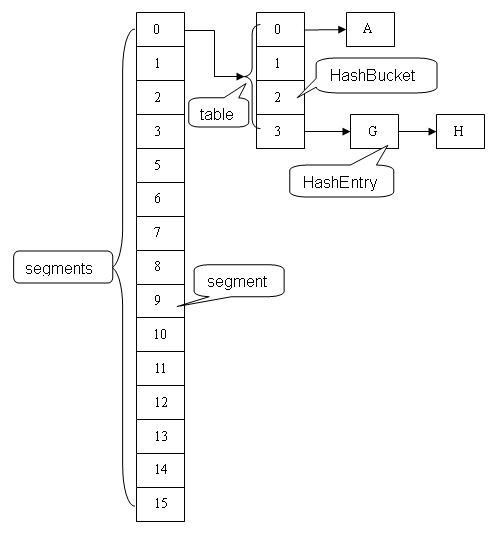
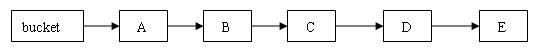
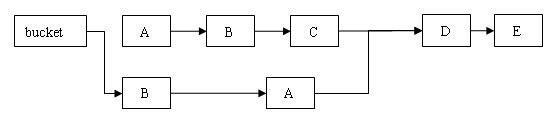
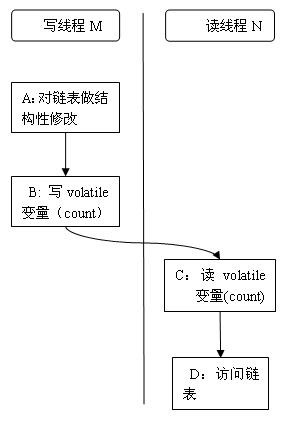

# ConcurrentHashMap 源码分析

`ConcurrentHashMap`类中包含两个静态内部类`HashEntry`和`Segment`。`HashEntry`用来封装映射表的键值对；`Segment`用来充当锁的角色，每个`Segment`对象守护整个散列映射表的若干个桶。每个桶是由若干个`HashEntry`对象链接起来的链表。一个`ConcurrentHashMap`实例中包含由若干个`Segment`对象组成的数组。

## HashEntry 类

`HashEntry`用来封装散列映射表中的键值对。在`HashEntry`类中，`key`、`hash`和`next`域都被声明为`final`型，`value`域被声明为`volatile`型。

```java
static final class HashEntry<K,V> {
        final K key;
        final int hash;
        volatile V value;
        final HashEntry<K,V> next;

        HashEntry(K key, int hash, HashEntry<K,V> next, V value) {
            this.key = key;
            this.hash = hash;
            this.next = next;
            this.value = value;
        }

	@SuppressWarnings("unchecked")
	static final <K,V> HashEntry<K,V>[] newArray(int i) {
	    return new HashEntry[i];
	}
}
```

在`ConcurrentHashMap`中，在散列时如果产生“碰撞”，将采用“分离链接法”来处理“碰撞”：把“碰撞”的`HashEntry`对象链接成一个链表。由于`HashEntry`的`next`域为`final`型，所以新节点只能在链表的表头处插入。

## Segment 类

`Segment`类继承于`ReentrantLock`类，从而使得`Segment`对象能充当锁的角色。每个`Segment`对象用来守护其（成员对象`table`中）包含的若干个桶。

`table`是一个由`HashEntry`对象组成的数组。`table`数组的每一个数组成员就是散列映射表的一个桶。

`count`变量是一个计数器，它表示每个`Segment`对象管理的`table`数组（若干个`HashEntry`组成的链表）包含的`HashEntry`对象的个数。每一个`Segment`对象都有一个`count`对象来表示本`Segment`中包含的`HashEntry`对象的总数。注意，之所以在每个`Segment`对象中包含一个计数器，而不是在`ConcurrentHashMap`中使用全局的计数器，是为了避免出现“热点域”而影响`ConcurrentHashMap`的并发性。

### 避免热点域

在`ConcurrentHashMap`中，每一个`Segment`对象都有一个`count`对象来表示本`Segment`中包含的`HashEntry`对象的个数。这样当需要更新计数器时，不用锁定整个`ConcurrentHashMap`。

```java
static final class Segment<K,V> extends ReentrantLock implements Serializable { 
       /** 
        * 在本 segment 范围内，包含的 HashEntry 元素的个数
        * 该变量被声明为 volatile 型
        */ 
       transient volatile int count; 
 
       /** 
        * table 被更新的次数
        */ 
       transient int modCount; 
 
       /** 
        * 当 table 中包含的 HashEntry 元素的个数超过本变量值时，触发 table 的再散列
        */ 
       transient int threshold; 
 
       /** 
        * table 是由 HashEntry 对象组成的数组
        * 如果散列时发生碰撞，碰撞的 HashEntry 对象就以链表的形式链接成一个链表
        * table 数组的数组成员代表散列映射表的一个桶
        * 每个 table 守护整个 ConcurrentHashMap 包含桶总数的一部分
        * 如果并发级别为 16，table 则守护 ConcurrentHashMap 包含的桶总数的 1/16 
        */ 
       transient volatile HashEntry<K,V>[] table; 
 
       /** 
        * 装载因子
        */ 
       final float loadFactor; 
 
       Segment(int initialCapacity, float lf) { 
           loadFactor = lf; 
           setTable(HashEntry.<K,V>newArray(initialCapacity)); 
       } 
 
       /** 
        * 设置 table 引用到这个新生成的 HashEntry 数组
        * 只能在持有锁或构造函数中调用本方法
        */ 
       void setTable(HashEntry<K,V>[] newTable) { 
           // 计算临界阀值为新数组的长度与装载因子的乘积
           threshold = (int)(newTable.length * loadFactor); 
           table = newTable; 
       } 
 
       /** 
        * 根据 key 的散列值，找到 table 中对应的那个桶（table 数组的某个数组成员）
        */ 
       HashEntry<K,V> getFirst(int hash) { 
           HashEntry<K,V>[] tab = table; 
           // 把散列值与 table 数组长度减 1 的值相“与”，
           // 得到散列值对应的 table 数组的下标
           // 然后返回 table 数组中此下标对应的 HashEntry 元素
           return tab[hash & (tab.length - 1)]; 
       } 
}

```

## ConcurrentHashMap 类

`ConcurrentHashMap`在默认并发级别会创建包含 16 个`Segment`对象的数组。每个`Segment`的成员对象`table`包含若干个散列表的桶。每个桶是由`HashEntry`链接起来的一个链表。如果键能均匀散列，每个`Segment`大约守护整个散列表中桶总数的 1/16。

下面是`ConcurrentHashMap`的结构示意图。



### 用分离锁实现多个线程间的并发写操作

在`ConcurrentHashMap`中，线程对映射表做读操作时，一般情况下不需要加锁就可以完成，对容器做结构性修改的操作才需要加锁。

注意：这里的加锁操作是针对（键的`hash`值对应的）某个具体的`Segment`，锁定的是该`Segment`而不是整个`ConcurrentHashMap`。因为插入键 / 值对操作只是在这个`Segment`包含的某个桶中完成，不需要锁定整个`ConcurrentHashMap`。此时，其他写线程对另外 15 个`Segment`的加锁并不会因为当前线程对这个`Segment`的加锁而阻塞。同时，所有读线程几乎不会因本线程的加锁而阻塞（除非读线程刚好读到这个 `Segment`中某个`HashEntry`的`value`域的值为`null`，此时需要加锁后重新读取该值）。

相比较于`HashTable`和由同步包装器包装的`HashMap`每次只能有一个线程执行读或写操作，`ConcurrentHashMap`在并发访问性能上有了质的提高。在理想状态下，`ConcurrentHashMap`可以支持 16 个线程执行并发写操作（如果并发级别设置为 16），及任意数量线程的读操作。

### 用 HashEntery 对象的不变性来降低读操作对加锁的需求

`HashEntry`中的`key`、`hash`、`next`都声明为`final`型。这意味着，不能把节点添加到链接的中间和尾部，也不能在链接的中间和尾部删除节点。这个特性可以保证：在访问某个节点时，这个节点之后的链接不会被改变。这个特性可以大大降低处理链表时的复杂性。

同时，`HashEntry`类的`value`域被声明为`volatile`型，Java的内存模型可以保证：某个写线程对`value`域的写入马上可以被后续的某个读线程“看”到。在`ConcurrentHashMap`中，不允许用`null`作为键和值，当读线程读到某个`HashEntry`的`value`域的值为`null`时，便知道产生了冲突——发生了重排序现象，需要加锁后重新读入这个`value`值。这些特性互相配合，使得读线程即使在不加锁状态下，也能正确访问 `ConcurrentHashMap`。

下面我们分别来分析线程写入的两种情形：对散列表做非结构性修改的操作和对散列表做结构性修改的操作。

非结构性修改操作只是更改某个`HashEntry`的`value`域的值。由于对`volatile`变量的写入操作将与随后对这个变量的读操作进行同步。当一个写线程修改了某个`HashEntry`的`value`域后，另一个读线程读这个值域，Java内存模型能够保证读线程读取的一定是更新后的值。所以，写线程对链表的非结构性修改能够被后续不加锁的读线程“看到”。

对`ConcurrentHashMap`做结构性修改，实质上是对某个桶指向的链表做结构性修改。如果能够确保：在读线程遍历一个链表期间，写线程对这个链表所做的结构性修改不影响读线程继续正常遍历这个链表。那么读 / 写线程之间就可以安全并发访问这个`ConcurrentHashMap`。

结构性修改操作包括`put`、`remove`、`clear`。下面我们分别分析这三个操作。

`clear`操作只是把`ConcurrentHashMap`中所有的桶“置空”，每个桶之前引用的链表依然存在，只是桶不再引用到这些链表（所有链表的结构并没有被修改）。正在遍历某个链表的读线程依然可以正常执行对该链表的遍历。

在`Segment`中执行具体的`put`操作”中，我们可以看出，`put`操作如果需要插入一个新节点到链表中时 , 会在链表头部插入这个新节点。此时，链表中的原有节点的链接并没有被修改。也就是说：插入新健 / 值对到链表中的操作不会影响读线程正常遍历这个链表。

`rermov`和`get`操作一样，首先根据散列码找到具体的链表；然后遍历这个链表找到要删除的节点；最后把待删除节点之后的所有节点原样保留在新链表中，把待删除节点之前的每个节点克隆到新链表中。下面通过图例来说明`remove`操作。假设写线程执行`remove`操作，要删除链表的`C`节点，另一个读线程同时正在遍历这个链表。

执行删除之前的原链表：



执行删除之后的新链表



从上图可以看出，删除节点`C`之后的所有节点原样保留到新链表中；删除节点`C`之前的每个节点被克隆到新链表中，注意：它们在新链表中的链接顺序被反转了。

在执行`remove`操作时，原始链表并没有被修改，也就是说：读线程不会受同时执行`remove`操作的并发写线程的干扰。

综合上面的分析我们可以看出，写线程对某个链表的结构性修改不会影响其他的并发读线程对这个链表的遍历访问。

### 用 Volatile 变量协调读写线程间的内存可见性

由于内存可见性问题，未正确同步的情况下，写线程写入的值可能并不为后续的读线程可见。

下面以写线程`M`和读线程`N`来说明`ConcurrentHashMap`如何协调读 / 写线程间的内存可见性问题。



假设线程`M`在写入了`volatile`型变量`count`后，线程`N`读取了这个`volatile`型变量`count`。

根据`happens-before`关系法则中的程序次序法则，A appens-before 于 B，C happens-before D。

根据 `volatile` 变量法则，B happens-before C。

根据传递性，连接上面三个 `happens-before` 关系得到：A appens-before 于 B； B appens-before C；C happens-before D。也就是说：写线程`M`对链表做的结构性修改，在读线程`N`读取了同一个 `volatile`变量后，对线程`N`也是可见的了。

虽然线程`N`是在未加锁的情况下访问链表。Java 的内存模型可以保证：只要之前对链表做结构性修改操作的写线程`M`在退出写方法前写`volatile`型变量`count`，读线程`N`在读取这个`volatile`型变量 `count` 后，就一定能“看到”这些修改。

`ConcurrentHashMap`中，每个`Segment`都有一个变量`count`。它用来统计`Segment`中的`HashEntry`的个数。这个变量被声明为`volatile`。

所有不加锁读方法，在进入读方法时，首先都会去读这个`count`变量。

在`ConcurrentHashMap`中，所有执行写操作的方法（`put`, `remove`, `clear`），在对链表做结构性修改之后，在退出写方法前都会去写这个`count`变量。所有未加锁的读操作（`get`, `contains`, `containsKey`）在读方法中，都会首先去读取这个`count`变量。

根据 Java 内存模型，对 同一个`volatile`变量的写 / 读操作可以确保：写线程写入的值，能够被之后未加锁的读线程“看到”。

这个特性和前面介绍的`HashEntry`对象的不变性相结合，使得在`ConcurrentHashMap`中，读线程在读取散列表时，基本不需要加锁就能成功获得需要的值。这两个特性相配合，不仅减少了请求同一个锁的频率（读操作一般不需要加锁就能够成功获得值），也减少了持有同一个锁的时间（只有读到`value`域的值为`null`时 , 读线程才需要加锁后重读）。
