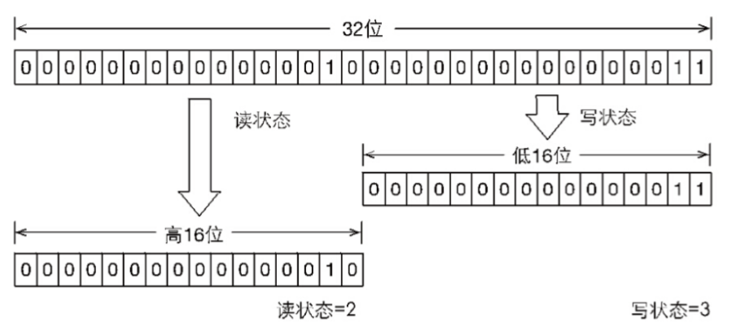

# JUC锁

锁是用来控制多个线程访问共享资源的方式。在JUC的Lock出现之前，Java程序是靠`synchronized`关键字实现锁功能的，而在Java 5之后，JUC新增了`Lock`接口用来实现锁功能，它提供了与`synchronized`关键字类似的同步功能，只是在使用时需要显式地获取和释放锁。`Lock`接口虽然缺少了隐式获取锁的便利性，但是却拥有了锁获取与释放的可中操作性、可中断的获取锁以及超时获取锁等多种`synchronized`关键字所不具备的同步特性。

`Lock`接口提供的`synchronized`关键字所不具备的主要特性：

* 尝试非阻塞地获取锁。当前线程尝试获取锁，如果这一时刻锁没有被其他线程获取到，则成功获取并持有锁。
* 能被中断地获取锁。与`synchronized`不同，获取到锁的线程能够响应中断，当获取到锁的线程被中断时，中断异常将会被抛出，同时锁会被释放。
* 超时获取锁。在指定的截止时间之前获取锁，如果截止时间到了仍旧无法获取锁，则返回。

`Lock`接口定义的操作：

* void lock()
* void lockInterruptibly() throws InterruptedException
* boolean tryLock()
* boolean tryLock(long time, TimeUnit unit) throws InterruptedException
* void unlock()
* Condition newCondition()

## 重入锁

重入锁`ReentrantLock`就是支持重进入的锁，它表示该锁能够支持一个线程对资源的重复加锁。除此之外，该锁还能支持获取锁时的公平和非公平性选择。

如果在绝对时间上，先对锁进行获取的请求一定先被满足，那么这个锁是公平的。反之，是不公平的。公平的获取锁，也就是等待时间最长的线程最优先获取锁，也可以说锁获取是顺序的。

事实上，公平锁往往没有非公平的效率高，但是，并不是任何场景都是以TPS作为唯一的指标，公平锁能够较少“饥饿”发生的概率，等待越久的请求越是能够得到优先满足。

### 实现重进入

重进入是指任意线程在获取到锁之后能够再次获取该锁而不会被锁阻塞，该特性的实现需要解决以下两个问题：

1. 线程再次获取锁。锁需要去识别获取锁的线程是否未当前占据锁的线程，如果是，则再次成功获取。
2. 锁的最终释放。线程重复n次获取锁，随后在第n次释放该锁后，其他线程能够获取到该锁。

`ReentrantLock`通过组合自定义同步器来实现锁的获取与释放。以非公平性（默认）实现为例，获取同步状态的代码如下：

```java
final boolean nonfairTryAcquire(int acquires) {
    final Thread current = Thread.currentThread();
    int c = getState();
    if (c == 0) {
        if (compareAndSetState(0, acquires)) {
            setExclusiveOwnerThread(current);
            return true;
        }
    }
    else if (current == getExclusiveOwnerThread()) {
        int nextc = c + acquires;
        if (nextc < 0) // overflow
            throw new Error("Maximum lock count exceeded");
        setState(nextc);
        return true;
    }
    return false;
}
```

该方法增加了再次获取同步状态的处理逻辑：通过判断当前线程是否为获取锁的线程来决定获取操作是否成功，如果是则再次获取锁，将同步状态值进行增加并返回true，表示获取状态成功。

`ReentrantLock`在释放同步状态时减少同步状态值。

```java
protected final boolean tryRelease(int releases) {
    int c = getState() - releases;
    if (Thread.currentThread() != getExclusiveOwnerThread())
        throw new IllegalMonitorStateException();
    boolean free = false;
    if (c == 0) {
        free = true;
        setExclusiveOwnerThread(null);
    }
    setState(c);
    return free;
}
```

如果该锁被获取了n次，那么前n-1次释放锁返回的都是false，只有同步状态完全释放了，才会返回true。

### 公平与非公平获取锁的区别

公平性与否是针对获取锁而言的，如果一个锁是公平的，那么锁的获取顺序就应该符合请求的绝对时间顺序，也就是FIFO。

对于非公平锁而言，在`nonfairTryAcquire`方法中，只要CAS设置同步状态成功，就表示当前线程获取到了锁，而公平锁则不同。

```java
protected final boolean tryAcquire(int acquires) {
    final Thread current = Thread.currentThread();
    int c = getState();
    if (c == 0) {
        if (!hasQueuedPredecessors() &&
            compareAndSetState(0, acquires)) {
            setExclusiveOwnerThread(current);
            return true;
        }
    }
    else if (current == getExclusiveOwnerThread()) {
        int nextc = c + acquires;
        if (nextc < 0)
            throw new Error("Maximum lock count exceeded");
        setState(nextc);
        return true;
    }
    return false;
}
```

该方法与`nonfairTryAcquire`唯一的不同是判断条件多了`hasQueuedPredecessors()`方法的调用，即加入了同步队列中当前节点是否有前驱节点的判断，如果该方法返回true，则表示有其他线程比当前线程更早地请求获取锁，因此需要等前驱线程获取并释放锁之后才能继续获取锁。

## 读写锁

读写锁在同一时刻可以允许多个读线程访问，但是在写线程访问时，所有的读线程和写线程均被阻塞。读写锁维护了一个读锁和一个写锁，通过分离读锁和写锁，使得并发性比一般的排它锁有了很大提升。

### 读写状态的设计

读写锁同样需要依赖自定义同步器来实现同步功能，而读写状态就是其同步器的同步状态，同步状态是一个整型变量，要想在一个整形变量上维护多个读线程和写线程的状态，就需要按位切割使用的方法。

读写锁将同步变量分成两部分，高16位表示读，低16位表示写。



通过位运算可以迅速确定当前读和写各自的状态。

### 写锁的获取与释放

写锁是一个支持重进入的排它锁。如果当前线程已经获取了写锁，则增加写状态。如果当前线程在获取写锁时，读锁已被获取（读状态不为0）或者该线程不是已经获取了写锁的线程，则当前线程进入等待状态。

```java
protected final boolean tryAcquire(int acquires) {
    /*
        * Walkthrough:
        * 1. if read count nonzero or write count nonzero
        *     and owner is a different thread, fail.
        * 2. If count would saturate, fail. (This can only
        *    happen if count is already nonzero.)
        * 3. Otherwise, this thread is eligible for lock if
        *    it is either a reentrant acquire or
        *    queue policy allows it. If so, update state
        *    and set owner.
        */
    Thread current = Thread.currentThread();
    int c = getState();
    int w = exclusiveCount(c);
    if (c != 0) {
        // (Note: if c != 0 and w == 0 then shared count != 0)
        if (w == 0 || current != getExclusiveOwnerThread())
            return false;
        if (w + exclusiveCount(acquires) > MAX_COUNT)
            throw new Error("Maximum lock count exceeded");
    }
    if ((w == 0 && writerShouldBlock(current)) ||
        !compareAndSetState(c, c + acquires))
        return false;
    setExclusiveOwnerThread(current);
    return true;
}
```

该方法除了重入条件（当前线程为获取了写锁的线程）之外，增加了一个读锁是否存在的判断。如果存在读锁，则写锁不能被获取，原因在于：读写锁要确保写锁的操作对读锁课件，如果允许读锁在已被获取的情况下对写锁的获取，那么正在运行的其他读线程就无法感知到当前写线程的操作。因此，只有等待其他读线程都释放了读锁，写锁才能被当前线程获取，而写锁一旦被获取，则其他读写线程的后续访问均被阻塞。

写锁的释放与`ReentrantLock`的释放过程基本类似，每次释放均减少写状态，当写状态为0时表示写锁已被释放，从而等待的读写线程能够继续访问读写锁，同时前次写线程的修改对后续读写线程可见。

### 读锁的获取与释放

读锁是一个支持重进入的共享锁，它能够被多个线程同时获取，在没有其他写线程访问（或者写状态为0）时，读锁总会被成功地获取，而所做的也只是（线程安全的）增加读状态。

如果当前线程已经获取了读锁，则增加读状态。如果当前线程在获取读锁时，写锁已被其他线程获取，则进入等待状态。如果当前线程获取了写锁或写锁未被获取，则当前线程（线程安全的、依靠CAS）增加读状态，成功获取读锁。

### 锁降级

锁降级指的是写锁降级为读锁。如果当前线程拥有写锁，然后将其释放，最后再获取读锁，这种分段完成的过程不能称之为锁降级。锁降级是指把持住当前拥有的写锁，再获取到读锁，随后释放先前用户的写锁的过程。

锁降级的目的是为了保证数据的可见性。如果当前线程不获取读锁而直接释放写锁，假设此刻另一个线程（记做线程T）获取了写锁并修改了数据，那么当前线程无法感知到线程T的数据更新。如果当前线程获取读锁，即遵循锁降级的步骤，则线程T将会被阻塞，知道当前线程使用数据并释放读锁之后，线程T才能获取写锁进行数据更新。

`RentrantReadWriteLock`不支持锁升级（把持读锁、获取写锁、最后释放读锁的过程）。目的也是保证数据可见性，如果读锁已被多个线程获取，其中任意线程成功获取了写锁并更新了数据，则其更新对其他获取到读锁的线程是不可见的。

## LockSupport工具

`LockSupport`定义了一组公共的静态方法，这些方法提供了基本的线程阻塞和唤醒功能，而`LockSupport`也成为构建同步组件的基础工具。

`LockSupport`定义了一组以`pack`开头的方法来阻塞当前线程，以及`unpack`方法来唤醒一个被阻塞的线程。

* `void pack()`：阻塞当前线程，如果调用`unpack(Thread thread)`方法或者当前线程被中断，才能从`pack`方法返回。
* `void packNanos(long nanos)`：阻塞当前线程，最长不超过`nanos`纳秒，返回条件在`pack()`的基础上增加了超时返回。
* `void packUntil(long deadline)`：阻塞当前线程，直到`deadline`时间（从1970年开始到`deadline`时间的毫秒数。
* `void unpack(Thread thread)`：唤醒处于阻塞状态的线程thread。

在Java 6中，增加了`pack(Object blocker)`、`packNanos(Object blocker, long nanos)`和`packUntil(Object blocker, long deadline)`3个方法，用于实现阻塞当前线程的方法，其中参数`blocker`是用来标识当前线程在等待的对象（以下称为阻塞对象），该对象主要用于问题排查和系统监控。