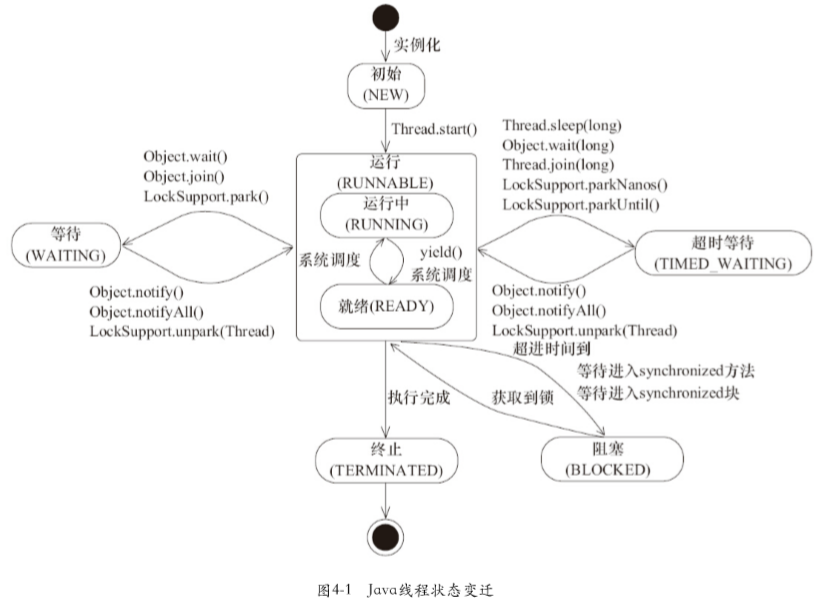
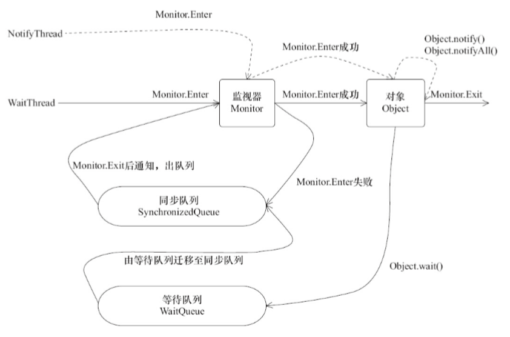

# Java并发-线程

## 什么是线程

现代操作系统在运行一个程序时，回为其创建一个进程。现代操作系统调度的最小单元是线程，也叫轻量级进程（Light Weight Process），在一个进程里可以创建多个线程，这些线程都拥有各自的计数器、堆栈和局部变量等属性，并且能够访问共享的内存变量。处理器在这些线程上高速切换，让使用者感觉到这些线程在同时执行。

## 线程优先级

Java线程种通过一个整型成员变量`priority`来控制优先级，优先级的范围从1~10，在线程构建的时候可以通过`setPriority(int)`方法来修改优先级，默认优先级是5，优先级高的线程分配时间片的数量要多于优先级低的线程。

设置线程优先级时，针对频繁阻塞（休眠或者I/O操作）的线程需要设置较高的优先级，而偏重计算（需要较多CPU时间或者偏运算）的线程则设置较低的优先级，确保处理器不会被独占。

在不同的JVM以及操作系统上，线程规划会存在差异，有些操作系统甚至会忽略对线程优先级的设定。


## Java线程的状态

Java线程在运行的生命周期中可能处于下述的6种不同的状态，在给定的一个时刻，线程只能处于其中的一个状态。

* NEW：初始状态，线程被构建，但是还没有调用`start()`方法
* RUNNABLE：运行状态，Java线程将操作系统种的就绪和运行两种状态笼统地乘坐“运行种”。
* BLOCKED：阻塞状态，表示线程阻塞于锁。
* WAITING：等待状态，表示线程进入等待状态，进入改状态表示当前线程需要等待其他线程做出一些特定动作（通知或中断）。
* TIME_WAITING：超时等待状态，该状态不同于WAITING，它是可以在指定的时间自行返回的。
* TERMINATED：终止状态，表示当前线程已经执行完毕。



线程创建之后，调用`start()`方法开始运行。当线程执行`wait()`方法之后，线程进入等待状态。进入等待状态的线程需要依靠其他线程的通知才能返回到运行状态，而超时等待状态相当于在等待状态的基础上增加了超时限制，也就是超时时间到达时将会返回到运行状态。当线程调用同步方法时，在没有获取到锁的情况下，线程将会进入到阻塞状态。线程在执行`Runnable`的`run()`方法之后将会进入到终止状态。

## Daemon线程

`Daemon`线程是一种支持型线程，因为他主要被用作程序中后台调度以及支持性工作。这意味着，当一个Java虚拟机中不存在非`Daemon`线程的时候，Java虚拟机将会退出。可以通过调用`Thread.setDaemon(true)`将线程设置为`Daemon`线程。

`Daemon`属性需要在启动线程之前设置，不能再启动线程之后设置。

`Daemon`线程被用作完成支持性工作，但是在Java虚拟机退出时`Daemon`线程中的`finally`块不一定会执行。

## 等待/通知机制

等待/通知的相关方法是任意Java对象都具备的，因为这些方法被定义在所有对象的超类`java.lang.Object`上。

* `notify()`：通知一个在对象上等待的线程，使其从`wait()`方法返回，而返回的前提是该线程获取到了对象的锁。
* `notifyAll()`：通知所有等待在该对象上的线程。
* `wait()`：调用该方法的线程进入`WAITING`，只有等待另外线程的通知或被中断才会返回，需要注意，调用`wait()`方法后，会释放对象的锁。
* `wait(long)`：超时等待一段时间，这里的参数时间是毫秒，也就是等待长达n毫秒，如果没有通知就超时返回。
* `wait(long, int)`：对于超时时间更细粒度的控制，可以达到纳秒。

等待/通知机制，是指一个线程A调用了对象O的`wait()`方法进入等待状态，而另一个线程B调用了对象O的`notify()`或者`notifyAll()`方法，线程A收到通知后从对象O的`wait()`方法返回，进而执行后续操作。上述两个线程通过对象O来完成交互，而对象上的`wait()`和`notify/notifyAll()`的关系就如何开关信号一样，用来完成等待方和通知方之间的交互工作。

调用`wait()`、`notify()`以及`notifyAll()`时需要注意的细节：

1. 使用`wait()`、`notify()`以及`notifyAll()`时需要先调用对象加锁。
2. 调用`wait()`方法后，线程状态由`RUNNING`变为`WAITING`，并将当前线程放置到对象的等待队列。
3. `notify`或`notifyAll()`方法调用后，等待线程依旧不会从`wait()`返回，需要调用`notify()`或`notifyAll()`的线程释放锁之后，等待线程才有机会从`wait()`返回。
4. `notify()`方法将等待队列中的一个等待线程从等待队列中移到同步队列中，而`notifyAll()`方法则是将等待队列中所有的线程全部移到同步队列，被移动的线程状态由`WAITING`变为`BLOCKED`。
5. 从`wait()`方法返回的前提是获得了调用对象的锁。

等待/通知机制依托于同步机制，其目的就是确保等待线程从`wait()`方法返回时能够感知到通知线程对变量做出的修改。



## 线程池

线程池提供了一种限制和管理资源（包括执行一个任务）。 每个线程池还维护一些基本统计信息，例如已完成任务的数量。

使用线程池的好处：

* 降低资源消耗：通过重复利用已创建的线程降低线程创建和销毁造成的消耗。
* 提高响应速度：当任务到达时，任务可以不需要的等到线程创建就能立即执行。
* 提高线程的可管理性：线程是稀缺资源，如果无限制的创建，不仅会消耗系统资源，还会降低系统的稳定性，使用线程池可以进行统一的分配，调优和监控。

在创建线程池时不允许使用 Executors 去创建，而是通过 ThreadPoolExecutor 的方式，这样的处理方式让写的同学更加明确线程池的运行规则，规避资源耗尽的风险。Executors 返回线程池对象的弊端如下：

* FixedThreadPool 和 SingleThreadExecutor ： 允许请求的队列长度为 Integer.MAX_VALUE ，可能堆积大量的请求，从而导致OOM。
* CachedThreadPool 和 ScheduledThreadPool ： 允许创建的线程数量为 Integer.MAX_VALUE ，可能会创建大量线程，从而导致OOM。

ThreadPoolExecutor 构造函数重要参数：

* corePoolSize : 核心线程数线程数定义了最小可以同时运行的线程数量。
* maximumPoolSize : 当队列中存放的任务达到队列容量的时候，当前可以同时运行的线程数量变为最大线程数。
* workQueue: 当新任务来的时候会先判断当前运行的线程数量是否达到核心线程数，如果达到的话，新任务就会被存放在队列中。
* keepAliveTime：当线程池中的线程数量大于 corePoolSize 的时候，如果这时没有新的任务提交，核心线程外的线程不会立即销毁，而是会等待，直到等待的时间超过了 keepAliveTime才会被回收销毁；
* unit ：keepAliveTime 参数的时间单位。
* threadFactory ：executor 创建新线程的时候会用到。
* handler ：饱和策略。

### 线程池提交任务

我们使用 executor.execute(worker) 来提交一个任务到线程池中去，这个方法非常重要，下面我们来看看它的源码：

```java
// 存放线程池的运行状态 (runState) 和线程池内有效线程的数量 (workerCount)
private final AtomicInteger ctl = new AtomicInteger(ctlOf(RUNNING, 0));

private static int workerCountOf(int c) {
    return c & CAPACITY;
}

private final BlockingQueue<Runnable> workQueue;

public void execute(Runnable command) {
    // 如果任务为null，则抛出异常。
    if (command == null)
        throw new NullPointerException();
    // ctl 中保存的线程池当前的一些状态信息
    int c = ctl.get();

    //  下面会涉及到 3 步 操作
    // 1.首先判断当前线程池中之行的任务数量是否小于 corePoolSize
    // 如果小于的话，通过addWorker(command, true)新建一个线程，并将任务(command)添加到该线程中；然后，启动该线程从而执行任务。
    if (workerCountOf(c) < corePoolSize) {
        if (addWorker(command, true))
            return;
        c = ctl.get();
    }
    // 2.如果当前之行的任务数量大于等于 corePoolSize 的时候就会走到这里
    // 通过 isRunning 方法判断线程池状态，线程池处于 RUNNING 状态才会被并且队列可以加入任务，该任务才会被加入进去
    if (isRunning(c) && workQueue.offer(command)) {
        int recheck = ctl.get();
        // 再次获取线程池状态，如果线程池状态不是 RUNNING 状态就需要从任务队列中移除任务，并尝试判断线程是否全部执行完毕。同时执行拒绝策略。
        if (!isRunning(recheck) && remove(command))
            reject(command);
            // 如果当前线程池为空就新创建一个线程并执行。
        else if (workerCountOf(recheck) == 0)
            addWorker(null, false);
    }
    //3. 通过addWorker(command, false)新建一个线程，并将任务(command)添加到该线程中；然后，启动该线程从而执行任务。
    //如果addWorker(command, false)执行失败，则通过reject()执行相应的拒绝策略的内容。
    else if (!addWorker(command, false))
        reject(command);
}
```