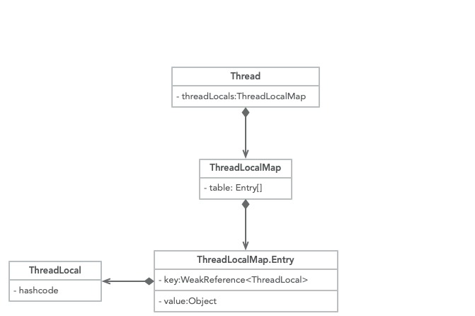
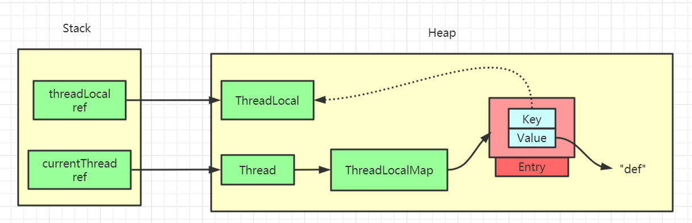

# ThreadLocal原理

`ThreadLocal` 可以提供线程局部变量。每个线程持有一份与自身关联的数据副本，不同线程之间互不干扰。

## ThreadLocal的数据结构

`Thread`类有一个类型为`ThreadLocal.ThreadLocalMap`的实例变量`threadLocals`，也就是说**每个线程都有一个自己的`ThreadLocalMap`**。

`ThreadLocalMap` 有独立实现，可以将其 `key` 理解为 `ThreadLocal` 对象，`value` 为业务代码放入的值。严格来说，`key` 并不是 `ThreadLocal` 本身，而是指向 `ThreadLocal` 的**弱引用**。

每个线程向 `ThreadLocal` 写入值时，都会写入当前线程自己的 `ThreadLocalMap`。读取时也以当前 `ThreadLocal` 为键，在当前线程的 `ThreadLocalMap` 中查找对应值，从而实现线程隔离。

`ThreadLocalMap`有点类似`HashMap`的结构，只是`HashMap`是由**数组+链表**实现的，而`ThreadLocalMap`中并没有链表结构。

`ThreadLocalMap`中的`Entry`，它的`key`是`ThreadLocal<?> k`，继承自`WeakReference`， 也就是我们常说的弱引用类型。



## 内存泄露

`ThreadLocalMap.Entry` 的 `key` 是弱引用。如果外部不再强引用某个 `ThreadLocal` 对象，发生 GC 后，该 `key` 可能变为 `null`。



如果 `ThreadLocal` 的外部强引用不存在，`key` 可能被回收；但对应的 `value` 仍然被当前线程的 `ThreadLocalMap` 间接引用。在线程长期存活，尤其是线程池复用线程的场景下，如果没有及时调用 `remove()`，就可能造成内存泄漏。


## InheritableThreadLocal

使用 `ThreadLocal` 时，普通线程局部变量不会自动传递到子线程。

为了解决父子线程之间的初始值传递问题，JDK 提供了 `InheritableThreadLocal`。示例如下：

```java
public class InheritableThreadLocalDemo {
    public static void main(String[] args) {
        ThreadLocal<String> ThreadLocal = new ThreadLocal<>();
        ThreadLocal<String> inheritableThreadLocal = new InheritableThreadLocal<>();
        ThreadLocal.set("父类数据:threadLocal");
        inheritableThreadLocal.set("父类数据:inheritableThreadLocal");

        new Thread(new Runnable() {
            @Override
            public void run() {
                System.out.println("子线程获取父类`ThreadLocal`数据：" + `ThreadLocal`.get());
                System.out.println("子线程获取父类inheritableThreadLocal数据：" + inheritableThreadLocal.get());
            }
        }).start();
    }
}
```

打印结果：

```
子线程获取父类`ThreadLocal`数据：null
子线程获取父类inheritableThreadLocal数据：父类数据:inheritableThreadLocal
```

其实现原理是：通过 `new Thread()` 创建子线程时，`Thread` 构造方法会调用 `Thread#init`，在 `init` 方法中将父线程的 `inheritableThreadLocals` 复制到子线程。

```java
private void init(ThreadGroup g, Runnable target, String name,
                      long stackSize, AccessControlContext acc,
                      boolean inheritThreadLocals) {
    if (name == null) {
        throw new NullPointerException("name cannot be null");
    }

    if (inheritThreadLocals && parent.inheritableThreadLocals != null)
        this.inheritableThreadLocals =
            ThreadLocal.createInheritedMap(parent.inheritableThreadLocals);
    this.stackSize = stackSize;
    tid = nextThreadID();
}
```

但 `InheritableThreadLocal` 在线程池场景下存在局限。它只在线程创建时复制父线程数据，而线程池会复用既有线程；因此提交任务时的上下文不一定能正确传递到实际执行任务的线程。

在需要跨线程池传递上下文时，可以考虑使用 `TransmittableThreadLocal` 等专门的上下文传递工具，并注意在线程复用场景下及时清理上下文。
