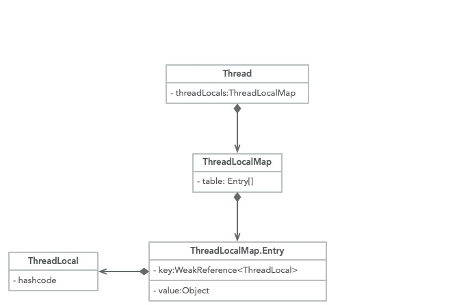

# ThreadLocal原理

ThreadLocal对象可以提供线程局部变量，每个线程Thread拥有一份自己的副本变量，多个线程互不干扰。

## ThreadLocal的数据结构

`Thread`类有一个类型为`ThreadLocal.ThreadLocalMap`的实例变量`threadLocals`，也就是说**每个线程都有一个自己的`ThreadLocalMap`**。

`ThreadLocalMap`有自己的独立实现，可以简单地将它的`key`视作`ThreadLocal`，`value`为代码中放入的值。实际上，`key`并不是`ThreadLocal`本身，而是它的一个**弱引用**。

每个线程在向`ThreadLocal`里放值的时候，都会在自己的`ThreadLocalMap`里存，读也是以`ThreadLocal`为引用，在自己的`map`里找对应的`key`，从而实现了线程隔离。

`ThreadLocalMap`有点类似`HashMap`的结构，只是`HashMap`是由**数组+链表**实现的，而`ThreadLocalMap`中并没有链表结构。

`ThreadLocalMap`中的`Entry`，它的`key`是`ThreadLocal<?> k`，继承自`WeakReference`， 也就是我们常说的弱引用类型。



## 内存泄露

`ThreadLocal`的`key`是弱引用，那么在`ThreadLocal.get()`的时候,发生GC之后，`key`是否是null？


如果**强引用threadLocalRef**不存在，那么`key`就会被回收，就会出现`value`没被回收，出现内存泄露。如果存在强引用，那么是`key`是不会被回收的。


## InheritableThreadLocal

使用ThreadLocal的时候，在异步场景下是无法给子线程共享父线程中创建的线程副本数据的。

为了解决这个问题，JDK中还有一个InheritableThreadLocal类，我们来看一个例子：

```java
public class InheritableThreadLocalDemo {
    public static void main(String[] args) {
        ThreadLocal<String> ThreadLocal = new ThreadLocal<>();
        ThreadLocal<String> inheritableThreadLocal = new InheritableThreadLocal<>();
        ThreadLocal.set("父类数据:threadLocal");
        inheritableThreadLocal.set("父类数据:inheritableThreadLocal");

        new Thread(new Runnable() {
            @Override
            public void run() {
                System.out.println("子线程获取父类`ThreadLocal`数据：" + `ThreadLocal`.get());
                System.out.println("子线程获取父类inheritableThreadLocal数据：" + inheritableThreadLocal.get());
            }
        }).start();
    }
}
```

打印结果：

```
子线程获取父类`ThreadLocal`数据：null
子线程获取父类inheritableThreadLocal数据：父类数据:inheritableThreadLocal
```

实现原理是子线程是通过在父线程中通过调用new Thread()方法来创建子线程，Thread#init方法在Thread的构造方法中被调用。在init方法中拷贝父线程数据到子线程中：

```java
private void init(ThreadGroup g, Runnable target, String name,
                      long stackSize, AccessControlContext acc,
                      boolean inheritThreadLocals) {
    if (name == null) {
        throw new NullPointerException("name cannot be null");
    }

    if (inheritThreadLocals && parent.inheritableThreadLocals != null)
        this.inheritableThreadLocals =
            ThreadLocal.createInheritedMap(parent.inheritableThreadLocals);
    this.stackSize = stackSize;
    tid = nextThreadID();
}
```

但`InheritableThreadLocal`仍然有缺陷，一般我们做异步化处理都是使用的线程池，而`InheritableThreadLocal`是在new Thread中的`init()`方法给赋值的，而线程池是线程复用的逻辑，所以这里会存在问题。

当然，有问题出现就会有解决问题的方案，阿里巴巴开源了一个`TransmittableThreadLocal`组件就可以解决这个问题。