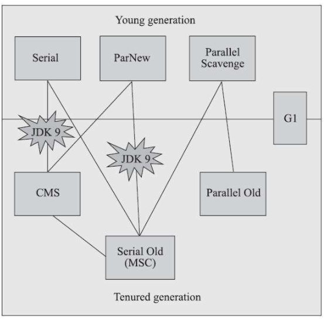

# 垃圾回收

## 垃圾收集策略与算法

Java各内存区域中，程序计数器、虚拟机栈、本地方法栈3个区域的生命周期同线程一致，栈帧中分配多少内存基本在类结构确定下来就是已知的，因此这几个区域的内存分配和回收都具备确定性。而Java堆和方法区这两个区域则有很强的不确定性，这部分内存的分配和回收都是动态的。垃圾收集器所关注的正式这部分内存。

### 如何判断对象已死

垃圾收集器在对堆进行回收前，首先要确定的就是对象中哪些是已“死“的，可以被回收了。

#### 引用计数算法

在对象中添加一个引用计数器，每当有一个地方引用它时，计数器加一；当引用失效时，计数器减一；计数器为零的对象就是可以被回收的。

引用计数算法原理简单，判定效率也很高，但主流的Java虚拟机里都没有采用，主要原因是很多例外情况需要考虑，例如循环引用问题。

#### 可达性分析算法

当前主流的内存管理子系统都是通过可达性分析算法来判定对象是否存活的。这个算法的基本思路就是通过一系列称为“GC Roots”的根对象作为起始节点集，从这些节点开始，根据引用关系向下搜索，搜索过程所走过的路径称为“引用链”，如果某个对象到GC Roots间没有任何引用链相连，则此对象是不可能再被使用的。

在Java中固定可作为GC Roots的对象包括以下几种：

* 虚拟机栈（栈帧中的本地变量表）中引用的对象，譬如各个线程被调用的方法堆栈中使用到的参数、局部变量、临时变量等。
* 方法区中类静态属性引用的对象，譬如Java类的引用类型静态变量。
* 方法区中常量引用的对象，批复字符串常量池中的引用。
* 本地方法栈中JNI引用的对象。
* Java虚拟机内部的引用，如基本数据类型对应的Class对象，一些常驻的异常对象，还有系统类加载器
* 所有被同步锁（synchronized）持有的对象
* 反映Java虚拟机内部情况的JMXBean、JVMTI中注册的回调、本地代码缓存等。

#### 引用的种类

引用分为强引用、软引用、弱引用和虚引用，这4种引用强度一次逐渐减弱。

* 强引用：指在程序代码中普遍存在的引用赋值。无论任何情况下，只要强引用关系还存在，垃圾收集器就永远不会回收掉被引用的对象。
* 软引用：用来描述一些还有用，但非必须的对象。只被软引用关联着的对象，在系统将要发生内存溢出异常前，会把这些对象列进回收范围之中进行第二次回收，如果这次回收还没有足够的内存，才会抛出内存溢出异常。
* 弱引用：用来描述那些非必须对象，但是它的强度比软引用更弱一些，被弱引用关联的对象只能生存到下一次垃圾收集发生为止。当垃圾收集器开始工作，无论当前内存是否足够，都会回收掉只被弱引用关联的对象。
* 虚引用：是最弱的一种引用关系，一个对象是否有虚引用的存在，完全不会对齐生存时间构成影响，也无法通过虚引用来取得一个对象实例。为一个对象设置虚引用的唯一目的就是为了能在这个对象被收集器回收时收到一个系统通知。

### finalize() 方法

在可达性分析中判定为不可达的对象，也不是必须被回收的，要真正宣告一个对象死亡，至少要经历两次标记过程。如果对象在进行可达性分析后发现没有与GC Roots相连接的引用链，那它将会被第一次标记，随后进行一次筛选，筛选的条件是此对象是否有必要执行finalize()方法。假如对象没有覆盖finalize()方法，或者finalize()方法已经被虚拟机调用过，那么虚拟机将这两种情况都视为“没有必要执行”。

如果这个对象被判定为确有必要执行finalize()方法，那么该对象将会被放置在一个名为F-Queue的队列中，并在稍后由一条虚拟机自动建立的、低调度优先级的Finalizer线程去执行它们的finalize()方法。虚拟机会触发这个方法的执行，但并不一定会等待它运行结束。finanlize()方法是对象逃脱死亡命运的最后一次机会，稍后收集器会对F-Queue中的对象进行第二次小规模标记，如果对象要在finalize()中成功拯救自己，只需要重新与引用链中的任何一个对象建立关联即可。

注意，finalize()方法不等同于C和C++语言中的析构函数，它的运行代价高昂，不确定大，无法保证各个对象的调用顺序，如今已被官方明确生命为不推荐使用的语法。

### 方法回收区

《Java虚拟机规范》中提到过可以不要求虚拟机在方法区中实现垃圾收集，事实上也确实有未实现或未能完整实现方法区类型卸载的收集器存在，例如JDK11时期的ZGC收集器就不支持类卸载。方法区垃圾收集的性价比通常也是比较低的：在Java堆中，尤其是在新生代中，对常规应用进行一次垃圾收集通常可以回收70%至99%的内存空间，相比之下，方法区回收由于苛刻的判定条件，其区域垃圾收集的回收成果往往远低于此。

方法区的垃圾收集主要回收两部分内容：废弃的常量和不再使用的类型。回收废弃常量与回收Java堆中的对象非常类似，只要常量池中的常量不被任何变量或对象引用，那么这些常量就会被清除掉。

而判定一个类型是否属于不再被使用的类条件就比较苛刻了，需要同时满足下面三个条件：

1. 该类所有的实例都已经被回收，也就是Java堆中不存在该类及其任何派生子类的实例。
2. 加载该类的类加载器已经被回收，这个条件除非是经过精心设计的可替换类加载器的场景，如OSGi、JSP的重加载等，否则通常是很难达成的。
3. 该类对应的java.lang.Class对象没有在任何地方被引用，无法在任何地方通过反射访问该类的方法。

Java虚拟机被允许对满足上述三个条件的无用类进行回收，这里说的仅仅是“被允许”，而并不是和对象一样，没有引用了就必然会回收。

在大量使用反射、动态代理、CGLib等字节码框架，动态生成JSP以及OSGi这类频繁自定义类加载器的场景中，通常都需要Java虚拟机具备类型卸载的能力，以保证不会对方法区造成过大的内存压力。

## 垃圾收集算法

从如何判定对象消亡的角度出发，垃圾收集算法可以划分为“引用计数式垃圾收集”（ReferenceCounting GC）和“追踪式垃圾收集”（Tracing GC）两大类，这两类也常被称作“直接垃圾收集”和“间接垃圾收集”。由于引用计数式垃圾收集算法在主流Java虚拟机中均未涉及，因此下述所有算法均属于追踪式垃圾收集的范畴。

### 分代收集理论

当前商用的垃圾收集器，大多都遵循“分代收集”的理论进行设计。分代收集建立在两个分代假说之上：

1. 弱分代假说：绝大多数对象都是朝生夕灭的。
2. 强分代假说：熬过越多次垃圾收集过程的对象就越难以消亡。

这两个分代假说共同奠定了多款常用的垃圾收集器的一致的设计原则：收集器应该将Java堆划分出不同的区域，然后将回收对象依据其年龄（年龄即对象熬过垃圾收集过程的次数）分配到不同的区域之中存储。

在Java堆划分出不同的区域之后，垃圾收集器才可以每次只回收其中某一个或者某些部分的区域——因而才有了“Minor GC”“Major GC”“Full GC”这样的回收类型的划分；也才能够针对不同的区域安排与里面存储对象存亡特征相匹配的垃圾收集算法——因而发展出了“标记-复制算法”“标记-清除算法”“标记-整理算法”等针对性的垃圾收集算法。

把分代收集理论具体放到现在的商用Java虚拟机里，设计者一般至少会把Java堆划分为新生代（Young Generation）和老年代（Old Generation）两个区域。

根据这两条假说逻辑推理得出的隐含结论：

3. 跨代引用假说：跨代引用相对于同代引用来说仅占极少数。

存在互相引用关系的两个对象，是应该倾向于同时生存或者同时消亡的。举个例子，如果某个新生代对象存在跨代引用，由于老年代对象难以消亡，该引用会使得新生代对象在收集时同样得以存活，进而在年龄增长之后晋升到老年代中，这时跨代引用也随即被消除了。

依据这条假说，我们就不应再为了少量的跨代引用去扫描整个老年代，也不必浪费空间专门记录每一个对象是否存在及存在哪些跨代引用，只需在新生代上建立一个全局的数据结构（该结构被称为“记忆集”，Remembered Set），这个结构把老年代划分成若干小块，标识出老年代的哪一块内存会存在跨代引用。此后当发生Minor GC时，只有包含了跨代引用的小块内存里的对象才会被加入到GCRoots进行扫描。虽然这种方法需要在对象改变引用关系（如将自己或者某个属性赋值）时维护记录数据的正确性，会增加一些运行时的开销，但比起收集时扫描整个老年代来说仍然是划算的。

不同分代收集的定义：

* 部分收集（Partial GC）：指目标不是完整收集整个Java堆的垃圾收集，其中又分为：
    * 新生代收集（Minor GC / Young GC）：指目标只是新生代的垃圾收集。
    * 老年代收集（Major GC / Old GC）：指目标只是老年代的垃圾收集。目前只有CMS收集器会有单独收集老年代的行为。
    * 混合收集（Mixed GC）：指目标是收集整个新生代以及部分老年代的垃圾收集。目前只有G1收集器会有这种行为。
* 整堆收集（Full GC）：收集整个Java堆和方法区的垃圾收集。

### 标记-清除算法

最早出现也是最基础的垃圾收集算法。算法分为“标记”和“清除”两个阶段，首先标记出所有需要回收的对象，在标记完成后，统一回收掉所有被标记的对象；也可以反过来，标记存活的对象，统一回收所有未被标记的对象。

标记-清除算法的主要缺点有两个：

1. 执行效率不稳定，如果Java堆中包含大量对象，而且其中大部分是需要被回收的，这是必须进行大量标记和清除的操作，导致标记和清除两个过程的执行效率都随着对象数量增长而降低。
2. 内存空间碎片化，标记、清除之后会产生大量不连续的内存碎片，空间碎片太多可能导致以后需要分配较大对象时无法找到足够的连续内存而不得不提前触发另一次垃圾收集。

### 标记-复制算法

为了解决标记-清除算法面对大量可回收对象时执行效率低的问题，它将可用内存按容量划分为大小相等的两块，每次只使用其中一块。当这一块的内存用完了，就将还存活着的对象复制到另外一块上，然后再把已使用过的内存空间一次清理掉。如果内存中多数对象都是存活的，这种算法会产生大量的内存间复制的开销，但对于多数对象都是可回收的情况，算法需要复制的就是占少数的存活对象，而且每次都是针对整个半区进行内存回收，分配内存时也就不用考虑有空间碎片的复杂情况，只要移动堆顶指针，按顺序分配即可。这样实现简单，运行高效不过其缺陷也显而易见，这种复制回收算法的代价是将可用内存缩小为了原来的一半，空间浪费比较多。

现在的商用Java虚拟机大多都优先采用了这种收集算法去回收新生代，由于新生代“朝生夕灭”的特点，不需要按照1:1的比例来划分新生代的内存空间。HotSpot虚拟机的Serial、ParNew等新生代收集器采用了一种更优化的半区复制分代策略。具体做法是把新生代分为一块较大的Eden空间和两块较小的Survivor空间，每次分配内存都只使用Eden和其中一块Survivor。发生垃圾收集时，将Eden和Survivor中仍然存活的对象一次性复制另一块Survivor空间上，然后直接清理掉Eden和已用过的那块Survivor空间。HotSpot默认Eden和Survivor的大小比例是8:1，即每次新生代中可用内存空间为整个新生代容量的90%。当Survivor空间不足以容纳一次Minor GC之后存活的对象时，就需要依赖其他内存区域进行分配担保，这些对象将直接进入老年代。

### 标记-整理算法

标记-复制算法在对象存活率较高时需要进行较多的复制操作，效率会降低。另外，如果不想浪费50%的空间，就需要额外的空间进行分配担保，以应对被使用的内存中所有对象都是100%存活的极端情况，所以在老年代一般不直接选用这种算法。

针对老年代对象的存亡特征，提出了另一种有针对性的“标记-整理”算法。其中的标记过程仍然与“标记-清除”算法一样，但后续步骤不是直接对可回收对象进行清理，而是让所有存活的对象都向内存空间一端移动，然后直接清理掉边界以外的内存。

标记-清除算法与标记-整理算法的本质差异在于，前者是一种非移动式的回收算法，而后者是移动式的。

是否移动回收后的存活对象是一项优缺点并存的风险决策：

1. 如果移动存活对象，尤其是在老年代这种每次回收都有大量对象存活区域，移动存活对象并更新所有引用这些对象的地方将会是一种极为负重的操作，而且这种对象移动操作必须全程暂停用户应用程序才能进行，这就更加让使用者不得不小心翼翼地权衡其弊端了，像这样的停顿被最初的虚拟机设计者形象地描述为“Stop The World”。
2. 但如果跟标记-清除算法那样完全不考虑移动和整理存活对象的话，弥散于堆中的存活对象导致的空间碎片化问题就只能依赖更为复杂的内存分配器和内存访问器来解决。譬如通过“分区空闲分配链表”来解决内存分配问题（计算机硬盘存储大文件就不要求物理连续的磁盘空间，能够在碎片化的硬盘上存储和访问就是通过硬盘分区表实现的）。内存的访问是用户程序最频繁的操作，甚至都没有之一，假如在这个环节上增加了额外的负担，势必会直接影响应用程序的吞吐量。

基于以上两点，是否移动对象都存在弊端，移动则内存回收时会更复杂，不移动则内存分配时会更复杂。从垃圾收集的停顿时间来看，不移动对象停顿时间会更短，甚至可以不需要停顿，但是从整个程序的吞吐量来看，移动对象会更划算。HotSpot虚拟机里面关注吞吐量的ParallelScavenge收集器是基于标记-整理算法的，而关注延迟的CMS收集器则是基于标记-清除算法的，这也从侧面印证这点。

标记-整理算法因为涉及到对象移动，在垃圾收集效率方面不如标记-清除算法；另一方面，标记-整理算法不会出现内存空间碎片化的问题，在内存分配和访问上效率比标记-清除算法更好。一般而言，关注吞吐量的收集器采用标记-整理算法，如Parallel Scavenge收集器；关注延迟的收集器采用标记-清除算法，如CMS收集器。

另外一种混合两种算法的解决方案是让虚拟机平时多数时间都采用标记-清除算法，直到内存空间的碎片化程度已经影响到对象分配时，再采用标记-整理算法收集一次，以获得规整的内存空间。CMS收集器就采用这种方案。

## HotSpot 垃圾收集器

HotSpot 虚拟机提供了多种垃圾收集器，每种收集器都有各自的特点。我们选择的只是对具体应用最合适的收集器。

上图中的7种作用于不同分代的收集器，如果两个收集器之间存在连线，就说明它们可以搭配使用。

### 新生代垃圾收集器

#### Serial 垃圾收集器

只开启一条GC线程进行垃圾回收，而且在垃圾收集过程中会停止一切用户线程，即Stop The World。

一般客户端应用所需内存较小，不会创建太多对象，而且堆内存不大，因此垃圾收集器回收时间短，即使在这段时间停止一切用户线程，也不会感觉明显卡顿。因此 Serial 垃圾收集器适合客户端使用。

由于 Serial 收集器只使用一条 GC 线程，避免了线程切换的开销，从而简单高效。

#### ParNew 垃圾收集器

ParNew是Serial的多线程版本，由多条GC线程并行地进行垃圾清理，但清理过程仍然需要Stop The World。

ParNew 追求“低停顿时间”,与 Serial 唯一区别就是使用了多线程进行垃圾收集，在多 CPU 环境下性能比 Serial 会有一定程度的提升；但线程切换需要额外的开销，因此在单 CPU 环境中表现不如 Serial。

ParNew收集器除了支持多线程并行收集之外，其他与Serial收集器相比并没有太多创新之处，但它却是不少运行在服务端模式下的HotSpot虚拟机，尤其是JDK 7之前的遗留系统中首选的新生代收集器，其中有一个与功能、性能无关但其实很重要的原因是：除了Serial收集器外，目前只有它能与CMS收集器配合工作。

#### Parallel Scavenge 垃圾收集器

Parallel Scavenge收集器也是一款新生代收集器，它同样是基于标记-复制算法实现的收集器，也是能够并行收集的多线程收集器。

Parallel Scavenge 和 ParNew 一样，都是多线程、新生代垃圾收集器。但是两者有巨大的不同点：

* Parallel Scavenge：追求 CPU 吞吐量，能够在较短时间内完成指定任务，因此适合没有交互的后台计算。
* ParNew：追求降低用户停顿时间，适合交互式应用。

吞吐量 = 运行用户代码时间 / (运行用户代码时间 + 垃圾收集时间)

* 通过参数 -XX:GCTimeRadio 设置垃圾回收时间占总 CPU 时间的百分比。
* 通过参数 -XX:MaxGCPauseMillis 设置垃圾处理过程最久停顿时间。
* 通过命令 -XX:+UseAdaptiveSizePolicy 开启自适应策略。我们只要设置好堆的大小和 MaxGCPauseMillis 或 GCTimeRadio，收集器会自动调整新生代的大小、Eden 和 Survivor 的比例、对象进入老年代的年龄，以最大程度上接近我们设置的 MaxGCPauseMillis 或 GCTimeRadio。

### 老年代垃圾收集器

### Serial Old 垃圾收集器

Serial Old 收集器是 Serial 的老年代版本，都是单线程收集器，使用标记-整理算法，只启用一条 GC 线程，适合客户端应用。它们唯一的区别就是：Serial Old 工作在老年代，使用“标记-整理”算法；Serial 工作在新生代，使用“复制”算法。

#### Parallel Old 垃圾收集器

Parallel Old 收集器是 Parallel Scavenge 的老年代版本，追求 CPU 吞吐量，基于标记-整理算法实现。

#### CMS 垃圾收集器

CMS(Concurrent Mark Sweep，并发标记清除)收集器是以获取最短回收停顿时间为目标的收集器（追求低停顿），它在垃圾收集时使得用户线程和 GC 线程并发执行，因此在垃圾收集过程中用户也不会感到明显的卡顿。

从名字（包含“Mark Sweep”）上就可以看出CMS收集器是基于标记-清除算法实现的，它的运作过程相对于前面几种收集器来说要更复杂一些，整个过程分为四个步骤，包括：

* 初始标记：Stop The World，仅使用一条初始标记线程对所有与 GC Roots 直接关联的对象进行标记。
* 并发标记：使用多条标记线程，与用户线程并发执行。此过程进行可达性分析，标记出所有废弃对象。速度很慢。
* 重新标记：Stop The World，使用多条标记线程并发执行，将刚才并发标记过程中新出现的废弃对象标记出来。
* 并发清除：只使用一条 GC 线程，与用户线程并发执行，清除刚才标记的对象。这个过程非常耗时。

并发标记与并发清除过程耗时最长，且可以与用户线程一起工作，因此，总体上说，CMS 收集器的内存回收过程是与用户线程一起并发执行的。

CMS 的缺点：

* CMS收集器对处理器资源非常敏感，在并发阶段因为占用了一部分线程而导致应用程序变慢，降低总吞吐量
* 无法处理浮动垃圾，导致频繁 Full GC
* 使用“标记-清除”算法产生碎片空间

对于产生碎片空间的问题，可以通过开启 -XX:+UseCMSCompactAtFullCollection，在每次 Full GC 完成后都会进行一次内存压缩整理，将零散在各处的对象整理到一块。设置参数 -XX:CMSFullGCsBeforeCompaction告诉 CMS，经过了 N 次 Full GC 之后再进行一次内存整理。

### G1 通用垃圾收集器

G1 是一款面向服务端应用的垃圾收集器。

G1的特点：

* 基于Region的堆内存布局，没有新生代和老年代的概念。
* 当要进行垃圾收集时，首先估计每个 Region 中垃圾的数量，每次都从垃圾回收价值最大的 Region 开始回收，因此可以获得最大的回收效率。
* 从整体上看， G1 是基于“标记-整理”算法实现的收集器，从局部（两个 Region 之间）上看是基于“复制”算法实现的，这意味着运行期间不会产生内存空间碎片。
* G1收集器可以由用户指定期望的停顿时间，设置不同的期望停顿时间，可使得G1在不同应用场景中取得关注吞吐量和关注延迟之间的最佳平衡。

G1收集器的运作过程大致可划分为以下四个步骤：

* 初始标记：Stop The World，标记一下GC Roots能直接关联到的对象，这个阶段需要停顿线程，但耗时很短，而且是借用进行Minor GC的时候同步完成的，所以G1收集器在这个阶段实际并没有额外的停顿。
* 并发标记：从GC Root开始对堆中对象进行可达性分析，递归扫描整个堆里的对象图，找出要回收的对象，这阶段耗时较长，但可与用户程序并发执行。当对象图扫描完成以后，还要重新处理SATB记录下的在并发时有引用变动的对象。
* 最终标记：Stop The World，对用户线程做另一个短暂的暂停，用于处理并发阶段结束后仍遗留下来的最后那少量的SATB记录。
* 筛选回收：负责更新Region的统计数据，对各个Region的回收价值和成本进行排序，根据用户所期望的停顿时间来制定回收计划，可以自由选择任意多个Region构成回收集，然后把决定回收的那一部分Region的存活对象复制到空的Region中，再清理掉整个旧Region的全部空间。这里的操作涉及存活对象的移动，是必须暂停用户线程，由多条收集器线程并行完成的。

除了并发标记外，其余阶段也是要完全暂停用户线程的。

可以由用户指定期望的停顿时间是G1收集器很强大的一个功能，设置不同的期望停顿时间，可使得G1在不同应用场景中取得关注吞吐量和关注延迟之间的最佳平衡。默认的停顿目标为两百毫秒，如果把停顿时间调的非常低，很可能出现的结果就是由于停顿目标时间太短，导致每次选出来的回收集只占堆内存很小的一部分，收集器收集的速度逐渐跟不上分配器分配的速度，导致垃圾慢慢堆积。

与CMS的“标记-清除”算法不同，G1从整体来看是基于“标记-整理”算法实现的收集器，但从局部（两个Region之间）上看又是基于“标记-复制”算法实现，无论如何，这两种算法都意味着G1运作期间不会产生内存空间碎片，垃圾收集完成之后能提供规整的可用内存。

比起CMS，G1的弱项也可以列举出不少，如在用户程序运行过程中，G1无论是为了垃圾收集产生的内存占用（Footprint）还是程序运行时的额外执行负载（Overload）都要比CMS要高。

## 内存分配与回收策略

对象的内存分配，就是在堆上分配（也可能经过 JIT 编译后被拆散为标量类型并间接在栈上分配），对象主要分配在新生代的 Eden 区上，少数情况下可能直接分配在老年代，分配规则不固定，取决于当前使用的垃圾收集器组合以及相关的参数配置。

**对象优先在 Eden 分配**

大多数情况下，对象在新生代 Eden 区中分配。当 Eden 区没有足够空间进行分配时，虚拟机将发起一次 Minor GC。

**大对象直接进入老年代**

大对象是指需要大量连续内存空间的 Java 对象，如很长的字符串或数据。

一个大对象能够存入 Eden 区的概率比较小，发生分配担保的概率比较大，而分配担保需要涉及大量的复制，就会造成效率低下。

虚拟机提供了一个 -XX:PretenureSizeThreshold 参数，令大于这个设置值的对象直接在老年代分配，这样做的目的是避免在 Eden 区及两个 Survivor 区之间发生大量的内存复制。

**长期存活的对象将进入老年代**

JVM 给每个对象定义了一个对象年龄计数器。当新生代发生一次 Minor GC 后，存活下来的对象年龄 +1，当年龄超过一定值时，就将超过该值的所有对象转移到老年代中去。

使用 -XXMaxTenuringThreshold 设置新生代的最大年龄，只要超过该参数的新生代对象都会被转移到老年代中去。

**动态对象年龄判定**

如果当前新生代的 Survivor 中，相同年龄所有对象大小的总和大于 Survivor 空间的一半，年龄 >= 该年龄的对象就可以直接进入老年代，无须等到 MaxTenuringThreshold 中要求的年龄。

**空间分配担保**

JDK 6 Update 24 之前的规则是这样的：
在发生 Minor GC 之前，虚拟机会先检查老年代最大可用的连续空间是否大于新生代所有对象总空间， 如果这个条件成立，Minor GC 可以确保是安全的； 如果不成立，则虚拟机会查看 HandlePromotionFailure 值是否设置为允许担保失败， 如果是，那么会继续检查老年代最大可用的连续空间是否大于历次晋升到老年代对象的平均大小， 如果大于，将尝试进行一次 Minor GC,尽管这次 Minor GC 是有风险的； 如果小于，或者 HandlePromotionFailure 设置不允许冒险，那此时也要改为进行一次 Full GC。

JDK 6 Update 24 之后的规则变为：
只要老年代的连续空间大于新生代对象总大小或者历次晋升的平均大小，就会进行 Minor GC，否则将进行 Full GC。

通过清除老年代中废弃数据来扩大老年代空闲空间，以便给新生代作担保。

这个过程就是分配担保。

**Full GC**

总结一下有哪些情况可能会触发 JVM 进行 Full GC。

1. System.gc() 方法的调用
此方法的调用是建议 JVM 进行 Full GC，注意这只是建议而非一定，但在很多情况下它会触发 Full GC，从而增加 Full GC 的频率。通常情况下我们只需要让虚拟机自己去管理内存即可，我们可以通过 -XX:+ DisableExplicitGC 来禁止调用 System.gc()。

2. 老年代空间不足
老年代空间不足会触发 Full GC操作，若进行该操作后空间依然不足，则会抛出如下错误：
java.lang.OutOfMemoryError: Java heap space

3. 永久代空间不足
JVM 规范中运行时数据区域中的方法区，在 HotSpot 虚拟机中也称为永久代（Permanet Generation），存放一些类信息、常量、静态变量等数据，当系统要加载的类、反射的类和调用的方法较多时，永久代可能会被占满，会触发 Full GC。如果经过 Full GC 仍然回收不了，那么 JVM 会抛出如下错误信息：
java.lang.OutOfMemoryError: PermGen space

4. CMS GC 时出现 promotion failed 和 concurrent mode failure
promotion failed，就是上文所说的担保失败，而 concurrent mode failure 是在执行 CMS GC 的过程中同时有对象要放入老年代，而此时老年代空间不足造成的。

5. 统计得到的Minor GC晋升到旧生代的平均大小大于老年代的剩余空间