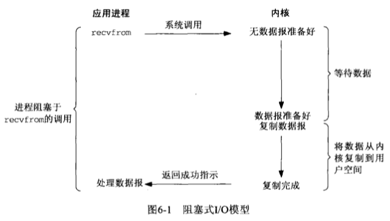
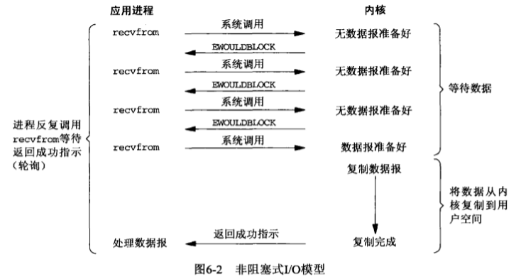
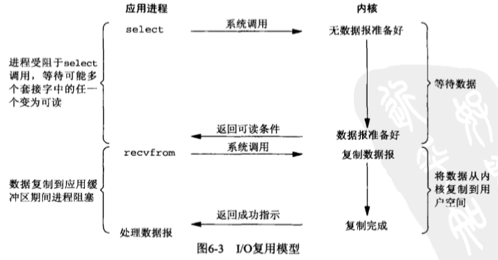
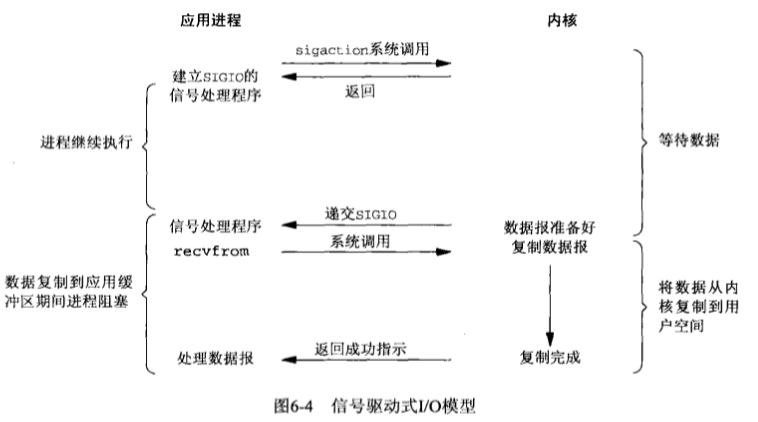
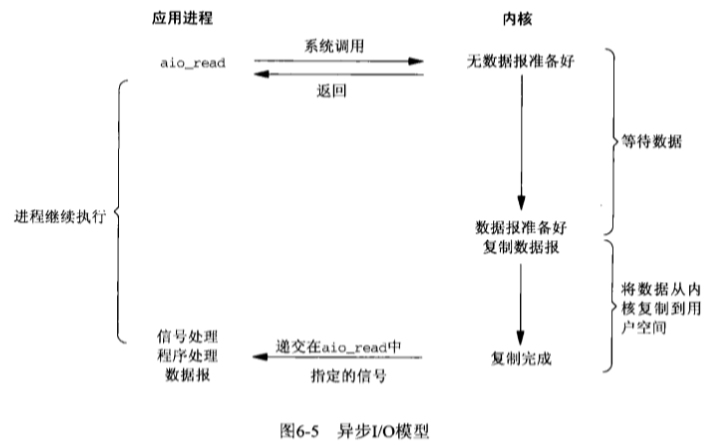
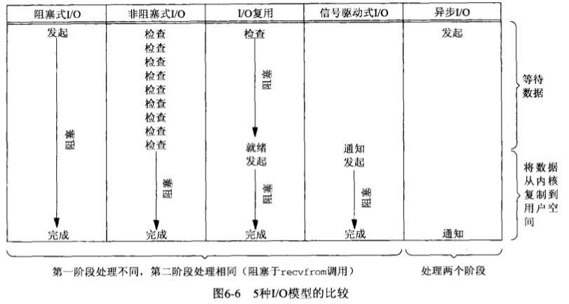

# IO 模型

Linux有5种IO模型：

* 同步阻塞式IO
* 同步非阻塞式IO
* IO多路复用
* 信号驱动式IO
* 异步非阻塞IO

网络IO的本质是socket的读取，当一个读操作发生时，通常包括两个不同的阶段：

1. 等待数据准备好
2. 从内核向进程复制数据

第2步是不同IO模型中差别较大的地方。

## 同步阻塞式IO

阻塞式IO模型是最简单和最常见的。在Linux中，默认情况下所有的socket都是blocking。

在该 I/O 模型中，用户空间应用程序执行系统调用（如 `recvfrom`），如果数据尚未准备好，调用线程会被阻塞，直到数据准备完成并从内核空间复制到用户空间。也就是说，在等待数据和复制数据两个阶段，调用线程都处于阻塞状态，无法处理其他网络 I/O。

当用户进程调用 `recv()` 或 `recvfrom()` 后，内核进入 I/O 的第一个阶段：等待数据准备完成。对于网络 I/O，数据可能尚未到达，例如尚未收到完整的数据包。数据准备完成后，内核进入第二个阶段：将数据从内核缓冲区复制到用户内存。复制完成并返回结果后，用户进程才解除阻塞并继续运行。

阻塞 I/O 的特点是：等待数据和复制数据两个阶段都会阻塞调用线程。

优点：

1. 能够及时返回数据，无延迟
2. 对内核开发者来说这是省事了

缺点：

1. 对用户来说处于等待就要付出性能的代价

## 同步非阻塞式IO

同步非阻塞 I/O 通常采用轮询（polling）方式。在这种模型中，设备或套接字以非阻塞方式打开；如果 I/O 操作无法立即完成，`read` 等调用会立即返回错误码，例如 `EAGAIN` 或 `EWOULDBLOCK`。

在网络 I/O 中，非阻塞 I/O 同样会调用 `recvfrom` 等系统调用检查数据是否准备好。与阻塞 I/O 不同，如果数据尚未准备好，系统调用会立即返回，应用程序可以继续执行其他逻辑，并在稍后再次尝试。

也就是说，非阻塞 `recvfrom` 调用后，如果数据尚未准备好，内核会立即返回错误码。应用程序随后可以执行其他任务，并在之后再次发起系统调用。这个反复检查的过程称为轮询。需要注意，当数据准备好并执行从内核空间到用户空间的复制时，该复制阶段仍然会占用调用线程。

在linux下，可以通过设置socket使其变为non-blocking。当对一个non-blocking socket执行读操作时，流程如图所示：

当用户进程发出read操作时，如果kernel中的数据还没有准备好，那么它并不会block用户进程，而是立刻返回一个error。从用户进程角度讲，它发起一个read操作后，并不需要等待，而是马上就得到了一个结果。用户进程判断结果是一个error时，它就知道数据还没有准备好，于是它可以再次发送read操作。一旦kernel中的数据准备好了，并且又再次收到了用户进程的system call，那么它马上就将数据拷贝到了用户内存，然后返回。

因此，非阻塞 I/O 的特点是用户进程需要主动、反复询问内核数据是否已经准备好。

同步非阻塞方式相比同步阻塞方式：

* 优点：等待 I/O 就绪期间，线程可以执行其他任务。
* 缺点：任务完成的响应延迟增大了，因为每过一段时间才去轮询一次read操作，而任务可能在两次轮询之间的任意时间完成。这会导致整体数据吞吐量的降低。

## IO多路复用

同步非阻塞方式需要应用程序主动轮询，可能消耗大量 CPU 时间。I/O 多路复用将多个文件描述符的就绪状态交由内核统一监视，当任意文件描述符就绪时再通知应用程序处理。UNIX/Linux 下常见的实现包括 `select`、`poll`、`epoll`。

I/O 多路复用常见系统调用包括 `select`、`poll`、`epoll`。与用户态反复轮询单个 socket 不同，多路复用可以同时监听多个文件描述符。当其中任意一个描述符进入可读或可写状态时，系统调用返回，应用程序再调用 `recvfrom`、`read`、`write` 等真正的 I/O 操作。需要注意，`select`、`poll` 或 `epoll_wait` 本身可能阻塞，后续数据复制阶段也仍由调用线程完成，因此多路复用通常归类为同步 I/O 模型。

I/O复用模型会用到select、poll、epoll函数，这几个函数也会使进程阻塞，但是和阻塞I/O所不同的的，这两个函数可以同时阻塞多个I/O操作。而且可以同时对多个读操作，多个写操作的I/O函数进行检测，直到有数据可读或可写时（注意不是全部数据可读或可写），才真正调用I/O操作函数。

对于多路复用，也就是轮询多个socket。多路复用既然可以处理多个IO，也就带来了新的问题，多个IO之间的顺序变得不确定了，当然也可以针对不同的编号。具体流程，如下图所示：

IO multiplexing就是我们说的select，poll，epoll，有些地方也称这种IO方式为event driven IO。select/epoll的好处就在于单个process就可以同时处理多个网络连接的IO。它的基本原理就是select，poll，epoll这个function会不断的轮询所负责的所有socket，当某个socket有数据到达了，就通知用户进程。

当用户进程调用了select，那么整个进程会被block，而同时，kernel会“监视”所有select负责的socket，当任何一个socket中的数据准备好了，select就会返回。这个时候用户进程再调用read操作，将数据从kernel拷贝到用户进程。

多路复用的特点是通过一种机制一个进程能同时等待IO文件描述符，内核监视这些文件描述符（套接字描述符），其中的任意一个进入读就绪状态，select， poll，epoll函数就可以返回。对于监视的方式，又可以分为 select， poll， epoll三种方式。

从单个连接角度看，多路复用不一定比阻塞 I/O 更快，因为它可能需要先调用 `select`，再调用 `recvfrom`。多路复用的主要优势在于一个线程可以同时管理多个连接的就绪事件。

因此，在连接数不高的场景下，使用 `select` 或 `epoll` 的服务器不一定比多线程阻塞 I/O 模型性能更好。`select`、`poll`、`epoll` 的优势主要在于提升大量连接场景下的连接管理能力，而不是提升单个连接的处理速度。

在IO multiplexing Model中，实际中，对于每一个socket，一般都设置成为non-blocking，但是，如上图所示，整个用户的process其实是一直被block的。只不过process是被select这个函数block，而不是被socket IO给block。所以IO多路复用是阻塞在select，epoll这样的系统调用之上，而没有阻塞在真正的I/O系统调用如recvfrom之上。

在I/O编程过程中，当需要同时处理多个客户端接入请求时，可以利用多线程或者I/O多路复用技术进行处理。I/O多路复用技术通过把多个I/O的阻塞复用到同一个select的阻塞上，从而使得系统在单线程的情况下可以同时处理多个客户端请求。与传统的多线程/多进程模型比，I/O多路复用的最大优势是系统开销小，系统不需要创建新的额外进程或者线程，也不需要维护这些进程和线程的运行，降底了系统的维护工作量，节省了系统资源，I/O多路复用的主要应用场景如下：

* 服务器需要同时处理多个处于监听状态或者多个连接状态的套接字。
* 服务器需要同时处理多种网络协议的套接字。

了解了前面三种IO模式，在用户进程进行系统调用的时候，他们在等待数据到来的时候，处理的方式不一样，直接等待，轮询，select或poll轮询，两个阶段过程：

* 第一个阶段有的阻塞，有的不阻塞，有的可以阻塞又可以不阻塞。
* 第二个阶段都是阻塞的。

从整个IO过程来看，他们都是顺序执行的，因此可以归为同步模型(synchronous)。都是进程主动等待且向内核检查状态。【此句很重要！！！】

高并发的程序一般使用同步非阻塞方式而非多线程 + 同步阻塞方式。要理解这一点，首先要扯到并发和并行的区别。比如去某部门办事需要依次去几个窗口，办事大厅里的人数就是并发数，而窗口个数就是并行度。也就是说并发数是指同时进行的任务数（如同时服务的 HTTP 请求），而并行数是可以同时工作的物理资源数量（如 CPU 核数）。通过合理调度任务的不同阶段，并发数可以远远大于并行度，这就是区区几个 CPU 可以支持上万个用户并发请求的奥秘。在这种高并发的情况下，为每个任务（用户请求）创建一个进程或线程的开销非常大。而同步非阻塞方式可以把多个 IO 请求丢到后台去，这就可以在一个进程里服务大量的并发 IO 请求。

关于 I/O 多路复用的模型归类，需要区分同步/异步与阻塞/非阻塞两个维度：

同步与异步的核心区别在于：真实 I/O 操作是否由调用方主动完成。I/O 多路复用中，应用程序主动调用 `select`、`poll` 或 `epoll_wait` 等待就绪事件，并在事件就绪后主动发起读写操作。因此它属于同步 I/O。若等待就绪事件的调用采用阻塞方式，则可称为同步阻塞；若配合非阻塞调用和超时轮询，也可表现为同步非阻塞。

## 信号驱动式IO

信号驱动式I/O：首先我们允许Socket进行信号驱动IO,并安装一个信号处理函数，进程继续运行并不阻塞。当数据准备好时，进程会收到一个SIGIO信号，可以在信号处理函数中调用I/O操作函数处理数据。过程如下图所示：

## 异步非阻塞IO

相对于同步IO，异步IO不是顺序执行。用户进程进行aio_read系统调用之后，无论内核数据是否准备好，都会直接返回给用户进程，然后用户态进程可以去做别的事情。等到socket数据准备好了，内核直接复制数据给进程，然后从内核向进程发送通知。IO两个阶段，进程都是非阻塞的。

Linux提供了AIO库函数实现异步，但是用的很少。目前有很多开源的异步IO库，例如libevent、libev、libuv。异步过程如下图所示：

用户进程发起aio_read操作之后，立刻就可以开始去做其它的事。而另一方面，从kernel的角度，当它受到一个asynchronous read之后，首先它会立刻返回，所以不会对用户进程产生任何block。然后，kernel会等待数据准备完成，然后将数据拷贝到用户内存，当这一切都完成之后，kernel会给用户进程发送一个signal或执行一个基于线程的回调函数来完成这次 IO 处理过程，告诉它read操作完成了。

在 Linux 中，通知的方式是 “信号”：

如果这个进程正在用户态忙着做别的事（例如在计算两个矩阵的乘积），那就强行打断之，调用事先注册的信号处理函数，这个函数可以决定何时以及如何处理这个异步任务。由于信号处理函数是突然闯进来的，因此跟中断处理程序一样，有很多事情是不能做的，因此保险起见，一般是把事件 “登记” 一下放进队列，然后返回该进程原来在做的事。

如果这个进程正在内核态忙着做别的事，例如以同步阻塞方式读写磁盘，那就只好把这个通知挂起来了，等到内核态的事情忙完了，快要回到用户态的时候，再触发信号通知。

如果这个进程现在被挂起了，例如无事可做 sleep 了，那就把这个进程唤醒，下次有 CPU 空闲的时候，就会调度到这个进程，触发信号通知。

异步 API 说来轻巧，做来难，这主要是对 API 的实现者而言的。Linux 的异步 IO（AIO）支持是 2.6.22 才引入的，还有很多系统调用不支持异步 IO。Linux 的异步 IO 最初是为数据库设计的，因此通过异步 IO 的读写操作不会被缓存或缓冲，这就无法利用操作系统的缓存与缓冲机制。

很多人把 Linux 的 O_NONBLOCK 认为是异步方式，但事实上这是前面讲的同步非阻塞方式。需要指出的是，虽然 Linux 上的 IO API 略显粗糙，但每种编程框架都有封装好的异步 IO 实现。操作系统少做事，把更多的自由留给用户，正是 UNIX 的设计哲学，也是 Linux 上编程框架百花齐放的一个原因。

从前面 IO 模型的分类中，我们可以看出 AIO 的动机：

同步阻塞模型需要在 IO 操作开始时阻塞应用程序。这意味着不可能同时重叠进行处理和 IO 操作。

同步非阻塞模型允许处理和 IO 操作重叠进行，但是这需要应用程序根据重现的规则来检查 IO 操作的状态。

这样就剩下异步非阻塞 IO 了，它允许处理和 IO 操作重叠进行，包括 IO 操作完成的通知。

IO多路复用除了需要阻塞之外，select 函数所提供的功能（异步阻塞 IO）与 AIO 类似。不过，它是对通知事件进行阻塞，而不是对 IO 调用进行阻塞。

## 五种IO模型总结

### blocking和non-blocking区别

调用blocking IO会一直block住对应的进程直到操作完成，而non-blocking IO在kernel还准备数据的情况下会立刻返回。

### synchronous IO和asynchronous IO区别

在说明synchronous IO和asynchronous IO的区别之前，需要先给出两者的定义。POSIX的定义是这样子的：

>A synchronous I/O operation causes the requesting process to be blocked until that I/O operation completes;
>An asynchronous I/O operation does not cause the requesting process to be blocked;

两者的区别就在于synchronous IO做”IO operation”的时候会将process阻塞。按照这个定义，之前所述的blocking IO，non-blocking IO，IO multiplexing都属于synchronous IO。

有人会说，non-blocking IO并没有被block啊。这里有个非常“狡猾”的地方，定义中所指的”IO operation”是指真实的IO操作，就是例子中的recvfrom这个system call。non-blocking IO在执行recvfrom这个system call的时候，如果kernel的数据没有准备好，这时候不会block进程。但是，当kernel中数据准备好的时候，recvfrom会将数据从kernel拷贝到用户内存中，这个时候进程是被block了，在这段时间内，进程是被block的。

而asynchronous IO则不一样，当进程发起IO 操作之后，就直接返回再也不理睬了，直到kernel发送一个信号，告诉进程说IO完成。在这整个过程中，进程完全没有被block。

各个IO Model的比较如图所示：

通过上面的图片，可以发现non-blocking IO和asynchronous IO的区别还是很明显的。在non-blocking IO中，虽然进程大部分时间都不会被block，但是它仍然要求进程去主动的check，并且当数据准备完成以后，也需要进程主动的再次调用recvfrom来将数据拷贝到用户内存。而asynchronous IO则完全不同。它就像是用户进程将整个IO操作交给了他人（kernel）完成，然后他人做完后发信号通知。在此期间，用户进程不需要去检查IO操作的状态，也不需要主动的去拷贝数据。

>作者：猿码道
> 
>链接：https://www.jianshu.com/p/486b0965c296
> 
>来源：简书
> 
>著作权归作者所有。商业转载请联系作者获得授权，非商业转载请注明出处。

## Reference

[Linux IO模式及 select、poll、epoll详解](https://segmentfault.com/a/1190000003063859#articleHeader13)
