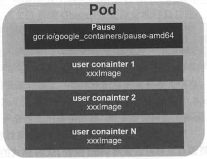

[[toc]]

# Kubernetes 介绍

## 集群架构

## 基本概念和术语

Kubernetes集群中有两种管理角色：Master和Node。

### Master

Kubernetes里的Master指的是集群控制节点，每个Kubernetes集群里需要有一个Master节点来负责整个集群的管理和控制，基本上Kubernetes的所有控制命令都发给它，它来负责具体的执行过程。

Master节点通常会占据一个独立的服务器（高可用部署建议用3台服务器），其主要原因是它太重要了，是整个集群的“首脑”，如果宕机或不可用，那么对集群内容器应用的管理都将失败。

Master节点上运行着以下一组关键进程。

* Kubernetes API Server（kube-apiserver）：提供了HTTP Rest接口的关键服务进程，是Kubernetes里所有资源的增、删、改、查等操作的唯一入口，也是集群控制的入口进程。
* Kubernetes Controller Manager（kube-controller-manager）：Kubernetes里所有资源对象的自动化控制中心，可以理解为资源对象的“大总管”。
* Kubernetes Scheduler（kube-scheduler）：负责资源调度（Pod调度）的进程，相当于公交公司的“调度室”。

另外，在Master节点上还需要启动一个etcd服务，因为Kubernetes里的所有资源对象的数据全部是保存在etcd中的。

### Node

除了Master，Kubernetes集群中的其他机器被称为Node节点，在较早的版本中也被称为Minion。与Master一样，Node节点可以是一台物理主机，也可以是一台虚拟机。Node节点是Kubernetes集群中的工作负载节点，每个Node都会被Master分配一些工作负载（Docker容器），当某个Node宕机时，其上的工作负载会被Master自动转移到其他节点上去。

每个Node节点上都运行着以下一组关键进程。

* kubelet：负责Pod对应的容器的创建、启停等任务，同时与Master节点密切协作，实现集群管理的基本功能。
* kube-proxy：实现Kubernetes Service的通信与负载均衡机制的重要组件。
* Docker Engine（docker）：Docker引擎，负责本机的容器创建和管理工作。

Node节点可以在运行期动态增加到Kubernetes集群中，前提是这个节点上已经正确安装、配置和启动了上述关键进程，在默认情况下kubelet会像Master注册自己，这也是Kubernetes推荐的Node管理方式。一旦Node被纳入集群管理范围，kubelet进程就会定时向Master节点汇报自身的情况，这样Master可以获知每个Node的资源使用情况，并实现高效均衡的资源调度策略。当某个Node超过指定时间不上报信息时，会被Master判定为“失联”，Node的状态被标记为不可用，随后Master会触发“工作负载大迁移”的自动流程。

### Pod

Pod是Kubernetes的最重要也最基本的概念。每个Pod都有一个特殊的被称为“根容器”的Pause容器。Pause容器对应的镜像属于Kubernetes平台的一部分，除了Pause容器，每个Pod还包含一个或多个紧密相关的用户业务容器。

Kubernetes设计Pod的原因主要有:

1. 在一组容器作为一个单元的情况下，很难对“整体”简单地进行判断及有效地进行行动。引入业务无关且不易死亡的Pause容器作为Pod的根容器，以它的状态代表整个容器组的状态，简单、巧妙地解决了这个难题。
2. Pod的多个业务容器共享Pause容器的IP，共享Pause容器挂接的Volume，这样既简化了密切关联的业务容器之间的通信问题，也很好地解决了它们之间的文件共享问题。

Kubernetes为每个Pod都分配了唯一的IP地址，称之为Pod IP，一个Pod里的多个容器共享Pod IP地址。Kubernetes要求底层网络支持集群内任意两个Pod之间的TCP/IP直接通信。在Kubernetes里，一个Pod里的容器与另外主机上的Pod容器能够直接通信。

Pod其实有两种类型：普通的Pod及静态Pod。后者比较特殊，它并不存放在Kubernetes的etcd存储里，而是存放在某个具体的Node上的一个具体文件里，并且只在此Node上启动运行。而普通的Pod一旦被创建，就会被放入到etcd中存储，随后会被Kubernetes Master调度到某个具体的Node上并进行绑定，随后该Pod被对应的Node上的kubelet进程实例化成一组相关的Docker容器并启动起来。在默认情况下，当Pod里的某个容器停止时，Kubernetes会自动检测到这个问题并重新启动这个Pod（重启Pod里的所有容器），如果Pod所在的Node宕机，则会将这个Node上的所有Pod重新调度到其他节点上。

### Label（标签）

Label是Kubernetes系统中另外一个核心概念。一个Label是一个key=value的键值对，其中key与value由用户自己指定。Labe可以附加到各种资源对象上，例如Node、Pod、Service、RC等，一个资源对象可以定义任意数量的Label，同一个Label也可以被添加到任意数量的资源对象上去，Label通常在资源对象定义时确定，也可以在对象创建后动态添加或删除。

我们可以通过给指定的资源对象捆绑一个或多个不同的Label来实现多维度的资源分组管理功能，已便于灵活、方便地进行资源分配、调度、配置、部署等管理工作。

Label相当于我们熟悉的“标签”，给某个资源对象顶一个Label，就相当于给它打了一个标签，随后可以通过Label Selector（标签选择器）查询和筛选拥有某些Label的资源对象，Kubernetes通过这种方式实现了类似SQL的简单又通用的对象查询机制。

### Replication Controller

RC是Kubernetes系统中的核心概念之一，简单来说，它其实是定义了一个期望的场景，即声明某种Pod的副本数量在任意时刻都符合某个预期值，所以RC的定义包括如下几个部分。

* Pod期待的副本数（replicas）。
* 用于筛选目标Pod的Label Selector。
* 当Pod的副本数量小于预期数量时，用于创建新Pod的Pod模板（template）。

当我们定义了一个RC并提交到Kubernetes集群中以后，Master节点上的Controller Manager组件就得到通知，定期巡检系统中当前存活的目标Pod，并确保目标Pod实例的数量刚好等于此RC的期望值，如果有过多的Pod副本在运行，系统就会停掉一些Pod，否则系统就会自动创建一些Pod。

由于Replication Controller与Kubernetes代码中的模块Replication Controller同名，同时这个词无法准确表达它的本意，所以在Kubernetes v1.2时，它升级成另外一个新的概念——Replica Set。它与RC当前存在的唯一区别是：Replica Set支持基于集合的Label Selector，而RC只支持基于等式的Label Selector，这使得Replica Set的功能更强。

当前很少单独使用Replica Set，它主要被Deployment这个更高层的资源对象所使用，从而形成一整套Pod创建、删除、更新的编排机制。当使用Deployment时，无须关心它是如何创建和维护Replica Set的，一切都是自动发生的。

Replica Set与Deployment这两个重要资源对象逐步替换了之前的RC的作用，是Kubernetes v1.3里Pod自动扩容（伸缩）这个告警功能实现的基础。

### Deployment

Deployment是Kubernetes v1.2引入的新概念，引入的目的是为了更好地解决Pod的编排问题。为此，Deployment在内部使用了Replica Set是实现目的，无论从Deployment的作用于目的、它的YAML定义，还是从它的具体命令行操作来看，我们都可以把它看做是RC的一次升级，两者的相似度超过90%。

Deployment相对于RC的一个最大升级是我们可以随时知道当前Pod“部署”的进度。实际上由于一个Pod的创建、调度、绑定节点及在目标Node上启动对应的容器这一完整过程需要一定的时间，所以我们期待系统启动N个Pod副本的目标状态，实际上是一个连续变化的“部署过程”导致的最终状态。

Deployment的典型使用场景有以下几个。

* 创建一个Deployment对象来生成对应的Replica Set并完成Pod副本的创建过程。
* 检查Deployment的状态来看部署动作是否完成（Pod副本的数量是否达到预期的值）。
* 更新Deployment以创建新的Pod（比如镜像升级）。
* 如果当前Deployment不稳定，则回滚到一个早先的Deployment版本。
* 暂停Deployment以便于一次性修改多个PodTemplateSpec的配置项，之后再恢复Deployment，进行新的发布。
* 扩展Deployment以应对高负载。
* 查看Deployment的状态，以此作为发布是否成功的指标。
* 清理不再需要的旧版本ReplicaSets。

### Horizontal Pod Autoscaler

HPA与之前的RC、Deployment一样，也属于一种Kubernetes资源对象。通过追踪分析RC控制的所有目标Pod的负载变化情况，来确定是否需要针对性地调整目标Pod的副本数，这是HPA的实现原理。当前，HPA可以有以下两种方式作为Pod负载的度量指标。

* CPUUtilizationPercentage。
* 应用程序自定义的度量指标，比如服务在每秒内的相应的请求数（TPS或QPS）。

CPUUtilizationPercentage是一个算术平均值，即目标Pod所有副本自身的CPU利用率的平均值。一个Pod自身的CPU利用率是该Pod当前CPU的使用量除以它的Pod Request的值。

CPUUtilizationPercentage计算过程中用到的Pod的CPU使用量通常是1min内的平均值，目前通过查询Heapster扩展组件来得到这个值，所以需要安装部署Heapster，这样一来便增加了系统的复杂度和实施HPA特性的复杂度，因此，未来的计划是Kubernetes自身实现一个基础性能数据采集模块。此外，如果目标Pod没有定义Pod Request的值，则无法使用CPUUtilizationPercentage来实现Pod横向自动扩容的能力。

Kubernetes从v1.2版本开始尝试支持应用程序自定义的度量指标，目前仍然为实验特性，不建议在生产环境中使用。

### StatefulSet

在Kubernetes系统中，Pod的管理对象RC、Deployment、DaemonSet和Job都是面向无状态的服务。但现实中有很多服务是有状态的，特别是一些复杂的中间件集群，例如MySQL集群、MongoDB集群、Akka集群、ZooKeeper集群等，这些应用集群有以下一些共同点。

* 每个节点都有固定的身份ID，通过这个ID，集群中的成员可以相互发现并且通信。
* 集群的规模是比较固定的，集群规模不能随意变动。
* 集群里的每个节点都是有状态的，通常会持久化数据到永久存储中。
* 如果磁盘损坏，则集群里的某个节点无法正常运行，集群功能受损。

为了解决上述问题，Kubernetes提供了StatefulSet。StatefulSet从本质上来说，可以看做是Deployment/RC的一个特殊变种，它有如下一些特性。

* StatefulSet里的每个Pod都有稳定、唯一的网络标识，可以用来发现集群内的其他成员。
* StatefulSet控制的Pod副本的启停顺序是受控的，操作第n个Pod时，前n-1个Pod已经是运行且准备好的状态。
* StatefulSet里的Pod采用稳定的持久化存储卷，通过PV/PVC来实现，删除Pod时默认不会删除与StatefulSet相关的存储卷。

StatefulSet除了与PV卷捆绑以存储Pod的状态数据，还要与Headless Service配合使用，即在每个StatefulSet的定义中要声明它属于哪个Headless Service。Headless Service与普通Service的关键在于，它没有Cluster IP，如果解析Headless Service的DNS域名，则返回的是该Service对应的全部Pod的Endpoint列表。StatefulSet在Headlese Service的基础上又为StatefulSet控制的每个Pod实例创建了一个DNS域名，这个域名的格式为：

${podname}.${headless service name}

例如一个3节点的Kafka集群，对应的Headless Service的名字为kafka，StatefulSet的名字为kafka，则StatefulSet里面的3个Pod的DNS名称分别为kafka-0.kafka、kafka-1.kafka、kafka-2.kafka。

### Service（服务）

Service也是Kubernetes里的最核心的资源对象之一，Kubernetes里的每个Service其实就是我们经常提起的微服务架构中的一个“微服务”。

### Volumen（存储卷）

Volume是Pod中能够被多个容器访问的共享目录。Kubernetes的Volume概念、用户和目的与Docker的Volume比较类似，但两者不等价。首先，Kubernetes中的Volume定义在Pod上，然后被一个Pod里的多个容器挂在到具体的文件目录下；其次，Kubernetes中的Volume与Pod的生命周期相同，但与容器的生命周期不相关，当容器终止或重启时，Volume中的数据也不会丢失；最后，Kubernetes支持多种类型的Volume，例如GlusterFS、Ceph等先进的分布式文件系统。

### Persistent Volume

Volume是定义在Pod上的，属于“计算资源”的一部分，而实际上，“网络存储”是相对独立于“计算资源”而存在的一种实体资源。

PV可以立即成Kubernetes集群中的某个网络存储中对应的一块存储，它与Volume很类似，但有以下区别。

* PV只能是网络存储，不属于任何Node，但可以在每个Node上访问。
* PV并不是定义在Pod上的，而是独立于Pod之外定义。

PV比较重要的是accessModes属性，目前有以下类型。

* ReadWriteOnce：读写权限，并且只能被单个Node挂载。
* ReadOnlyMany：只读权限，允许被多个Node挂载。
* ReadWriteMany：读写权限，允许被多个Node挂载。

如果某个Pod想申请某种类型的PV，则首先需要定义个PersistentVolumeClaim（PVC）对象。

PV是有状态的对象，它有以下几种状态。

* Available：空闲状态。
* Bound：已经绑定到某个PVC上。
* Released：对应的PVC已经删除，但资源还没有被集群回收。
* Failed：PV自动回收失败。

### Namespace（命名空间）

Namespace（命名空间）是Kubernetes系统中另一个非常重要的概念，Namespace在很多情况下用于实现多租户的资源隔离。Namespace通过将集群内部的资源对象“分配”到不同的Namespace中，形成逻辑上分组的不同项目、小组或用户组，便于不同的分组在共享使用整个集群的资源的同时还能被分别管理。

Kubernetes集群在启动后会创建一个名为default的Namespace，接下来，如果不特别指明Namespace，则用户创建的Pod、RC、Service都将被系统创建到这个默认的名为default的Namespace中。

当给每个租户创建一个Namespace来实现多租户的资源隔离时，还能结合Kubernetes的资源配额管理，限定不同租户能占用的资源，例如CPU使用量、内存使用量等。

### Annotation

Annotation（注解）与Label类似，也使用key/value键值对的形式进行定义。不同的是Label具有严格的命名规则，它定义的是Kubernetes对象的元数据（Metadata），并且用于Label Selector。Annotation则是用户任意定义的附加信息，以便于外部工具查找。在很多时候，Kubernetes的模块自身会通过Annotation标记资源对象的一些特殊信息。

通常来说，用Annotation来记录的信息如下。

* build信息、release信息、Docker镜像信息等，例如时间戳、release id号、PR号、镜像Hash值、Docker Registry地址等。
* 日志库、监控库、分析库等资源库的地址信息。
* 程序调试工具信息，例如工具名称、版本号等。
* 团队的联系信息，例如电话号码、负责人名称、网址等。

### ConfigMap

为了能够准确和深刻理解Kubernetes ConfigMap的功能和价值，我们需要从Docker说起。我们知道，Docker通过将程序、依赖库、数据及配置文件“打包固化”到一个不变的镜像文件中的做法，解决了应用的部署的难题，但这同时带来了棘手的问题，即配置文件中的参数在运行期如何修改的问题。我们不可能在启动Docker容器后再修改容器里的配置文件，然后用新的配置文件重启容器里的用户主进程。为了解决这个问题，Docker提供了两种方式：

* 在运行时通过容器的环境变量来传递参数；
* 通过Docker Volume将容器外的配置文件映射到容器内。

这两种方式都有其优势和缺点，在大多数情况下，后一种方式更合适我们的系统，因为大多数应用通常从一个或多个配置文件中读取参数。但这种方式也有明显的缺陷：我们必须在目标主机上先创建好对应的配置文件，然后才能映射到容器里。

上述缺陷在分布式情况下变得更为严重，因为无论采用哪种方式，写入（修改）多台服务器上的某个指定文件，并确保这些文件保持一致，都是一个很难完成的目标。此外，在大多数情况下，我们都希望能集中管理系统的配置参数，而不是管理一堆配置文件。针对上述问题，Kubernetes给出了一个很巧妙的设计实现，如下所述。

首先，把所有的配置项都当作key-value字符串，当然value可以来自某个文本文件，比如配置项password=123456、user=root、host=192.168.8.4用于表示连接FTP服务器的配置参数。这些配置项可以作为Map表中的一个项，整个Map的数据可以被持久化存储在Kubernetes的Etcd数据库中，然后提供API以方便Kubernetes相关组件或客户应用CRUD操作这些数据，上述专门用来保存配置参数的Map就是Kubernetes ConfigMap资源对象。

接下来，Kubernetes提供了一种内建机制，将存储在etcd中的ConfigMap通过Volume映射的方式变成目标Pod内的配置文件，不管目标Pod被调度到哪台服务器上，都会完成自动映射。进一步地，如果ConfigMap中的key-value数据被修改，则映射到Pod中的“配置文件”也会随之自动更新。于是，Kubernetes ConfigMap就成了分布式系统中最为简单（使用方法简单，但背后实现比较复杂）且对应用无侵入的配置中心。

