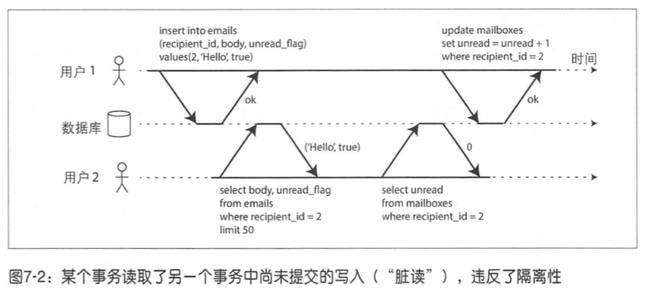
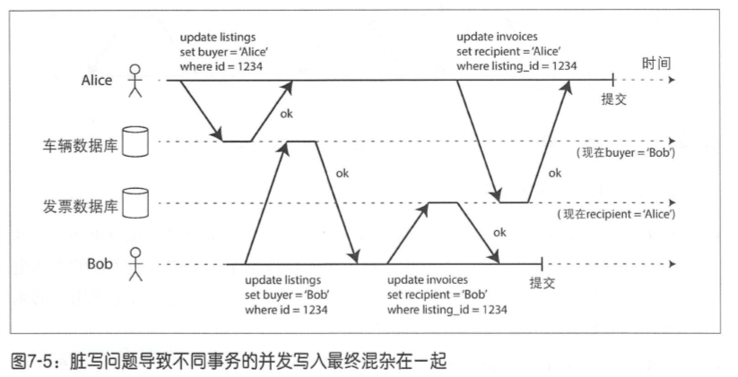
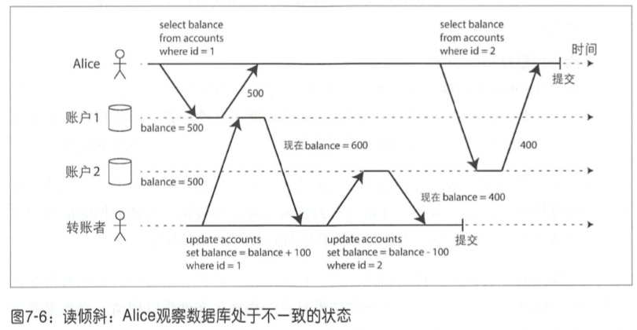

# 事务

事务将应用程序的多个读、写操作捆绑在一起成为一个逻辑单元，即事务中的所有读写是一个执行的整体，整个事务要么成功（提交），要么失败（终止或回滚）。

## ACID

事务锁提供的安全保证即众所周知的ACID，分别代表原子性、一致性、隔离性、持久性。实际上，各个数据库所实现的ACID并不尽相同。

### 原子性

原子指不可分解为更小粒度的东西。这个术语在计算器的不同领域里有着相似但却微妙的差异。例如，在多线程编程中，如果某线程执行一个原子操作，这意味着其他线程是无法看到该操作的中间结果。它只能处于操作之前或操作之后的状态，而不是两者之间的状态。

而ACID中的原子性并不关乎多个操作的并发性，它并没有描述多个线程试图访问相同的数据会发生什么情况，后者其实是由ACID的隔离性所定义。

ACID原子性其实描述了客户端发起一个包含多个写操作的请求时可能发生的情况，例如在完成了一部分写入会后，系统发生了故障，包括进程崩溃、网络中断，磁盘变满或者违反了某种完整性约束等；把多个写操作纳入到一个原子事务，玩意出现了上述故障而导致没法完成最终提交时，则事务会终止，并且数据库必须丢弃或撤销哪些局部完成的更改。

ACID中原子性所定义的特征是：在出错时终止事务，并将部分完成的写入全部丢弃。

### 一致性

ACID的一致性主要是指对数据由特定的预期状态，任何数据更改必须满足状态约束（或者恒等条件）。

这种一致性本质上要求应用层来维护状态一致（或者恒等），应用程序有责任正确地定义事务来保持一致性。

原子性、隔离性和持久性是数据库自身的属性，而ACID中的一致性更多是应用层的属性。应用程序可能借助数据库提供的原子性和隔离性，以达到一致性，但一致性本身并不源于数据库。因此，C其实并不应该属于ACID。

### 隔离性

ACID语义中的隔离性意味着并发执行的多个事务相互隔离，它们不能互相交叉。

### 持久性

持久性保证一旦事务提交成功，即使存在硬件故障或数据库崩溃，事务所写入的任何数据也不会消失。

## 弱隔离级别

如果两个事务操作的是不同的数据，即不存在数据依赖管理，那么它们可以安全的并行执行。只有出现某个事务修改数据而另一个事务同事要读取该数据，或者两个事务同时修改相同数据时，才会引起并发问题。

可串行化的隔离以为着数据库保证事务的最终执行结果与串行执行结果相同。可串行化会严重影响性能，因此更多倾向于采用较弱的隔离级别。

### 读-提交

读-提交是最基本的事务隔离级别，它只提供以下两个保证：

1. 读数据库时，只能看到已成功提交的数据（防止脏读）。
2. 写数据库时，只会覆盖已成功提交的数据（防止脏写）。

脏读：假定某个事务已完成部分数据写入，但事务尚未提交（或中止），此时另一个事务是否可以看到尚未提交的数据呢？如果是的话，那就是脏读。

脏写：如果两个事务同时尝试更新相同的对象，会发生什么情况呢？我们不清楚写入的顺序，但可以想象后写的操作会覆盖焦躁的写入。但是，如果先前的写入是尚未提交事务的一部分，是否还是被覆盖？如果是，那就是脏写。读-提交隔离级别可以防止脏写，通常的方式是推迟第二个写请求，直到前面的事务完成提交。

数据库通常使用行级锁来防止脏写。当事务想修改某个对象时，它必须首先获得该对象的锁；然后一直持有锁直到事务提交（或中止）。给定时刻，只有一个事务可以拿到特定对象的锁，如果有另一个事务尝试更新同一个对象，则必须等待，直到前面的事务完成了提交（或中止）后，才能获得锁并继续。这种锁定是由处于读-提交模式（或更强的隔离级别）数据库自动完成的。

那如何防止脏读呢？一种选择是使用相同的锁，但实际上不可行，运行时间较长的写事务会导致许多只读的事务等待太长时间。大多数数据库，对于每个待更新的对象，都会维护其旧值和当前持锁事务将要设置的新值两个版本，在事务提交之前，所有其他的读操作都读取旧值，仅当写事务提交之后，才会切换到读取新值。

### 快照级别隔离与可重复读

读-提交存在着读倾斜（不可重复读）的问题。

例子：假设Alice在银行有1000美元的存款，分为两个账户，每个500美观。现在有这样一笔转账交易从账户1转100美元到账户2.如果在她提交转账请求之后而银行数据库系统执行转账的过程中间，来查看两个账户的余额，她有可能会看到账户2在收到转账之前的余额（500美元），和账户1在完成转账之后的余额（400美元）。对于Alice来说，貌似她的账户总共只有900美元，有100美元消失了。

快照级别隔离是上述问题最常见的手段。其总体想法是，每个事务都从数据库的一致性快照中读取，事务已开始所看到的是最近提交的数据，即使数据随后可能被另一个事务更改，但保证每个事务都只能看到该特定时间点的旧数据。

快照级别隔离的实现通常采用写锁来防止脏写，与读-提交类似。但是读取则不需要加锁。考虑到多个正在进行的事务可能会在不同的时间点查看数据库状态，所有数据库保留了对象多个不同的提交版本，这种技术因此也被称为多版本并发控制（Multi-Version Concurrency Control，MVCC）。如果只为了提供读-提交级别隔离，而不是完整的快照级别隔离，则只保留对象的两个版本就足够了。

**更新丢失**

读-提交和快照级别隔离主要是为了解决只读事务遇到并发写时可以看到什么，虽然中间也涉及脏写问题，总体而言我们还没有触及另一种情况，即两个写事务并发，而脏写只是写并发的一个特例。

更新丢失可能发生在这样一个场景：应用程序从数据库读取某些值，根据应用逻辑做出修改，然后写回新值（read-modify-write过程）。当有两个事务在同样的数据对象上执行类似操作时，由于隔离性，第二个写操作并不包括第一个事务修改后的值，最终会导致第一个事务的修改值可能会丢失。

并发写事务冲突是一个普遍问题，目前由多种可行的解决方案。

原子写操作。避免应用层代码完成“读-修改-写回”操作 。不过，ORM框架很容易写出非“读-修改-写回”的应用层代码，导致无法使用数据库锁提供的原子操作。

显式加锁。由应用程序显式锁定待更新的数据。然后，应用程序可以执行“读-修改-写回”这样的操作；此时如果有其他事务尝试同时读取对象，则必须等地当前正在执行的操作全部完成。（SELECT FOR UPDATE 方法显式地对结果行加锁）

原子比较和设置。UPDATE table SET content = 'new content' WHERE id = 1234 AND content = 'old content';

**写倾斜与幻读**

例子：在一个管理一声轮班的应用程序中，通常医院会安排多个医生值班，医生也可以申请调整班次，但前提是确保至少一位医生还在该班次中值班。现在Alice和Bob是两位值班医生，两人同时决定请假，由于数据库正在使用快照级别隔离，两个事务首先检查是否至少有两位医生目前在值班，两个检查都返回两名医生，所以两个事务都安全第进入下一阶段，接下来Alice更新自己的值班记录为离开，Bob也更新自己的记录为离开。两个事务都成功提交，最后的结果就是没有任何医生在值班。

这种情况称为写倾斜，它既不是一种脏写，也不是更新丢失，两个事务更新的是两个不同的对象（分别是Alice和Bob的值班记录）。

可以将写倾斜视为一种更广义的更新丢失问题，即如果两个事务读取相同的一组对象，然后更新其中一部分，不同的事务可能更新不同的对象，则可能发生写倾斜；而不同的事务如果更新的是同一个对象，则可能发生脏写或更新丢失（具体取决于时间窗口）。

**为何产生写倾斜**

所有产生写倾斜的例子都遵循如下模式：首先SELECT查询出满足条件的行；根据查询的结果，应用层代码来决定下一步操作；如果应用程序决定继续执行，将发起数据库写入并提交事务。

这个写操作会改变步骤2做出决定的前提条件。换句话说，如果提交写入之后再重复执行步骤1的SELECT查询，就会返回完全不同的结果，原因是刚刚的写操作改变了决定的前提条件。

这种在一个事务中的写入改变了另一个事务查询结果的现象，称为幻读。快照级别隔离可以避免只读查询时的幻读，但对于读-写事务，它却无法解决写倾斜问题。

### 串行化 ###

可串行化隔离通常被认为是最强的隔离级别。它保证即使事务可能会并行执行，但最终的结果与每次一个即串行执行的结果相同。

目前大多数提供可串行化的数据库都使用了以下三种技术之一：

* 严格按照执行顺序执行
* 两阶段锁定，这几乎是唯一可行的选择
* 乐观并发控制技术