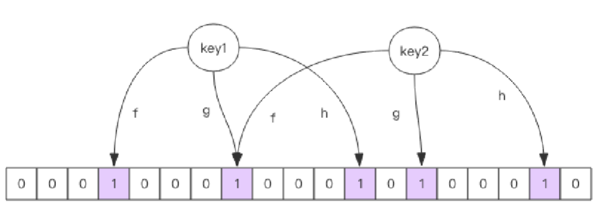

# 布隆过滤器

布隆过滤器可以理解为一个不怎么精确的 set 结构，当你使用它的 contains 方法判断某个对象是否存在时，它可能会误判。但是布隆过滤器也不是特别不精确，只要参数设置的合理，它的精确度可以控制的相对足够精确，只会有小小的误判概率。 

当布隆过滤器说某个值存在时，这个值可能不存在；当它说不存在时，那就肯定不存在。

## 布隆过滤器的原理

每个布隆过滤器对应到 Redis 的数据结构里面就是一个大型的位数组和几个不一样的无偏 hash 函数。所谓无偏就是能够把元素的 hash 值算得比较均匀。 

向布隆过滤器中添加 key 时，会使用多个 hash 函数对 key 进行 hash 算得一个整数索引值然后对位数组长度进行取模运算得到一个位置，每个 hash 函数都会算得一个不同的位置。再把位数组的这几个位置都置为 1 就完成了 add 操作。

向布隆过滤器询问 key 是否存在时，跟 add 一样，也会计算多个位置。只要其中一个位置为 0，就能确定这个 key 不存在；如果所有位置均为 1，只能说明 key **可能存在**，因为这些位也可能由其他 key 置为 1。位数组越拥挤，哈希碰撞越多，误判为“存在”的概率越高；位数组越稀疏，误判概率越低。

布隆过滤器的位数组大小和哈希函数数量应根据预期元素数量与目标误判率预先计算。实际元素数量超过设计容量后，位数组会越来越拥挤，误判率也会升高。固定容量的实现通常需要创建更大的过滤器并重新导入历史元素；支持自动扩容的 RedisBloom 则会追加子过滤器，但查询需要检查更多子过滤器，仍应合理设置初始容量。

## Reference

[详解布隆过滤器的原理，使用场景和注意事项](https://zhuanlan.zhihu.com/p/43263751)
